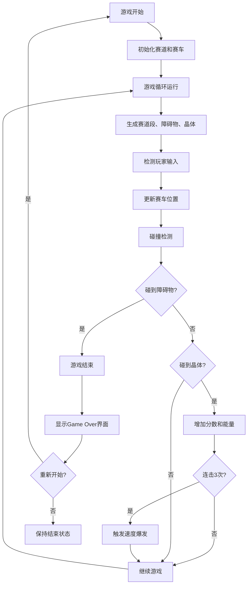

## 1. 产品概述

极速光轨是一款霓虹风格的赛车跑酷Web游戏，玩家控制一辆光子赛车在不断延伸的彩色光带赛道上穿梭，躲避障碍物并收集能量晶体来获得分数和加速。游戏采用赛博朋克霓虹美学，强调速度感和视觉冲击力。

- **核心玩法**：鼠标/触摸控制赛车左右移动，躲避障碍物，收集能量晶体
- **目标用户**：休闲游戏玩家、网页游戏爱好者
- **产品价值**：提供沉浸式的霓虹赛车体验，简单易上手但具有挑战性

## 2. 核心功能

### 2.1 功能模块

1. **游戏主画面**：全屏Canvas渲染，包含赛道、赛车、障碍物、能量晶体
2. **HUD显示系统**：速度、分数、能量槽、游戏状态显示
3. **游戏控制系统**：鼠标/触摸控制，平滑跟随效果
4. **碰撞检测系统**：AABB碰撞检测，障碍物和晶体判定
5. **难度递增系统**：随分数提升速度和障碍物密度
6. **得分系统**：基础得分、连击爆发模式、最高分记录
7. **游戏状态管理**：开始、进行中、结束状态切换

### 2.2 游戏元素详情

| 元素名称 | 类型 | 功能描述 |
|---------|------|----------|
| 光子赛车 | 玩家角色 | 多边形造型，尾焰粒子效果，0.1s平滑跟随鼠标 |
| 彩色光带 | 赛道 | 四种霓虹色随机切换，宽度动态变化，向玩家飞来 |
| 能量晶体 | 收集物 | 旋转六边形，金色，收集后得分并触发连击计数 |
| 菱形障碍物 | 障碍 | 红色发光，碰撞后游戏结束 |
| 速度爆发 | 特殊状态 | 连续收集3个晶体触发，3秒内速度翻倍、得分翻倍 |

## 3. 核心流程

## 4. 用户界面设计

### 4.1 设计风格

- **主题风格**：赛博朋克/霓虹科技风
- **主色调**：深蓝到紫色渐变背景（#0F172A 到 #1E1B4B）
- **霓虹色板**：#FF3366（粉红）、#33CCFF（青蓝）、#FFCC00（金黄）、#00FF88（翠绿）
- **字体**：monospace 等宽字体，加粗，白色带文字阴影
- **视觉元素**：发光效果、粒子尾焰、速度线、光波扩散

### 4.2 界面布局

| 区域 | 模块名称 | UI元素 |
|------|---------|--------|
| 全屏 | 游戏Canvas | 赛道、赛车、障碍物、晶体、粒子效果 |
| 左上角 | HUD信息 | 速度值、分数值，monospace字体18px |
| 右上角 | 能量槽 | 200x12px进度条，黄色填充，圆角6px |
| 中心 | Game Over | 最终得分、最高分、重新开始按钮 |

### 4.3 响应式与移动端

- **桌面端**：鼠标控制，赛车跟随鼠标X轴位置
- **移动端**：触摸滑动控制，赛车跟随手指位置
- **适配策略**：Canvas自适应屏幕尺寸，游戏逻辑基于坐标比例

### 4.4 动画与特效

- **赛车尾焰**：随速度变化颜色（蓝→黄→红），粒子流效果
- **赛道边界**：流动虚线，间距30px，与赛道同速流动
- **晶体收集**：向外扩散圆形光波，半径0→40px，透明度1→0，持续0.3s
- **游戏结束**：全屏红色闪烁，#FF0000透明度0.3，持续0.3秒
- **速度爆发**：速度线效果，赛车变绿色，持续3秒
