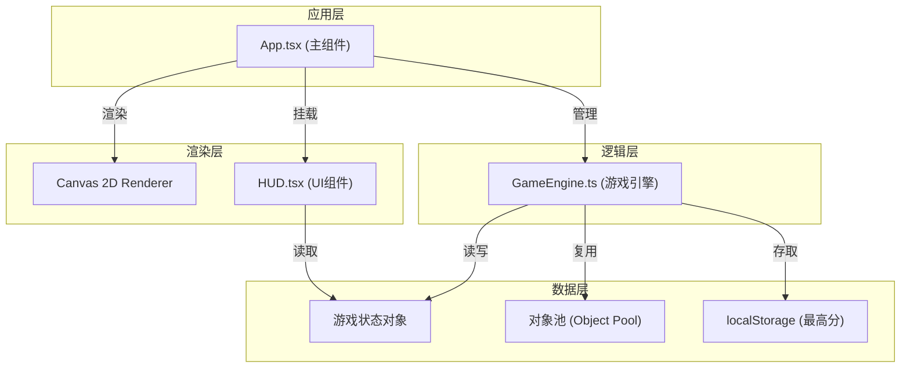

## 1. 架构设计



## 2. 技术描述

- **前端框架**：React 18 + TypeScript
- **构建工具**：Vite + @vitejs/plugin-react
- **渲染引擎**：HTML5 Canvas 2D API
- **状态管理**：React useState + useRef（游戏循环内使用ref避免重渲染）
- **数据持久化**：localStorage 存储最高分
- **动画驱动**：requestAnimationFrame（60FPS）

## 3. 项目文件结构

```
├── package.json
├── index.html
├── vite.config.js
├── tsconfig.json
└── src/
    ├── App.tsx          # 主组件，Canvas初始化，游戏循环协调
    ├── GameEngine.ts    # 核心游戏逻辑引擎
    └── HUD.tsx          # 平视显示器UI组件
```

## 4. 核心模块设计

### 4.1 GameEngine 类

```typescript
class GameEngine {
  // 游戏状态
  state: GameState;
  
  // 玩家
  player: Player;
  
  // 赛道段对象池
  trackSegments: TrackSegment[];
  segmentPool: TrackSegment[];
  
  // 障碍物对象池
  obstacles: Obstacle[];
  obstaclePool: Obstacle[];
  
  // 晶体对象池
  crystals: Crystal[];
  crystalPool: Crystal[];
  
  // 粒子效果
  particles: Particle[];
  
  // 方法
  init(): void;
  update(deltaTime: number): void;
  render(ctx: CanvasRenderingContext2D): void;
  handleInput(x: number): void;
  checkCollisions(): void;
  spawnTrackSegment(): void;
  spawnObstacle(): void;
  spawnCrystal(): void;
  triggerSpeedBurst(): void;
  gameOver(): void;
  reset(): void;
}
```

### 4.2 核心数据结构

```typescript
interface Vector2 { x: number; y: number; }

interface Player {
  x: number;
  targetX: number;
  y: number;
  width: number;
  height: number;
  speed: number;
  smoothTime: number; // 0.1s
}

interface TrackSegment {
  y: number;
  height: number;
  width: number;
  color: string;
  active: boolean;
}

interface Obstacle {
  x: number;
  y: number;
  size: number; // 20px
  active: boolean;
}

interface Crystal {
  x: number;
  y: number;
  size: number; // 12px
  rotation: number;
  active: boolean;
}

interface Particle {
  x: number;
  y: number;
  vx: number;
  vy: number;
  life: number;
  maxLife: number;
  color: string;
  size: number;
}

interface GameState {
  score: number;
  highScore: number;
  speed: number;
  baseSpeed: number;
  energy: number;
  maxEnergy: number;
  comboCount: number;
  isSpeedBurst: boolean;
  speedBurstTimer: number;
  isGameOver: boolean;
  gameOverFlashTimer: number;
  difficulty: number;
}
```

## 5. 性能优化策略

### 5.1 对象池模式
- 赛道段、障碍物、晶体、粒子均使用对象池复用
- 避免频繁创建和销毁对象，减少GC压力

### 5.2 碰撞检测优化
- 采用AABB（轴对齐包围盒）算法
- 仅检测屏幕可见范围内的对象
- 按Y坐标排序后提前终止检测

### 5.3 渲染优化
- 离屏Canvas缓存静态元素
- 批量绘制同类型元素
- 只更新视口范围内的对象

### 5.4 游戏循环
- 使用 requestAnimationFrame 驱动
- deltaTime 时间步长，确保不同设备速度一致
- 固定逻辑更新率，渲染与逻辑分离

## 6. 输入处理

- **鼠标控制**：mousemove 事件，读取 clientX
- **触摸控制**：touchmove 事件，读取 touches[0].clientX
- **平滑跟随**：使用线性插值（lerp）实现0.1秒平滑过渡
- **坐标映射**：将屏幕坐标映射到游戏世界坐标
