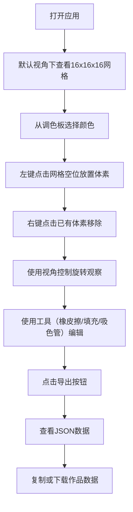

## 1. 产品概述

立体像素雕塑家是一款基于Web的3D体素艺术创作工具，用户可以在三维网格空间中通过放置和移除彩色立方体体素，自由搭建出立体像素艺术作品。

- 核心价值：让用户以直观的方式在浏览器中创作3D像素艺术，降低3D建模门槛
- 目标用户：像素艺术爱好者、创意设计师、游戏开发者、教育场景用户

## 2. 核心功能

### 2.1 用户角色

| 角色 | 注册方式 | 核心权限 |
|------|----------|----------|
| 普通用户 | 无需注册，直接使用 | 创作、保存、导出体素作品 |

### 2.2 功能模块

1. **3D场景编辑器**：16x16x16网格空间，体素放置/移除/预览
2. **调色板面板**：12种预设颜色选择、颜色工具（橡皮擦、填充、吸色管、清空）
3. **视角控制**：旋转视角、复位视角
4. **导出功能**：JSON格式导出、复制、下载
5. **响应式布局**：宽屏左右布局、窄屏底部抽屉

### 2.3 页面详情

| 页面名称 | 模块名称 | 功能描述 |
|----------|----------|----------|
| 主编辑页 | 3D场景区 | 16x16x16网格，体素放置移除，鼠标悬停预览，InstancedMesh优化 |
| 主编辑页 | 调色板面板 | 12色渐变调色板、4个工具按钮、工具状态切换 |
| 主编辑页 | 视角控制区 | 上下左右旋转按钮、复位按钮、平滑过渡动画 |
| 主编辑页 | 导出按钮 | 打开导出模态框 |
| 主编辑页 | 导出模态框 | 展示JSON数据、一键复制、下载文件 |

## 3. 核心流程

### 3.1 主要用户流程

用户打开应用 → 选择颜色 → 点击网格放置体素 → 右键移除体素 → 调整视角观察 → 使用工具编辑 → 导出作品

## 4. 用户界面设计

### 4.1 设计风格

- **主题**：深色科技风，突出3D创作场景
- **主背景色**：#0F172A
- **卡片/面板色**：#1E293B
- **文字主色**：#E2E8F0
- **标题色**：#F8FAFC（加粗）
- **主色调**：蓝色 #3B82F6、绿色 #10B981、橙色 #F59E0B
- **网格线**：#374151，透明度0.3
- **圆角**：面板12-16px，按钮8-50%
- **动效**：0.15-0.4s过渡动画，ease-out缓动
- **字体**：现代无衬线字体，清晰可读

### 4.2 页面设计概览

| 页面名称 | 模块名称 | UI元素 |
|----------|----------|--------|
| 主编辑页 | 3D场景区 | 三维网格、彩色体素、半透明预览方块、弹性缩放动画 |
| 主编辑页 | 调色板面板 | 高度320px、背景#1E293B、圆角12px、12色色块(48x32px、圆角6px)、4个工具按钮(100x40px、圆角8px) |
| 主编辑页 | 视角控制区 | 5个圆形按钮(40x40px)、十字形排列、悬停反馈 |
| 主编辑页 | 导出按钮 | 120x44px、绿色背景、圆角8px、悬停变色 |
| 主编辑页 | 导出模态框 | 宽480px、背景#1E293B、圆角16px、从顶部滑入动画、复制/下载按钮 |

### 4.3 响应式

- **设计策略**：桌面端优先，移动端适配
- **宽屏布局**：场景占左侧85%，右侧面板占15%
- **窄屏布局**：右侧面板收为底部可滑动抽屉（高度250px、圆角12px、上滑动画0.35s）
- **触控优化**：按钮尺寸适配触控操作

### 4.4 3D场景指引

- **环境**：深色背景，营造科技感创作氛围
- **光照**：环境光 + 方向光，确保体素颜色准确呈现，有立体感
- **相机**：默认位置(25,20,25)看向原点，透视相机
- **视角控制**：绕Y轴左右旋转各15度，绕X轴上下旋转各10度，0.4s ease-out过渡
- **网格**：16x16x16三维网格，线框显示，半透明
- **体素**：尺寸0.95单位（防止重叠闪烁），放置/移除时0.15s弹性缩放动画（0.7倍→1.0倍）
- **性能优化**：使用InstancedMesh渲染体素，确保帧率≥30fps，操作响应<50ms
- **交互**：鼠标悬停显示半透明预览方块（透明度0.4），左键放置，右键移除
