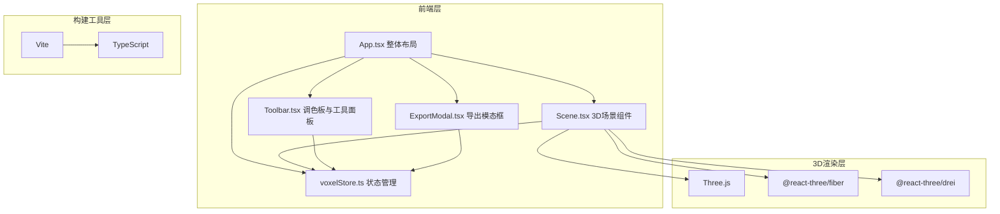

## 1. 架构设计



## 2. 技术描述

- **前端框架**：React 18 + TypeScript
- **3D引擎**：Three.js + @react-three/fiber + @react-three/drei
- **状态管理**：Zustand
- **构建工具**：Vite
- **样式方案**：内联样式 + CSS变量（深色主题）
- **图标方案**：Lucide React

## 3. 项目文件结构

| 文件路径 | 用途 |
|----------|------|
| `package.json` | 项目依赖和脚本配置 |
| `index.html` | 入口HTML文件 |
| `vite.config.js` | Vite构建配置 |
| `tsconfig.json` | TypeScript配置（严格模式） |
| `src/App.tsx` | 主应用组件，整体布局与UI组件组织 |
| `src/Scene.tsx` | Three.js场景组件，渲染3D网格、体素和交互处理 |
| `src/Toolbar.tsx` | 调色板与工具面板UI组件 |
| `src/ExportModal.tsx` | 导出模态框组件 |
| `src/voxelStore.ts` | 体素数据状态管理（Zustand） |

## 4. 数据模型

### 4.1 体素数据结构

```typescript
interface Voxel {
  x: number;
  y: number;
  z: number;
  color: string;
}

type ToolType = 'brush' | 'eraser' | 'fill' | 'eyedropper';

interface VoxelState {
  voxels: Voxel[];
  currentColor: string;
  currentTool: ToolType;
  addVoxel: (x: number, y: number, z: number) => void;
  removeVoxel: (x: number, y: number, z: number) => void;
  setColor: (color: string) => void;
  setTool: (tool: ToolType) => void;
  clearAll: () => void;
  fillVoxels: (x: number, y: number, z: number, color: string) => void;
  exportData: () => string;
}
```

### 4.2 预设颜色数组

12种从暖色到冷色渐变排列的预设颜色：
```typescript
const PRESET_COLORS = [
  '#EF4444', // 红
  '#F97316', // 橙红
  '#F59E0B', // 橙
  '#EAB308', // 黄
  '#84CC16', // 黄绿
  '#22C55E', // 绿
  '#10B981', // 青绿
  '#06B6D4', // 青
  '#3B82F6', // 蓝
  '#6366F1', // 靛蓝
  '#8B5CF6', // 紫
  '#EC4899', // 粉
];
```

## 5. 核心实现方案

### 5.1 3D场景性能优化

- 使用 `InstancedMesh` 批量渲染体素，减少draw call
- 体素数据通过Map存储，O(1)时间复杂度查询
- 射线检测优化：只检测网格平面和已有体素

### 5.2 交互处理

- 使用 `@react-three/drei` 的 `Hover` 和 raycaster 处理鼠标交互
- 网格空位检测：通过射线与网格平面求交计算坐标
- 体素移除检测：通过射线与InstancedMesh求交获取实例ID

### 5.3 动画实现

- 放置/移除动画：0.15s弹性缩放（scale 0.7 → 1.0）
- 视角切换动画：0.4s ease-out过渡
- 模态框动画：0.3s从顶部滑入
- 抽屉动画：0.35s上滑

### 5.4 响应式布局

- 使用CSS媒体查询检测视口宽度
- 宽屏（>1024px）：左右布局，场景85% + 面板15%
- 窄屏（≤1024px）：上下布局，底部抽屉可滑动

## 6. 性能指标

| 指标 | 目标值 |
|------|--------|
| 稳定帧率 | ≥ 30fps |
| 放置/移除响应时间 | < 50ms |
| 最大体素数量 | 4096 (16×16×16) |
| 初始加载时间 | < 2s |
