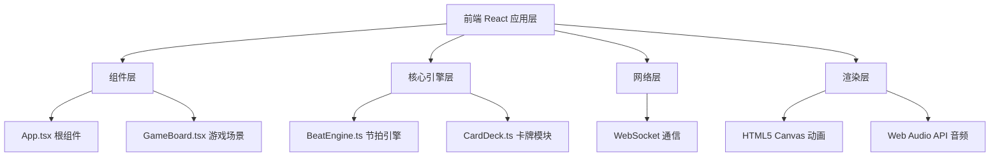

## 1. 架构设计



## 2. 技术栈

- **前端框架**：React 18 + TypeScript
- **构建工具**：Vite
- **路由**：React Router DOM
- **网络通信**：原生 WebSocket
- **音频处理**：Web Audio API
- **动画渲染**：HTML5 Canvas
- **样式**：CSS Modules / Tailwind CSS（可选）

## 3. 依赖包

| 包名 | 版本 | 用途 |
|------|------|------|
| react | ^18.2.0 | UI框架 |
| react-dom | ^18.2.0 | DOM渲染 |
| react-router-dom | ^6.20.0 | 路由管理 |
| typescript | ^5.3.0 | 类型系统 |
| vite | ^5.0.0 | 构建工具 |
| @vitejs/plugin-react | ^4.2.0 | Vite React插件 |
| websocket | ^1.0.0 | WebSocket polyfill |

## 4. 目录结构

```
├── package.json
├── index.html
├── vite.config.js
├── tsconfig.json
├── src/
│   ├── App.tsx
│   ├── GameBoard.tsx
│   ├── BeatEngine.ts
│   ├── CardDeck.ts
│   └── main.tsx
```

## 5. 核心模块定义

### 5.1 BeatEngine 节拍引擎

```typescript
interface BeatTime {
  timestamp: number;
  index: number;
  bpm: number;
}

class BeatEngine {
  constructor(bpm: number, beatsPerBar: number, bars: number);
  start(): void;
  stop(): void;
  getCurrentBeat(): BeatTime | null;
  isInBeatWindow(timestamp: number): boolean;
  onBeat(callback: (beat: BeatTime) => void): () => void;
  getBeatTimes(): BeatTime[];
}
```

### 5.2 CardDeck 卡牌模块

```typescript
interface Card {
  id: string;
  name: string;
  attack: number;
  defense: number;
  soundUrl: string;
  bpmOffset: number;
}

interface CardDeck {
  cards: Card[];
  shuffle(): void;
  drawCard(): Card | null;
  isHitBeat(cardPlayTime: number, beatTimes: BeatTime[]): boolean;
  calculateDamage(card: Card, isHit: boolean): number;
}
```

### 5.3 游戏状态类型

```typescript
interface PlayerState {
  id: string;
  health: number;
  maxHealth: number;
  hand: Card[];
  field: Card[];
}

interface GameState {
  players: PlayerState[];
  currentPlayer: string;
  isGameOver: boolean;
  winner: string | null;
}
```

## 6. 性能优化策略

- 使用 requestAnimationFrame 驱动动画循环
- Canvas 分层渲染（背景层、动画层、UI层
- 粒子对象池复用
- WebSocket 消息队列优化
- 音频资源预加载
