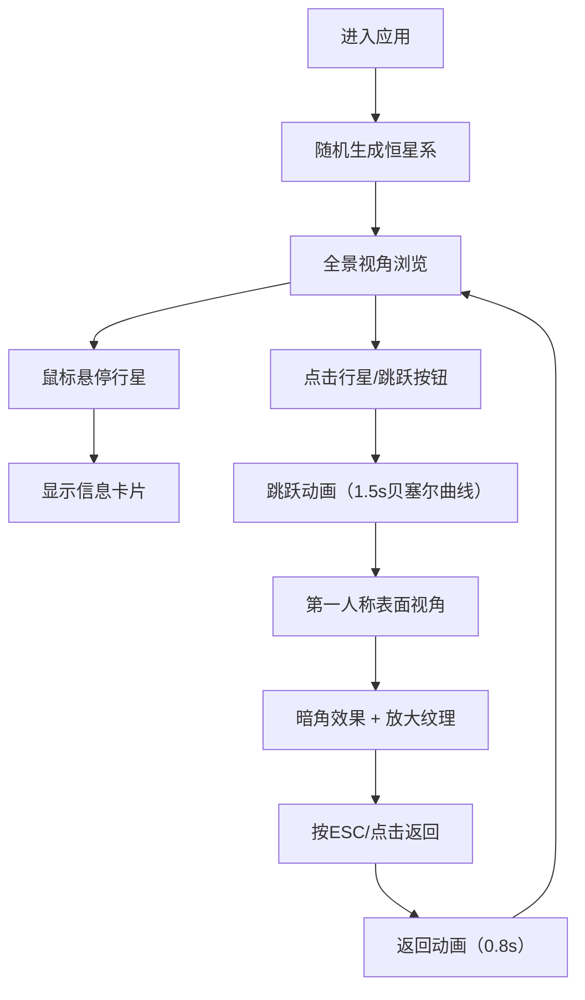

## 1. 产品概述

星图穿越者是一款沉浸式3D恒星系探索应用，让用户在浏览器中体验随机生成的宇宙奇观，近距离观察行星的壮丽景象。

- 核心价值：通过交互式3D可视化，让用户直观感受恒星系的运行规律，享受太空探索的沉浸感
- 目标用户：天文爱好者、游戏玩家、教育工作者、科技爱好者
- 市场定位：轻量级Web端3D互动体验应用，无需下载即可体验太空探索乐趣

## 2. 核心功能

### 2.1 用户角色

| 角色 | 注册方式 | 核心权限 |
|------|----------|----------|
| 访客用户 | 无需注册 | 完整探索恒星系、跳跃行星、视角控制 |

### 2.2 功能模块

1. **主场景模块**：3D恒星系渲染、中央恒星、行星轨道、背景星空
2. **行星系统模块**：随机行星生成、公转动画、表面纹理、信息标签
3. **交互控制模块**：鼠标悬停交互、点击跳跃、视角动画、ESC返回
4. **UI控制面板模块**：行星列表、跳跃按钮、重置按钮、信息卡片

### 2.3 页面详情

| 页面名称 | 模块名称 | 功能描述 |
|----------|----------|----------|
| 主探索页面 | 3D场景渲染 | 实时渲染恒星、行星、轨道、星空背景，60FPS流畅运行 |
| 主探索页面 | 行星系统 | 随机生成5-9颗行星，各有独立轨道、大小、颜色、纹理 |
| 主探索页面 | 交互动画 | 悬停放大高亮、点击跳跃动画、贝塞尔曲线缓动 |
| 主探索页面 | 控制面板 | 行星列表导航、一键跳跃、视角重置、信息展示 |

## 3. 核心流程

用户进入应用后，系统自动生成随机恒星系。用户可以通过鼠标悬停查看行星信息，点击行星或使用控制面板跳跃到行星表面，以第一人称视角近距离观察。按ESC或点击返回按钮回到全景视角。

## 4. 用户界面设计

### 4.1 设计风格

- **主色调**：深空蓝 #0F172A（背景）、石板灰 #1E293B（面板）、亮蓝 #3B82F6（主按钮）
- **行星色板**：8种预设色（#3B82F6, #10B981, #F59E0B, #EF4444, #8B5CF6, #EC4899, #06B6D4, #84CC16）
- **按钮风格**：圆角6px，高度36px，蓝色主按钮 + 灰色次按钮
- **字体**：现代无衬线字体，清晰易读，14px信息标签，标题加粗
- **布局风格**：全屏沉浸式3D场景，左下角悬浮控制面板，无传统导航栏
- **视觉特效**：恒星光晕、行星发光边缘、暗角遮罩、平滑过渡动画

### 4.2 页面设计概述

| 页面名称 | 模块名称 | UI元素 |
|----------|----------|--------|
| 主探索页面 | 3D场景 | 中央发光恒星、公转行星、半透明轨道线、200颗背景星粒 |
| 主探索页面 | 行星交互 | 悬停放大1.2倍、发光边缘高亮、跟随鼠标信息卡片 |
| 主探索页面 | 控制面板 | 280px宽面板，行星列表（色点+名称），底部双按钮，0.3s透明度过渡 |
| 主探索页面 | 表面视角 | 放大的行星纹理细节、全屏暗角径向渐变遮罩 |

### 4.3 响应式设计

- 桌面端优先，全屏沉浸式体验
- 控制面板固定定位，自适应窗口大小
- 3D场景自动适配视口尺寸，保持正确比例
- 触摸设备支持基础点击交互

### 4.4 3D场景指导

- **环境氛围**：深空黑色背景，营造宇宙空间感，无HDRI环境贴图
- **光照设置**：点光源（恒星位置，强度2.0）+ 环境光（强度0.15，基础照明）
- **摄像机设置**：PerspectiveCamera，fov 60，初始位置(0, 8, 12)，看向原点
- **构图焦点**：中央恒星为视觉中心，行星轨道呈同心圆分布，层次分明
- **交互动画**：悬停缩放过渡（0.2s），跳跃动画（1.5s三次贝塞尔缓动），返回动画（0.8s）
- **后期效果**：行星表面视角时添加暗角遮罩，增强沉浸感
- **性能优化**：256x256 Canvas生成纹理，BufferGeometry合并星粒，维持60FPS
