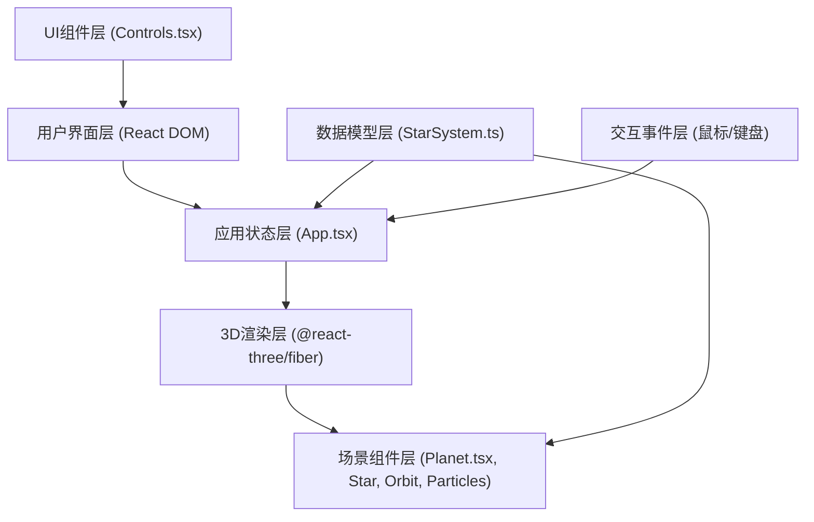

## 1. 架构设计

这是一个纯前端3D交互应用，采用分层架构设计，分离数据模型、3D渲染逻辑和UI交互控制。



## 2. 技术描述

- **前端框架**: React 18 + TypeScript 5
- **构建工具**: Vite 5 + @vitejs/plugin-react 4
- **3D引擎**: Three.js 0.160 + @react-three/fiber 8 + @react-three/drei 9
- **状态管理**: React useState/useRef 本地状态，无需全局状态管理库
- **动画系统**: 自定义requestAnimationFrame动画循环 + 三次贝塞尔曲线缓动
- **纹理生成**: Canvas 2D API 动态生成256x256行星纹理
- **性能优化**: BufferGeometry合并粒子、InstancedMesh、Frustum Culling

## 3. 目录结构

```
d:\Pro\tasks\auto255\
├── .trae\documents\
│   ├── prd.md
│   └── tech-arch.md
├── src\
│   ├── App.tsx          # 主应用组件，场景调度中心
│   ├── StarSystem.ts    # 恒星系数据模型与生成算法
│   ├── Planet.tsx       # 行星3D组件
│   └── Controls.tsx     # UI控制面板组件
├── index.html           # 入口HTML
├── vite.config.js       # Vite配置
├── tsconfig.json        # TypeScript配置
└── package.json         # 项目依赖
```

## 4. 核心数据模型 (StarSystem.ts)

### 4.1 接口定义

```typescript
interface PlanetData {
  id: number;
  name: string;
  orbitRadius: number;      // 2-8单位
  orbitSpeed: number;       // 与轨道半径负相关
  radius: number;           // 0.3-0.8单位
  color: string;            // 8种预设色之一
  textureType: 'noise' | 'stripes';
  seed: number;             // 纹理生成种子
  orbitPeriod: number;      // 公转周期（地球日）
}

interface StarSystemData {
  star: {
    radius: number;         // 0.8单位
    color: string;          // #FDE047
    glowRadius: number;     // 3单位
  };
  planets: PlanetData[];    // 5-9颗行星
}
```

### 4.2 生成算法

1. 行星数量：`Math.floor(Math.random() * 5) + 5` (5-9)
2. 轨道半径：按升序排列，间隔随机，范围2-8单位
3. 公转速度：`0.5 + (8 - orbitRadius) * 0.15` (近快远慢)
4. 公转周期：基于轨道半径和开普勒第三定律计算
5. 颜色：从预设色板随机选取，避免相邻行星同色
6. 纹理类型：随机选择噪点或条纹

## 5. 核心组件说明

### 5.1 App.tsx - 主应用组件

**职责**：
- 初始化Three.js场景、摄像机、光源
- 生成恒星系数据
- 管理当前选中行星、跳跃状态
- 调度跳跃动画（三次贝塞尔曲线缓动）
- 监听ESC键返回全景
- 渲染3D场景和UI控制面板

**关键状态**：
- `starSystem: StarSystemData` - 恒星系数据
- `selectedPlanetId: number | null` - 当前选中行星
- `isOnSurface: boolean` - 是否在行星表面视角
- `cameraPosition: THREE.Vector3` - 摄像机当前位置
- `cameraTarget: THREE.Vector3` - 摄像机看向目标

### 5.2 Planet.tsx - 行星3D组件

**Props**：
- `data: PlanetData` - 行星数据
- `isSelected: boolean` - 是否被选中
- `onHover: (id: number | null) => void` - 悬停回调
- `onClick: (id: number) => void` - 点击回调

**功能**：
- 动态生成256x256 Canvas纹理（噪点/条纹）
- 公转运动（useFrame动画循环）
- 悬停效果：缩放1.2倍 + 发光边缘
- 点击触发跳跃
- 悬浮名称标签（始终面向摄像机）
- 轨道线渲染

### 5.3 Controls.tsx - UI控制面板

**Props**：
- `planets: PlanetData[]` - 行星列表
- `selectedPlanetId: number | null` - 选中行星
- `isOnSurface: boolean` - 是否在表面
- `onSelectPlanet: (id: number) => void` - 选择行星
- `onJump: () => void` - 跳跃
- `onReset: () => void` - 重置视角

**UI元素**：
- 固定定位左下角，280px宽度
- 行星列表（色点+名称）
- 跳跃按钮（蓝色#3B82F6）
- 重置/返回按钮（灰色#475569）
- 鼠标悬停时透明度0.9→1.0过渡

## 6. 关键技术实现

### 6.1 跳跃动画（三次贝塞尔曲线）

```typescript
// 缓动函数：三次贝塞尔曲线 cubic-bezier(0.34, 1.56, 0.64, 1)
function bezierEase(t: number): number {
  const cp1 = 0.34, cp2 = 1.56, cp3 = 0.64, cp4 = 1;
  return 3 * cp1 * t * (1 - t) ** 2 + 
         3 * cp2 * t ** 2 * (1 - t) + 
         cp3 * t ** 3;
}
```

### 6.2 Canvas纹理生成

```typescript
function generatePlanetTexture(
  color: string, 
  type: 'noise' | 'stripes', 
  seed: number
): THREE.CanvasTexture {
  const canvas = document.createElement('canvas');
  canvas.width = 256;
  canvas.height = 256;
  const ctx = canvas.getContext('2d')!;
  
  // 基础颜色填充
  ctx.fillStyle = color;
  ctx.fillRect(0, 0, 256, 256);
  
  // 根据类型添加噪点或条纹
  // 使用seed确保一致性
  return new THREE.CanvasTexture(canvas);
}
```

### 6.3 背景星粒（BufferGeometry）

```typescript
function StarParticles() {
  const count = 200;
  const positions = new Float32Array(count * 3);
  const colors = new Float32Array(count * 3);
  const sizes = new Float32Array(count);
  
  // 在半径15的球壳内随机分布
  for (let i = 0; i < count; i++) {
    const r = 15 * Math.cbrt(Math.random());
    const theta = Math.random() * Math.PI * 2;
    const phi = Math.acos(2 * Math.random() - 1);
    positions[i * 3] = r * Math.sin(phi) * Math.cos(theta);
    positions[i * 3 + 1] = r * Math.sin(phi) * Math.sin(theta);
    positions[i * 3 + 2] = r * Math.cos(phi);
    sizes[i] = 0.02 + Math.random() * 0.06;
  }
  
  return <points geometry={geometry} material={material} />;
}
```

### 6.4 暗角效果

使用CSS径向渐变实现表面视角的暗角遮罩：

```css
.vignette-overlay {
  position: fixed;
  top: 0;
  left: 0;
  width: 100%;
  height: 100%;
  pointer-events: none;
  background: radial-gradient(
    ellipse at center,
    transparent 0%,
    transparent 50%,
    rgba(0, 0, 0, 0.7) 100%
  );
  opacity: 0;
  transition: opacity 0.5s ease;
}

.vignette-overlay.active {
  opacity: 1;
}
```

## 7. 性能优化策略

1. **纹理优化**：所有行星纹理使用256x256 Canvas动态生成，无需网络请求
2. **几何体优化**：背景星粒合并为单个BufferGeometry，减少draw call
3. **动画优化**：使用@react-three/fiber的useFrame钩子，共享RAF循环
4. **材质复用**：相同类型材质共享实例
5. **视锥体剔除**：Three.js自动启用，不可见物体不渲染
6. **事件节流**：鼠标移动事件使用requestAnimationFrame节流
7. **性能监控**：开发环境可开启Stats.js监控FPS

## 8. 依赖版本锁定

```json
{
  "react": "^18.2.0",
  "react-dom": "^18.2.0",
  "three": "^0.160.0",
  "@react-three/fiber": "^8.15.12",
  "@react-three/drei": "^9.92.7",
  "typescript": "^5.3.3",
  "vite": "^5.0.10",
  "@vitejs/plugin-react": "^4.2.1"
}
```
