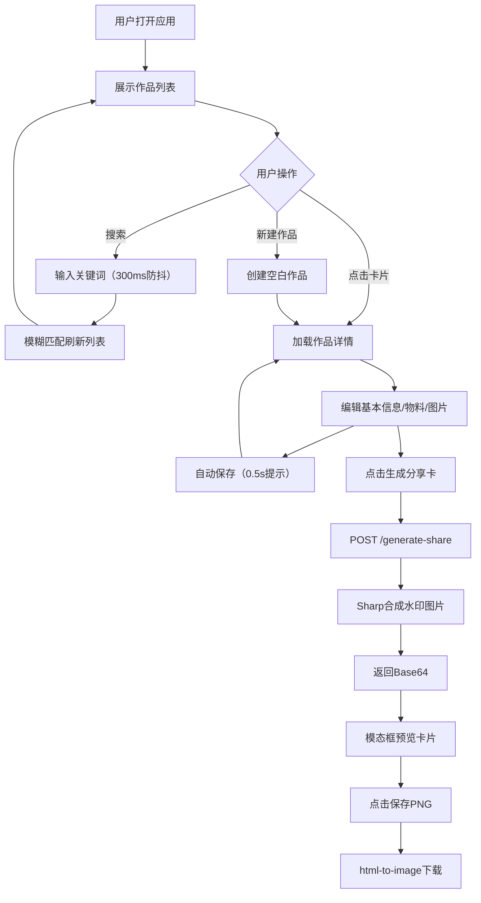

## 1. 产品概述

艺匠工坊是一款专为独立手工艺人和小型工作室打造的作品管理Web应用，解决作品目录管理、物料成本核算、品牌分享图制作的痛点问题。通过一站式的数字化工具，帮助手艺人高效管理作品集、精准计算成本利润、快速生成精美分享卡片，提升运营效率与品牌专业度。

- 核心目标用户：独立手工艺创作者、小型手作工作室主理人
- 产品价值：降低手艺人的数字化管理门槛，从成本核算到品牌输出形成完整闭环

## 2. 核心功能

### 2.1 用户角色
| 角色 | 注册方式 | 核心权限 |
|------|----------|----------|
| 创作者用户 | 无需注册，本地使用 | 作品CRUD、物料管理、图片上传、分享卡片生成 |

### 2.2 功能模块
1. **作品清单管理**：作品卡片列表展示、详情编辑、搜索筛选、自动保存
2. **物料成本核算**：物料条目增删、实时成本计算、利润可视化
3. **多图上传与排序**：拖拽上传、缩略图网格、拖拽排序、最多9张
4. **分享卡片生成**：品牌水印、一键生成、预览模态框、PNG导出
5. **数据持久化**：内存Map存储、时间戳记录、唯一ID、模糊搜索

### 2.3 页面详情
| 页面名称 | 模块名称 | 功能描述 |
|-----------|-------------|---------------------|
| 主工作区 | 顶部导航栏 | 品牌标识、搜索框（300ms防抖）、操作按钮区 |
| 主工作区 | 作品列表面板 | 卡片网格（280x360px）、悬停上移效果、点击进入详情 |
| 主工作区 | 详情编辑面板 | 作品基本信息表单、物料成本区、图片上传区、生成分享卡按钮 |
| 详情编辑页 | 物料列表区 | 物料条目增删、单价/用量/单位录入、实时总成本显示 |
| 详情编辑页 | 图片上传区 | react-dropzone拖拽区、2x2/3x3网格、拖拽排序 |
| 分享卡片模态框 | 卡片预览区 | 主图展示、品牌Logo、定价材质尺寸、渐变背景 |
| 分享卡片模态框 | 操作区 | 微调排列、保存为PNG按钮 |

## 3. 核心流程

用户打开应用后，默认展示作品列表视图。用户可通过顶部搜索框模糊搜索作品，或点击"新建作品"按钮创建新作品。点击作品卡片后，右侧详情面板展示作品信息，用户可编辑基本信息、管理物料清单、上传作品图片。编辑内容自动保存（0.5s成功提示）。点击"生成分享卡"后，向后端发送请求，Sharp合成带水印图片，前端模态框展示预览，用户确认后下载PNG文件。

## 4. 用户界面设计

### 4.1 设计风格
- **主色调**：深色背景#0F172A，卡片背景#1E293B，强调色#8B5CF6（紫罗兰）
- **辅助色**：成功#10B981（翠绿），错误#EF4444（赤红），边框#475569
- **文字颜色**：主色#F1F5F9（近白），次要#94A3B8
- **字体**：数字使用monospace字体，正文使用现代无衬线字体
- **按钮风格**：圆角8px，强调色填充，点击缩放0.95（0.2s过渡）
- **输入框风格**：圆角8px，背景#334155，聚焦边框#8B5CF6（0.3s过渡）
- **卡片风格**：圆角12px，悬停上移4px+阴影加深（0.3s）
- **视觉特效**：顶部导航栏毛玻璃backdrop-filter: blur(8px)，半透明rgba(15,23,42,0.85)

### 4.2 页面设计概述
| 页面名称 | 模块名称 | UI元素 |
|-----------|-------------|-------------|
| 主工作区 | 整体布局 | 左右分栏（35%/65%），可拖拽分隔线；<768px切换上下布局（40%/60%） |
| 主工作区 | 作品卡片 | 280x360px，#1E293B背景，圆角12px，顶部主图缩略图，底部名称+售价 |
| 主工作区 | 成本显示 | monospace字体，24px，#10B981绿色 |
| 分享卡片模态框 | 遮罩层 | 半透明黑色，点击关闭 |
| 分享卡片模态框 | 卡片容器 | 居中，0.3s缩放动画（0.8→1.0） |
| 分享卡片模态框 | 卡片内容 | 中央主图，左上角"艺匠工坊"Logo，右下角定价/材质/尺寸，#1E293B→#334155渐变背景 |

### 4.3 响应式设计
- 桌面端（≥768px）：左右分栏布局，列表35%/详情65%，拖拽调整分隔线
- 平板/手机端（<768px）：上下堆叠布局，列表40%/详情60%
- 触控优化：增大可点击区域（≥44px），禁用悬停效果改用触控反馈
- 滚动性能：列表虚拟化，50+卡片时保持≥45fps

### 4.4 动效规范
- 列表卡片：hover上移4px + 阴影加深，0.3s ease
- 按钮点击：scale(0.95)，0.2s ease
- 输入框聚焦：边框变色+外发光，0.3s ease
- 提示消息（Toast）：0.3s淡入淡出
- 模态框进入：scale(0.8→1.0) + opacity(0→1)，0.3s cubic-bezier(0.16,1,0.3,1)
- 拖拽上传：边框虚线#475569 → 实线#3B82F6 + 背景#1E3A5F
