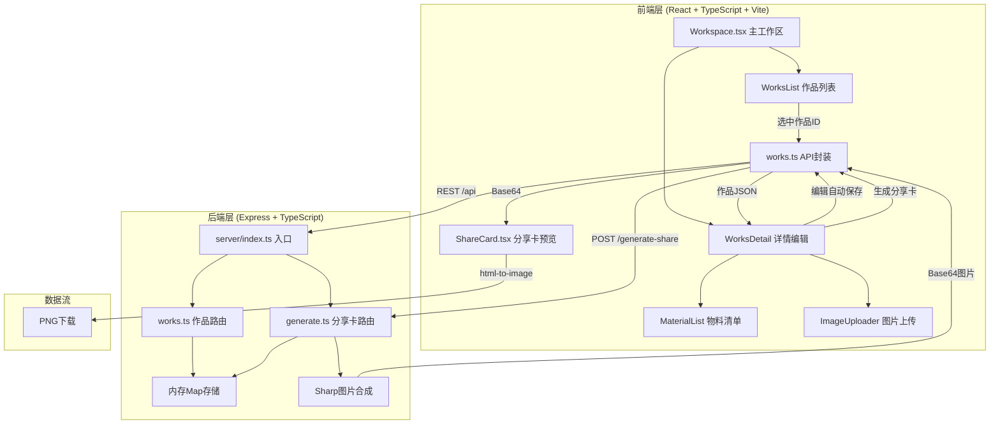
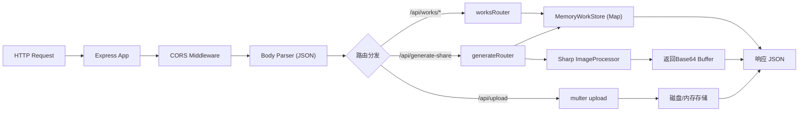
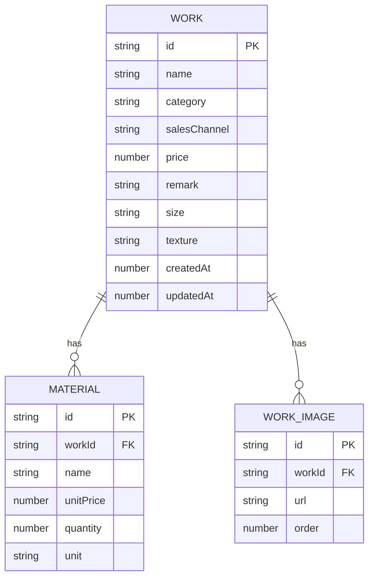

## 1. 架构设计



## 2. 技术描述

### 2.1 前端技术栈
- **框架**：React@18 + TypeScript@5（严格模式）
- **构建工具**：Vite@5 + @vitejs/plugin-react
- **路由**：react-router-dom@6
- **HTTP客户端**：axios@1
- **文件上传**：react-dropzone@14
- **图片导出**：html-to-image@1
- **状态管理**：React useState/useEffect（轻量场景，无需zustand）

### 2.2 后端技术栈
- **框架**：Express@4 + TypeScript@5（ESM格式）
- **中间件**：cors@2、multer@1（文件上传）
- **图片处理**：sharp@0.33
- **工具**：uuid@9（唯一ID生成）

### 2.3 初始化方式
- 使用 `vite-init` 的 `react-express-ts` 模板创建基础工程
- 手动补充用户指定的依赖包版本
- 前后端统一TypeScript严格模式

## 3. 目录结构与文件职责

```
auto257/
├── package.json              # 统一依赖与启动脚本 npm run dev
├── index.html                # Vite入口，全屏#0F172A
├── vite.config.js            # Vite构建配置，代理/api→localhost:3001
├── tsconfig.json             # TS严格模式
├── src/
│   ├── main.tsx              # React挂载入口
│   ├── App.tsx               # 根组件，路由布局
│   ├── components/
│   │   ├── Workspace.tsx     # 主工作区，左右分栏+拖拽分隔线
│   │   ├── WorksList.tsx     # 作品卡片列表+搜索
│   │   ├── WorksDetail.tsx   # 详情编辑+物料+图片+生成按钮
│   │   ├── MaterialList.tsx  # 物料条目增删+成本计算
│   │   ├── ImageUploader.tsx # react-dropzone拖拽上传+排序
│   │   └── ShareCard.tsx     # 分享卡预览+html-to-image下载
│   └── api/
│       └── works.ts          # axios封装：/works CRUD + /generate-share
└── server/
    ├── index.ts              # Express入口：CORS/JSON/静态资源/挂载路由
    ├── routes/
    │   ├── works.ts          # /works CRUD，操作内存Map
    │   └── generate.ts       # /generate-share，Sharp合成+Base64返回
    └── store/
        └── memoryStore.ts    # 内存Map封装（作品、物料、时间戳）
```

### 文件调用关系
- `Workspace.tsx` → 调用 `works.ts` API，向子组件传递数据与回调
- `WorksDetail.tsx` → 自动保存时调用 `works.ts` 的 update/upsert 接口
- `ShareCard.tsx` → 点击生成时，`Workspace` 调用 `works.ts` 的 generateShareCard
- `server/index.ts` → 挂载 `worksRouter`（路径/api/works）和 `generateRouter`（路径/api/generate-share）
- `server/routes/generate.ts` → 通过内存store查询作品数据，调用Sharp合成

## 4. 路由定义

| 前端路由 | 页面/组件 | 用途 |
|-------|---------|------|
| / | Workspace.tsx | 主工作台（默认路由） |

| 后端API路由 | HTTP方法 | 用途 |
|-------|------|------|
| /api/works | GET | 获取作品列表（支持?keyword=模糊搜索） |
| /api/works/:id | GET | 获取单个作品详情 |
| /api/works | POST | 创建新作品 |
| /api/works/:id | PUT | 更新作品（含物料、图片数组） |
| /api/works/:id | DELETE | 删除作品 |
| /api/generate-share | POST | 生成分享卡，入参{workId, brandSettings}，返回{imageBase64} |
| /api/upload | POST | multer接收图片上传，返回{url, id} |

## 5. API类型定义

```typescript
// ===== 数据模型 =====
interface Material {
  id: string;           // uuid
  name: string;         // 物料名称
  unitPrice: number;    // 单价（元）
  quantity: number;     // 用量
  unit: string;         // 单位（g/个/米等）
}

interface WorkImage {
  id: string;           // uuid
  url: string;          // 图片路径或Base64
  order: number;        // 排序序号
}

interface Work {
  id: string;           // uuid
  name: string;         // 作品名称
  category: string;     // 分类
  salesChannel: string; // 销售渠道
  price: number;        // 售价（元）
  remark: string;       // 备注
  materials: Material[];// 物料清单
  images: WorkImage[];  // 作品图片（最多9张，第1张为主图）
  size?: string;        // 尺寸（可选，用于分享卡）
  texture?: string;     // 材质（可选，用于分享卡）
  createdAt: number;    // 创建时间戳
  updatedAt: number;    // 更新时间戳
}

// ===== 请求/响应 =====
interface GenerateShareRequest {
  workId: string;
  brandSettings?: {
    logoText: string;     // 默认"艺匠工坊"
    gradientFrom: string; // 默认#1E293B
    gradientTo: string;   // 默认#334155
  };
}

interface GenerateShareResponse {
  imageBase64: string;    // data:image/png;base64,...
  width: number;
  height: number;
}

interface ApiResponse<T> {
  code: 0 | number;       // 0成功
  data: T;
  message?: string;
}
```

## 6. 服务器架构



## 7. 数据模型（内存Map）



### 内存Store实现要点
- 使用两个Map：`worksMap: Map<string, Work>`、`imagesMap: Map<string, Buffer>`（可选）
- 每个写入操作自动更新 `updatedAt = Date.now()`
- 模糊搜索：`name.includes(keyword) || category.includes(keyword)` 不区分大小写
- 防抖搜索由前端实现（300ms），后端只做查询

## 8. 性能保障方案

### 8.1 列表滚动性能（≥45fps @ 50+卡片）
- 使用CSS `content-visibility: auto` 或 IntersectionObserver 实现虚拟滚动
- 卡片图片使用懒加载（loading="lazy"）
- 缩略图由后端Sharp生成280px宽度的小图
- 避免在render中进行复杂计算，物料成本用useMemo缓存

### 8.2 分享卡生成（≤2秒）
- 后端Sharp使用stream pipeline，避免完整Bitmap驻留内存
- 默认卡片尺寸800x1000px（平衡清晰度与处理速度）
- 主图尺寸预先缩放至卡片宽度，避免过大素材
- 如前端已通过html-to-image生成，后端仅作为备选/增强路径

## 9. 启动与开发

- **统一启动**：`npm run dev` 使用concurrent同时启动Vite（5173）和Express（3001）
- **代理**：vite.config中配置 `'/api' → 'http://localhost:3001'`
- **热更新**：Vite HMR + ts-node-dev/nodemon 监听server目录
