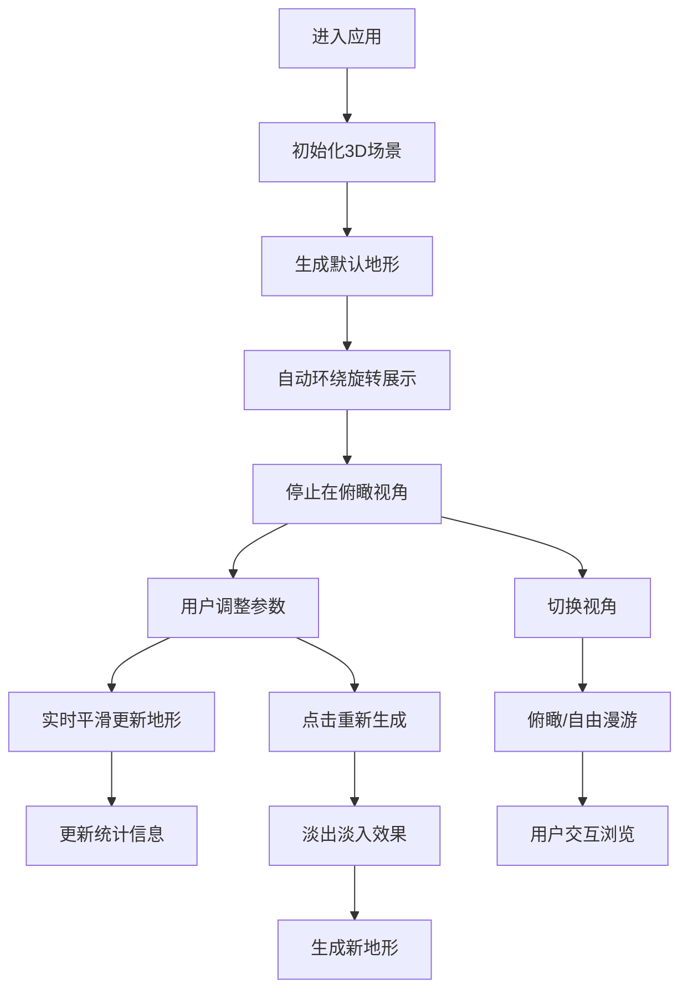

## 1. 产品概述
地形生成沙盒是一款基于WebGL的3D交互应用，用户可通过参数化控制实时生成和调整山脉地形，支持多视角欣赏和自由漫游。

- 面向3D爱好者、游戏设计师和教育用户，提供直观的地形参数化生成体验
- 市场价值：无需专业软件即可在浏览器中快速创建和可视化3D地形，支持实时调整和导出概念

## 2. 核心功能

### 2.1 用户角色
| 角色 | 注册方式 | 核心权限 |
|------|----------|----------|
| 普通用户 | 无需注册 | 使用所有地形生成和浏览功能 |

### 2.2 功能模块
1. **地形场景模块**：60x60单位3D地形渲染，基于Simplex噪声的高度图生成，支持平滑过渡动画
2. **控制面板模块**：参数滑块（高度、平滑度、纹理色调）、视角切换按钮、重新生成按钮
3. **视角系统**：俯瞰视角（固定45度角，滚轮缩放）、自由漫游视角（鼠标拖拽旋转，WASD移动）
4. **统计信息模块**：底部状态栏实时显示地形高度统计数据

### 2.3 页面详情
| 页面名称 | 模块名称 | 功能描述 |
|----------|----------|----------|
| 主页面 | 3D地形场景 | 渲染可交互的3D地形网格，支持视角切换和参数实时更新 |
| 主页面 | 控制面板 | 高度幅度(0.2-2.0)、平滑度(0.1-1.0)、纹理色调滑块，重新生成按钮，视角切换 |
| 主页面 | 底部状态栏 | 实时显示最大高度、最小高度、平均高度、顶点数量 |

## 3. 核心流程
用户进入应用后，默认显示俯瞰视角的初始地形，地形自动环绕旋转一周展示。用户可通过右侧控制面板调整参数，地形实时平滑更新。点击自由漫游按钮可切换到第一人称视角，使用WASD键盘和鼠标进行交互。调整参数后，底部统计数据自动更新。

## 4. 用户界面设计

### 4.1 设计风格
- **主色调**：深蓝色 #0F172A（背景）、#1E293B（面板）、#3B82F6（主按钮）、#334155（悬停）
- **文字颜色**：#94A3B8（次要文字）、#E2E8F0（主要文字）
- **按钮样式**：圆角8-16px，阴影 box-shadow: 0 4px 12px rgba(0,0,0,0.3)，悬停背景色变化0.2s动画，点击缩放0.95倍
- **字体**：等宽字体用于数字统计，系统无衬线字体用于界面文字
- **布局风格**：左侧70%为3D场景，右侧300px悬浮控制面板垂直居中，底部固定统计条

### 4.2 页面设计概述
| 页面名称 | 模块名称 | UI元素 |
|----------|----------|--------|
| 主页面 | 3D场景区域 | 全屏深色背景，60x60单位地形网格，光照效果，渐变纹理 |
| 主页面 | 控制面板 | 圆角12px，内边距16px，滑块带数值显示，按钮带选中状态 |
| 主页面 | 底部状态栏 | 高度40px，半透明背景，等宽字体显示四项统计数据 |

### 4.3 响应式设计
- **桌面端（≥768px）**：左侧70%场景，右侧300px控制面板垂直居中
- **移动端（<768px）**：场景占满全屏，控制面板变为底部抽屉式（高度400px，可滑动收起/展开）
- **触摸优化**：滑块和按钮增大点击区域，支持触摸手势旋转视角

### 4.4 3D场景设计
- **环境**：深色背景#0F172A，无天空盒，突出地形本身
- **光照**：平行光（强度0.8，左上角照射）+ 环境光（强度0.3），启用环境光遮挡（AO强度0.2）
- **相机**：俯瞰视角固定在正上方45度角，距离可调；自由漫游视角支持WASD移动（2单位/秒）
- **动画**：初始化自动环绕旋转一周（5秒），参数更新0.3s平滑过渡，重新生成时0.5s淡出淡入
- **后处理**：轻微环境光遮挡增强地形凹凸感
- **性能**：网格最大256x256顶点（≤65536），参数更新计算≤16ms，帧率≥45FPS
