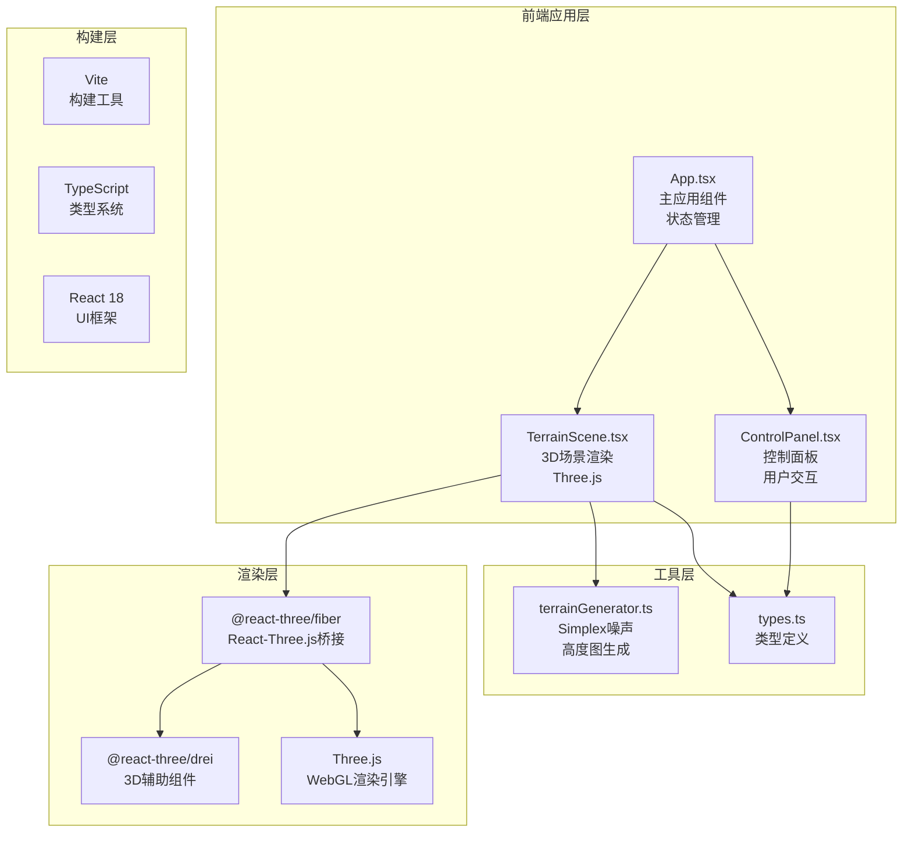

## 1. 架构设计



## 2. 技术栈说明

### 2.1 核心依赖
| 依赖 | 版本 | 用途 |
|------|------|------|
| react | ^18.2.0 | UI框架 |
| react-dom | ^18.2.0 | DOM渲染 |
| three | ^0.160.0 | 3D渲染引擎 |
| @react-three/fiber | ^8.15.0 | React Three.js集成 |
| @react-three/drei | ^9.88.0 | 3D辅助组件库 |
| simplex-noise | ^4.0.1 | Simplex噪声算法 |
| typescript | ^5.3.0 | 类型系统 |
| vite | ^5.0.0 | 构建工具 |
| @vitejs/plugin-react | ^4.2.0 | Vite React插件 |

### 2.2 初始化方式
使用 `npm init vite-init@latest` 创建 React + TypeScript 项目，然后手动添加 Three.js 相关依赖。

## 3. 目录结构

```
auto258/
├── index.html              # 入口HTML
├── package.json            # 依赖配置
├── tsconfig.json           # TypeScript配置
├── vite.config.js          # Vite构建配置
└── src/
    ├── App.tsx             # 主应用组件
    ├── main.tsx            # 应用入口
    ├── index.css           # 全局样式
    ├── scene/
    │   ├── TerrainScene.tsx    # 3D地形场景组件
    │   └── ControlPanel.tsx    # 控制面板组件
    ├── utils/
    │   └── terrainGenerator.ts # 地形生成工具函数
    └── types.ts            # 类型定义
```

## 4. 核心数据类型定义

```typescript
// 视角模式枚举
export enum ViewMode {
  OVERVIEW = 'overview',     // 俯瞰视角
  FREE_ROAM = 'free_roam'    // 自由漫游
}

// 地形参数接口
export interface TerrainParams {
  heightAmplitude: number;   // 高度幅度 0.2-2.0
  smoothness: number;        // 平滑度 0.1-1.0
  textureTone: number;       // 纹理色调 0-1
  seed: number;              // 随机种子
}

// 地形统计数据
export interface TerrainStats {
  maxHeight: number;
  minHeight: number;
  avgHeight: number;
  vertexCount: number;
}

// 颜色渐变配置
export interface ColorGradient {
  lowColor: [number, number, number];   // 低海拔颜色
  highColor: [number, number, number];  // 高海拔颜色
}
```

## 5. 核心模块设计

### 5.1 地形生成模块 (terrainGenerator.ts)
- 使用 `simplex-noise` 库生成2D Simplex噪声
- 根据 `smoothness` 参数调整噪声频率（平滑度越高，频率越低）
- 根据 `heightAmplitude` 参数调整高度幅度
- 返回二维高度图数组 `number[][]`
- 提供 `generateTerrainStats` 函数计算统计数据
- 性能要求：单次生成 ≤ 16ms

### 5.2 地形场景组件 (TerrainScene.tsx)
- 使用 `@react-three/fiber` 的 `Canvas` 组件
- 地形网格使用 `PlaneGeometry`，通过 `BufferGeometry` 动态更新顶点位置
- 使用 `useFrame` 钩子实现平滑过渡动画和初始化旋转
- 使用 `@react-three/drei` 的 `OrbitControls`（俯瞰）和 `FirstPersonControls`（漫游）
- 自定义 `StandardMaterial` 实现基于高度的渐变色纹理
- 使用 `useTransition` 实现高度和颜色的0.3s平滑过渡

### 5.3 控制面板组件 (ControlPanel.tsx)
- 四个滑块：高度幅度、平滑度、纹理色调
- 两个视角切换按钮
- 重新生成按钮
- 所有交互元素带CSS过渡动画
- 使用 `useCallback` 优化性能

### 5.4 主应用组件 (App.tsx)
- 使用 `useState` 管理地形参数、视角模式、统计数据
- 响应式布局：使用CSS媒体查询处理移动端抽屉
- 将参数和回调传递给子组件
- 布局：Flex布局，左侧场景，右侧控制面板

## 6. 性能优化策略

1. **几何体更新优化**：直接修改 `BufferGeometry` 的 `position` 属性，避免重建几何体
2. **噪声计算优化**：使用 TypedArray 存储高度数据，避免频繁GC
3. **材质更新优化**：使用 `onBeforeCompile` 自定义shader实现顶点颜色，避免纹理采样
4. **帧率监控**：使用 `Stats` 组件监控帧率（开发环境）
5. **节流控制**：参数变化使用 `requestAnimationFrame` 节流，避免频繁更新
6. **网格分辨率**：默认使用128x128网格（16384顶点），最大支持256x256（65536顶点）
