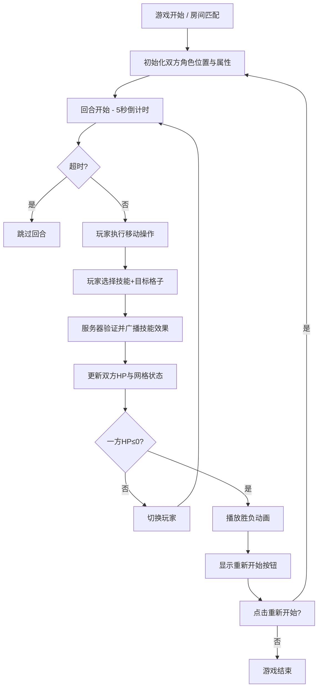

## 1. 产品概述
魔法能量对决是一款双人实时对战的策略游戏，玩家在5x5网格竞技场上通过移动和释放技能进行回合制战斗，旨在解决双人同屏对战缺乏策略深度与视觉反馈不足的问题。
- 主要目标用户：喜欢策略对战游戏的双人玩家，支持本地同屏和在线对战
- 产品价值：提供深度策略体验 + 华丽视觉反馈的魔法战斗游戏

## 2. 核心功能

### 2.1 用户角色
| 角色 | 接入方式 | 核心权限 |
|------|----------|----------|
| 玩家1 | 本地键盘操作 / 在线匹配 | 控制法师角色，移动、释放技能 |
| 玩家2 | 本地键盘操作 / 在线匹配 | 控制法师角色，移动、释放技能 |

### 2.2 功能模块
1. **对战主界面**：5x5网格竞技场、双方法师角色、回合指示器、技能特效渲染
2. **玩家控制面板**：生命值条、技能按钮组（含冷却显示）、操作状态提示
3. **回合控制系统**：5秒操作倒计时、移动+技能释放阶段、超时跳过机制
4. **胜负结算系统**：胜负判定、胜者/败者动画、重新开始按钮
5. **在线对战模块**（后端支撑）：房间匹配、状态同步、Socket实时通信

### 2.3 页面详情
| 页面名称 | 模块名称 | 功能描述 |
|----------|----------|----------|
| 对战主界面 | 5x5网格竞技场 | 每格60x60px，显示角色位置、技能影响、格子状态变色 |
| 对战主界面 | 技能特效系统 | 火球（橙色粒子爆炸，30px半径，0.4s）、冰盾（蓝色六边形扩散，0.6s）、闪电（白色闪电+屏幕闪光，0.3s） |
| 玩家控制面板 | 生命值条 | 宽200px高24px圆角12px，HP渐变颜色（60%+绿/30-60%黄/<30%红），0.3s缓动过渡 |
| 玩家控制面板 | 技能按钮组 | 3个技能按钮80x40px圆角8px，渐变背景蓝，悬停上移2px增强阴影，冷却显示 |
| 对战主界面 | 回合指示器 | 屏幕中央顶部，脉冲动画1.5s周期（透明度1→0.6） |
| 对战主界面 | 胜负结算 | 胜者放大闪烁0.5s，负者淡出0.8s，重新开始按钮 |

## 3. 核心流程
玩家进入游戏 → 初始化双方角色（各100HP，位置：玩家1(0,0)，玩家2(4,4)）→ 回合开始→5秒倒计时→当前玩家执行（移动+技能）→ 服务器验证/广播 → 切换玩家 → 循环至一方HP≤0 → 播放胜负动画 → 重新开始

## 4. 用户界面设计

### 4.1 设计风格
- **主色调**：深色科幻主题，背景#0F172A，控制区#1E293B，发光边框#3B82F6
- **色系分配**：火系（橙#F97316）、冰系（蓝#60A5FA）、闪电系（白#F8FAFC）
- **按钮风格**：圆角8px，渐变#3B82F6→#2563EB，悬停translateY(-2px)，box-shadow增强
- **字体**：Orbitron（标题/数字）+ Rajdhani（正文），科幻赛博风格
- **布局风格**：居中对称布局，竞技场居中发光边框，左右玩家面板对称
- **视觉元素**：技能粒子特效、屏幕闪光、脉冲动画、生命值缓动过渡

### 4.2 页面设计概述
| 页面名称 | 模块名称 | UI元素 |
|----------|----------|--------|
| 对战主界面 | 整体容器 | 背景#0F172A，居中布局min-width:1024px，圆角16px |
| 对战主界面 | 竞技场容器 | 四周glow边框#3B82F6 blur:20px，内含5x5网格 |
| 对战主界面 | 回合指示器 | 顶部居中，pulse动画1.5s，显示"玩家X回合" |
| 对战主界面 | 5x5网格 | 单格60x60px，状态色（火橙/冰蓝/电白/默认灰） |
| 对战主界面 | 角色渲染 | 法师图标，玩家1红色光环，玩家2蓝色光环 |
| 对战主界面 | 技能特效层 | Canvas绝对定位覆盖，渲染粒子/闪电/冰盾动画 |
| 玩家面板 | 生命值容器 | 宽200px高24px圆角12px，背景#1E293B |
| 玩家面板 | HP填充条 | 渐变颜色，transition:width 0.3s ease，文字居中 |
| 玩家面板 | 技能按钮组 | 3个并排按钮80x40px，图标+冷却数字遮罩 |
| 对战主界面 | 胜负遮罩层 | fixed全屏，胜者放大+blink 0.5s，负者fade-out 0.8s |

### 4.3 响应式
- 桌面优先设计，最小宽度1024px
- 宽度≥1280px时保持居中，两侧留白
- 不支持移动端触控（键盘操作对战）

### 4.4 性能指标
- 动画帧率≥50FPS（使用requestAnimationFrame）
- 本地操作响应≤16ms
- Socket在线同步延迟≤100ms
- 粒子数量控制在200以内

