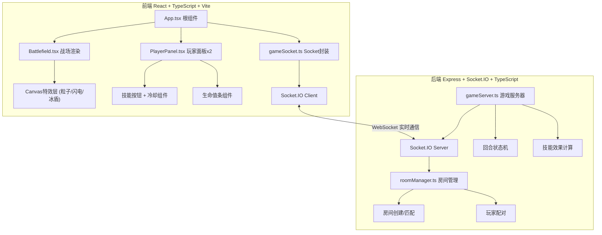

## 1. 架构设计


## 2. 技术描述
- **前端**：React 18 + TypeScript 5 + Vite 5
- **初始化工具**：Vite create react-ts模板
- **后端**：Express 4 + Socket.IO 4 + TypeScript 5
- **状态管理**：React useState/useReducer（本地）+ Socket.IO广播（同步）
- **动画**：requestAnimationFrame + Canvas 2D API（技能特效）+ CSS Transitions（UI）
- **构建**：Vite负责前端HMR，ts-node/tsx负责后端TypeScript运行

## 3. 项目文件结构
| 文件路径 | 用途 |
|----------|------|
| package.json | 依赖管理：react, react-dom, typescript, vite, @vitejs/plugin-react, express, cors, socket.io, socket.io-client |
| index.html | 入口HTML，全屏深色背景#0F172A |
| vite.config.js | Vite构建配置，含代理/api到后端端口 |
| tsconfig.json | TypeScript严格模式 strict:true |
| server/gameServer.ts | 后端游戏核心：管理房间、回合状态机、技能判定、Socket事件广播 |
| server/roomManager.ts | 房间匹配：创建房间、等待队列、玩家配对分配 |
| client/src/App.tsx | React根组件：Socket连接初始化、视图切换（等待/对战/结算）、全局状态 |
| client/src/components/Battlefield.tsx | 5x5网格渲染、角色位置、Canvas特效层、Socket事件监听更新 |
| client/src/components/PlayerPanel.tsx | HP条（200x24渐变+过渡）、技能按钮（80x40+冷却）、回合指示 |
| client/src/socket/gameSocket.ts | Socket.IO连接封装、事件发送(移动/技能)、事件接收(状态同步/回合/倒计时) |

## 4. Socket 事件定义

### 客户端 → 服务器 (Emit)
```typescript
// 加入/创建房间
'joinRoom': { roomId?: string, playerName: string }

// 移动操作
'move': { roomId: string, playerId: number, targetCell: {row: number, col: number} }

// 释放技能
'castSkill': { 
  roomId: string, 
  playerId: number, 
  skillType: 'fireball' | 'iceshield' | 'lightning',
  targetCell: {row: number, col: number}
}

// 回合操作完成
'endTurn': { roomId: string, playerId: number }
```

### 服务器 → 客户端 (Broadcast)
```typescript
// 房间状态同步（每回合/操作后推送）
'gameState': {
  roomId: string,
  currentTurn: 1 | 2,
  turnPhase: 'move' | 'skill' | 'waiting',
  turnTimer: number, // 剩余秒数
  players: [{
    id: 1 | 2,
    hp: number,
    maxHp: 100,
    position: {row: number, col: number},
    cooldowns: { fireball: number, iceshield: number, lightning: number }
  }],
  gridState: Array<Array<null | 'fire' | 'ice' | 'lightning'>>,
  winner: null | 1 | 2
}

// 技能特效事件（触发前端动画）
'skillEffect': {
  skillType: 'fireball' | 'iceshield' | 'lightning',
  targetCell: {row: number, col: number},
  playerId: 1 | 2,
  timestamp: number
}

// HP变化事件
'hpChange': {
  playerId: 1 | 2,
  newHp: number,
  delta: number
}

// 回合超时
'turnTimeout': { skipPlayerId: 1 | 2 }
```

## 5. 游戏核心逻辑规则
| 项目 | 规则 |
|------|------|
| 竞技场 | 5x5网格 (0-4, 0-4)，角色只能上下左右移动1格 |
| 初始位置 | 玩家1: (0,0)，玩家2: (4,4) |
| HP系统 | 双方100HP，HP≤0判负 |
| 回合制 | 玩家轮流，每回合5秒，可执行：移动+技能释放 |
| 火球技能 | 伤害25，冷却2回合，范围：目标格+上下左右相邻格 |
| 冰盾技能 | 减伤50%（下回合），冷却3回合，范围：自身所在格 |
| 闪电技能 | 伤害35，冷却3回合，范围：整列或整行（随机选一） |
| 格子状态 | 命中后变色1回合：火(#F97316) / 冰(#60A5FA) / 闪电(#F8FAFC) |

## 6. 性能与动画实现
- **Canvas特效层**：独立于React渲染，使用requestAnimationFrame循环
- **粒子池**：对象池复用Fireball Particle，避免GC卡顿
- **UI动画**：CSS transition/animation实现HP条过渡、按钮悬停、脉冲指示器
- **帧率监控**：内置FPS计数器，低于50FPS时降级粒子数量
- **Socket优化**：debounce操作+状态快照diff，降低带宽

