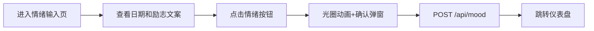
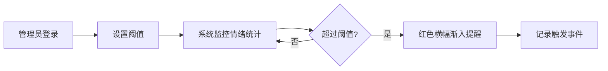

## 1. 产品概述

团队情绪晴雨表是一个匿名团队情绪追踪工具，帮助团队成员记录每日心情，管理者通过可视化仪表盘了解团队整体情绪状态，及时发现潜在问题并采取干预措施。

- 核心功能：匿名情绪记录、动态气泡可视化、历史趋势分析、阈值预警提醒
- 目标用户：团队成员（普通用户）、团队管理者（管理员）
- 产品价值：提升团队沟通效率，预防团队心理问题，优化团队管理决策

## 2. 核心 Features

### 2.1 用户角色

| 角色 | 登录方式 | 核心权限 |
|------|---------|---------|
| 普通用户 | 无需登录 | 匿名记录每日情绪、查看仪表盘统计 |
| 管理员 | 密码验证（tomcat123） | 查看历史趋势、设置情绪阈值、管理预警提醒 |

### 2.2 功能模块

1. **情绪输入页面**：日期显示、励志文案、五种情绪选择按钮
2. **仪表盘页面**：动态气泡图、情绪分布条形图
3. **历史趋势页面**：日期范围选择器、多情绪折线图
4. **管理员页面**：阈值设置滑动条、历史触发事件列表、密码登录

### 2.3 页面详情

| 页面名称 | 模块名称 | 功能描述 |
|---------|---------|---------|
| 情绪输入页 | 日期与文案区 | 显示当前日期，每日切换励志文案 |
| 情绪输入页 | 情绪选择区 | 五个圆形表情按钮，悬停放大，点击有光圈动画 |
| 情绪输入页 | 确认弹窗 | 点击情绪后弹出"已记录您的今日心情"提示 |
| 仪表盘页 | 动态气泡图 | Canvas绘制，600×400px，气泡碰撞弹性动画 |
| 仪表盘页 | 条形统计图 | 显示各情绪人数分布及百分比 |
| 历史趋势页 | 日期选择器 | 原生date input，支持选择起止日期 |
| 历史趋势页 | 折线图表 | 五种情绪占比变化曲线，悬停显示tooltip |
| 管理员页 | 密码登录 | 硬编码验证密码tomcat123 |
| 管理员页 | 阈值设置 | 滑动条0-100%设置各情绪预警阈值 |
| 管理员页 | 预警横幅 | 阈值超标时红色背景渐入动画提醒 |
| 管理员页 | 触发事件列表 | 记录所有阈值超标的历史事件 |

## 3. 核心流程

### 3.1 情绪记录流程
用户进入情绪输入页 → 查看日期和励志文案 → 点击对应情绪按钮 → 按钮显示光圈动画 → 弹出确认对话框 → 数据POST到后端API → 自动跳转到仪表盘查看统计

### 3.2 管理员预警流程
管理员登录 → 设置情绪阈值 → 系统定期检查最新统计 → 某情绪占比超过阈值 → 顶部横幅渐入提醒 → 记录触发事件到列表

## 4. 用户界面设计

### 4.1 设计风格
- **主色调**：柔和渐变背景 #F0F4F8 → #E2E8F0
- **情绪主题色**：
  - 快乐：金黄 #FFD700
  - 平静：薄荷绿 #98FB98
  - 焦虑：橙红 #FF6347
  - 疲惫：淡紫 #DDA0DD
  - 生气：深红 #DC143C
- **侧边栏**：深灰 #2D3748，悬停 #4A5568，选中指示 #48BB78
- **卡片样式**：白色背景、圆角16px、阴影 0 4px 12px rgba(0,0,0,0.08)
- **字体**：使用 Playfair Display（标题）+ Lato（正文），避免Inter/Roboto等通用字体
- **按钮样式**：圆形（直径70px）、圆角50%、悬停放大1.15倍

### 4.2 页面设计概览

| 页面名称 | 模块名称 | UI元素 |
|---------|---------|--------|
| 情绪输入页 | 日期文案区 | 居中显示、柔和阴影、优雅过渡动画 |
| 情绪输入页 | 情绪按钮区 | 等距排列、悬停缩放、点击光圈动画 |
| 仪表盘页 | 气泡图区 | Canvas画布、缓慢漂移、碰撞弹性、60FPS |
| 仪表盘页 | 条形图区 | 圆角条形、百分比标注、颜色映射 |
| 历史趋势页 | 折线图区 | 多色线条、节点圆点、悬停tooltip |
| 管理员页 | 阈值设置区 | 滑动条、实时数值显示、保存按钮 |
| 全局 | 侧边栏 | 固定220px、菜单项悬停指示、切换平滑动画 |
| 全局 | 顶部横幅 | 红色#FF4444背景、白色文字、0.5s渐入 |

### 4.3 响应式设计
- **桌面端（≥768px）**：侧边栏固定220px，气泡图600×400px，卡片横向排列
- **移动端（<768px）**：侧边栏折叠为顶部汉堡菜单，弹窗式展开，气泡图高度300px，卡片竖向排列
- **触控优化**：按钮最小触控区域48×48px，滚动流畅

### 4.4 动画与交互
- 页面切换：0.3s ease-in-out 水平滑入
- 情绪按钮：悬停放大1.15倍（0.2s ease-out），点击渐变光圈（0.3s）
- 气泡动画：每帧移动1-3px，碰撞反向+缩放0.95→1.0（0.2s）
- 预警横幅：0.5s渐入动画
