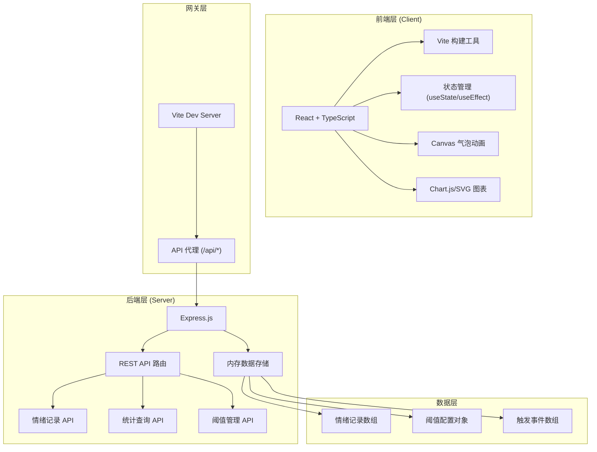
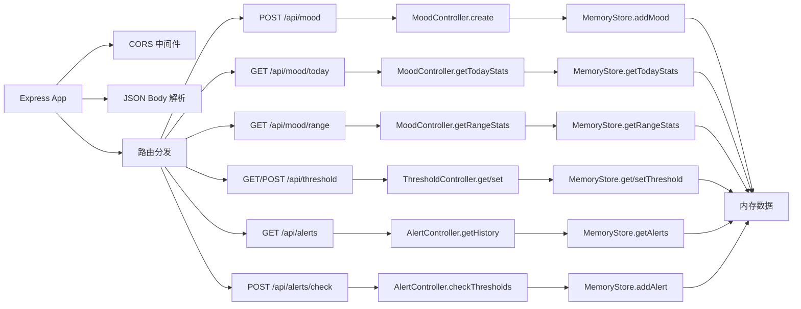
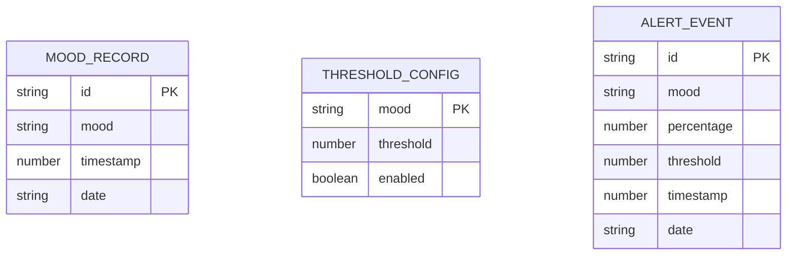

## 1. 架构设计



## 2. 技术描述

- **前端技术栈**：React@18 + TypeScript@5 + Vite@5
- **构建工具**：Vite（热更新、快速构建、代理配置）
- **后端技术栈**：Express@4 + TypeScript@5
- **数据存储**：内存存储（Node.js 内存数组/对象，无持久化数据库）
- **图表方案**：Canvas API（气泡图）+ 原生SVG（条形图、折线图），避免引入大型图表库
- **动画方案**：CSS transitions + requestAnimationFrame + Canvas 动画
- **HTTP客户端**：原生 fetch API

## 3. 路由定义

| 前端路由 | 页面组件 | 访问权限 |
|---------|---------|---------|
| `/` | MoodInput | 公开 |
| `/dashboard` | Dashboard | 公开 |
| `/trends` | TrendsPage | 需管理员登录 |
| `/admin` | AdminPage | 需管理员登录 |

| 后端API路由 | 方法 | 用途 |
|-----------|------|------|
| `/api/mood` | POST | 提交今日情绪记录 |
| `/api/mood/today` | GET | 获取今日情绪统计 |
| `/api/mood/range` | GET | 获取指定日期范围的情绪统计 |
| `/api/threshold` | GET | 获取所有情绪阈值配置 |
| `/api/threshold` | POST | 更新情绪阈值配置 |
| `/api/alerts` | GET | 获取阈值触发事件历史 |
| `/api/alerts/check` | POST | 手动触发阈值检查 |

## 4. API 定义

### 4.1 TypeScript 类型定义

```typescript
// 情绪类型
type MoodType = 'happy' | 'calm' | 'anxious' | 'tired' | 'angry';

// 情绪记录
interface MoodRecord {
  id: string;
  mood: MoodType;
  timestamp: number;
  date: string; // YYYY-MM-DD
}

// 情绪统计
interface MoodStats {
  date: string;
  total: number;
  distribution: Record<MoodType, number>;
  percentages: Record<MoodType, number>;
}

// 阈值配置
interface ThresholdConfig {
  mood: MoodType;
  threshold: number; // 0-100
  enabled: boolean;
}

// 预警事件
interface AlertEvent {
  id: string;
  mood: MoodType;
  percentage: number;
  threshold: number;
  timestamp: number;
  date: string;
}

// 情绪配置
interface MoodConfig {
  type: MoodType;
  label: string;
  emoji: string;
  color: string;
}

// API 响应
interface ApiResponse<T> {
  success: boolean;
  data?: T;
  error?: string;
}
```

### 4.2 请求/响应 Schema

**POST /api/mood**
- Request: `{ mood: MoodType }`
- Response: `{ success: boolean, record: MoodRecord }`

**GET /api/mood/today**
- Response: `{ success: boolean, stats: MoodStats }`

**GET /api/mood/range?startDate=YYYY-MM-DD&endDate=YYYY-MM-DD**
- Response: `{ success: boolean, stats: MoodStats[] }`

**GET/POST /api/threshold**
- GET Response: `{ success: boolean, configs: ThresholdConfig[] }`
- POST Request: `{ mood: MoodType, threshold: number, enabled: boolean }`
- POST Response: `{ success: boolean, config: ThresholdConfig }`

**GET /api/alerts**
- Response: `{ success: boolean, events: AlertEvent[] }`

## 5. 服务器架构图



## 6. 数据模型

### 6.1 数据模型定义



### 6.2 内存数据结构

```typescript
// 服务器内存存储
interface MemoryStore {
  moodRecords: MoodRecord[];           // 所有情绪记录
  thresholdConfigs: Record<MoodType, ThresholdConfig>;  // 阈值配置
  alertEvents: AlertEvent[];           // 预警事件历史
}

// 初始化数据（mock数据用于演示）
const initialData: MemoryStore = {
  moodRecords: generateMockData(30), // 生成过去30天的模拟数据
  thresholdConfigs: {
    happy: { mood: 'happy', threshold: 70, enabled: false },
    calm: { mood: 'calm', threshold: 60, enabled: false },
    anxious: { mood: 'anxious', threshold: 30, enabled: true },
    tired: { mood: 'tired', threshold: 40, enabled: true },
    angry: { mood: 'angry', threshold: 15, enabled: true },
  },
  alertEvents: [],
};

// 情绪配置常量
const MOOD_CONFIGS: MoodConfig[] = [
  { type: 'happy', label: '快乐', emoji: '😊', color: '#FFD700' },
  { type: 'calm', label: '平静', emoji: '😌', color: '#98FB98' },
  { type: 'anxious', label: '焦虑', emoji: '😰', color: '#FF6347' },
  { type: 'tired', label: '疲惫', emoji: '😴', color: '#DDA0DD' },
  { type: 'angry', label: '生气', emoji: '😠', color: '#DC143C' },
];

// 励志文案
const MOTIVATIONAL_QUOTES = [
  '每一天都是新的开始，保持微笑！',
  '团队的力量来自每个人的真诚。',
  '你的心情很重要，分享让我们更紧密。',
  '今天也是充满希望的一天！',
  '真诚面对自己，才能更好地成长。',
];
```

### 6.3 文件结构

```
auto26/
├── package.json
├── vite.config.js
├── tsconfig.json
├── index.html
├── src/
│   ├── App.tsx
│   ├── main.tsx
│   ├── types.ts
│   ├── constants.ts
│   ├── api/
│   │   └── client.ts
│   ├── components/
│   │   ├── MoodInput.tsx
│   │   ├── Dashboard.tsx
│   │   ├── TrendsPage.tsx
│   │   ├── AdminPage.tsx
│   │   ├── BubbleChart.tsx
│   │   ├── BarChart.tsx
│   │   ├── LineChart.tsx
│   │   ├── Sidebar.tsx
│   │   └── AlertBanner.tsx
│   ├── hooks/
│   │   ├── useMoodStats.ts
│   │   └── useAuth.ts
│   └── styles/
│       └── global.css
└── server/
    ├── index.ts
    ├── types.ts
    ├── store.ts
    ├── controllers/
    │   ├── mood.ts
    │   ├── threshold.ts
    │   └── alert.ts
    └── utils/
        └── mock.ts
```

## 7. 性能优化策略

### 7.1 气泡图性能
- 使用 `requestAnimationFrame` 实现60FPS动画
- 气泡碰撞检测优化：空间分区检测，避免O(n²)复杂度
- 离屏Canvas双缓冲技术，减少重绘闪烁

### 7.2 折线图性能
- 使用 `useMemo` 缓存图表数据计算结果
- 数据点限制：自动采样，超过500点时降采样
- SVG `pointer-events` 优化悬停检测

### 7.3 通用优化
- React `useCallback` 避免不必要的重渲染
- 组件懒加载：管理员页面按需加载
- CSS 动画优先使用 transform 和 opacity，触发 GPU 加速
