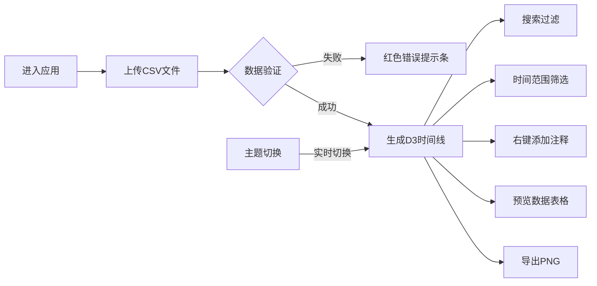

## 1. 产品概述

数据叙事时间线是一款面向数据新闻记者和博主的Web应用，帮助用户将枯燥的表格数据快速转化为具有叙事感的交互式时间线。应用解决了现有工具操作复杂、可视化效果缺乏互动性的痛点。

- 核心价值：通过简单的拖拽操作，自动生成带时间标注的交互式时间线
- 目标用户：数据新闻记者、博主、数据分析师、内容创作者
- 市场价值：降低数据可视化门槛，提升叙事内容的互动性和传播力

## 2. 核心功能

### 2.1 用户角色

| 角色 | 注册方式 | 核心权限 |
|------|----------|----------|
| 普通用户 | 无需注册，直接使用 | 上传CSV、生成时间线、添加注释、导出PNG |

### 2.2 功能模块

1. **首页（单页应用）**：
   - 顶部导航栏：应用名称、主题切换按钮
   - 左侧面板：CSV上传区域、数据预览按钮、事件列表
   - 右侧面板：D3时间线可视化、搜索框、双滑块筛选器、导出PNG按钮
   - 模态框：数据预览表格
   - 右键菜单：添加注释节点
   - 通知条：错误提示

### 2.3 页面详情

| 页面名称 | 模块名称 | 功能描述 |
|----------|----------|----------|
| 首页 | 顶部导航栏 | 显示应用名称，提供主题切换（浅色/深色），固定高度56px |
| 首页 | CSV上传区域 | 拖拽或点击上传CSV（最大10MB，UTF-8编码），PapaParse解析，验证日期列和事件列 |
| 首页 | 数据预览按钮 | 点击弹出模态框，表格形式展示所有数据行，支持横向滚动 |
| 首页 | 事件列表 | 左侧显示解析后的事件列表，悬停高亮，点击对应时间线节点 |
| 首页 | 搜索框 | 关键词过滤事件节点，300ms防抖 |
| 首页 | D3时间线 | SVG水平时间线，圆形节点（#3B82F6），虚线连接，悬停放大阴影，点击显示气泡详情 |
| 首页 | 双滑块筛选器 | 时间范围筛选，未选中范围半透明（0.2）不可点击 |
| 首页 | 注释节点 | 右键菜单添加，菱形橙色节点（#F59E0B），白色问号图标，气泡注释文本，双击编辑/删除 |
| 首页 | 导出PNG按钮 | html2canvas截图（2x分辨率）并下载 |
| 首页 | 主题切换 | 圆形按钮，浅色/深色主题，0.3s ease过渡动画 |
| 首页 | 错误提示条 | 红色背景（#DC2626），白色文字，圆角6px，2.5s自动消失 |

## 3. 核心流程

### 主流程
用户进入应用 → 拖拽/点击上传CSV文件 → 系统解析并验证数据 → 自动生成时间线 → 用户可搜索/筛选/缩放 → 右键添加注释 → 预览数据或导出PNG

## 4. 界面设计

### 4.1 设计风格
- **主色调**：蓝色 #3B82F6（按钮、节点、滑块）
- **辅助色**：深灰 #1E293B（导航栏、深色背景）、白色 #FFFFFF（背景）、橙色 #F59E0B（注释节点）
- **错误色**：红色 #DC2626（错误提示）
- **字体**：使用现代无衬线字体，清晰易读
- **按钮风格**：圆角8px，悬停0.2s过渡（#3B82F6 → #2563EB）
- **卡片风格**：圆角8px，悬停阴影变化（0 2px 8px → 0 4px 16px）
- **布局风格**：顶部固定导航栏 + Flex左右分栏布局

### 4.2 页面设计概述

| 页面名称 | 模块名称 | UI元素 |
|----------|----------|----------|
| 首页 | 顶部导航栏 | 深色背景#1E293B，白色文字，左右内边距48px，应用名称居左，主题按钮居右 |
| 首页 | 左侧面板 | 响应式宽度320-480px（min 280px, max 560px），上传区域 + 事件列表 |
| 首页 | 右侧面板 | 剩余宽度，搜索框（280x36px）、时间线（高400px）、双滑块、导出按钮 |
| 首页 | 时间线节点 | 圆形半径12px，悬停18px + 阴影0 4px 12px rgba(0,0,0,0.15) |
| 首页 | 注释节点 | 菱形24x24px，橙色#F59E0B，白色问号图标 |
| 首页 | 模态框 | 750x500px，圆角16px，阴影0 8px 32px rgba(0,0,0,0.2) |
| 首页 | 错误提示条 | 红色#DC2626背景，白色文字，圆角6px，底部弹出 |

### 4.3 响应式设计
- **桌面端**（≥768px）：Flex左右分栏布局，左侧320-480px，右侧自适应
- **移动端**（<768px）：左侧面板折叠为顶部抽屉，汉堡菜单按钮展开
- **触摸优化**：按钮最小40px，节点点击区域适当放大

### 4.4 动效设计
- 所有可交互元素悬停、点击0.2s ease-out过渡
- 主题切换0.3s ease过渡动画
- 时间线节点加载时淡入效果
- 搜索和筛选时节点平滑过渡
