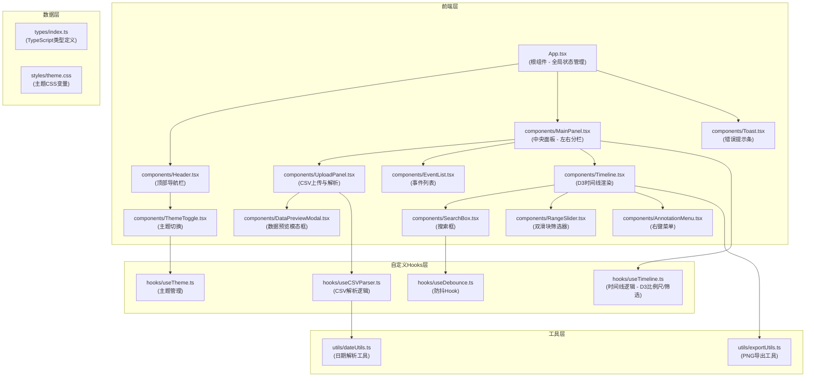

## 1. 架构设计



## 2. 技术描述

- **前端框架**：React@18 + TypeScript@5
- **构建工具**：Vite@5 + @vitejs/plugin-react@4
- **可视化库**：D3@7（SVG时间线渲染、比例尺、坐标轴）
- **CSV解析**：papaparse@5
- **PNG导出**：html2canvas@1
- **样式方案**：原生CSS + CSS变量（主题切换）
- **状态管理**：React Hooks (useState, useReducer) + Context

### 依赖说明
```json
{
  "dependencies": {
    "react": "^18.2.0",
    "react-dom": "^18.2.0",
    "d3": "^7.8.5",
    "papaparse": "^5.4.1",
    "html2canvas": "^1.4.1"
  },
  "devDependencies": {
    "typescript": "^5.3.0",
    "vite": "^5.0.0",
    "@vitejs/plugin-react": "^4.2.0",
    "@types/react": "^18.2.0",
    "@types/react-dom": "^18.2.0",
    "@types/d3": "^7.4.0",
    "@types/papaparse": "^5.3.14"
  }
}
```

## 3. 路由定义

单页应用，无多路由配置

| 路由 | 用途 |
|------|------|
| / | 主应用页面 |

## 4. 数据模型与类型定义

### 4.1 核心类型定义

```typescript
// types/index.ts

export interface TimelineEvent {
  id: string;
  date: Date;
  dateString: string;
  eventName: string;
  description?: string;
  [key: string]: any;
}

export interface Annotation {
  id: string;
  x: number;
  y: number;
  date: Date;
  text: string;
}

export interface TimeRange {
  start: Date;
  end: Date;
}

export interface TimelineData {
  events: TimelineEvent[];
  annotations: Annotation[];
  dateColumn: string;
  eventColumn: string;
  descriptionColumn?: string;
}

export interface Theme {
  mode: 'light' | 'dark';
  colors: {
    background: string;
    text: string;
    primary: string;
    secondary: string;
    accent: string;
    error: string;
    timelineTrack: string;
    border: string;
    cardBg: string;
    cardHover: string;
  };
}

export interface CSVParseResult {
  success: boolean;
  data: TimelineEvent[];
  dateColumn: string;
  eventColumn: string;
  descriptionColumn?: string;
  error?: string;
}
```

## 5. 文件结构与调用关系

```
src/
├── App.tsx                      # 根组件，全局状态管理
│   ├── 管理：数据集、时间范围、筛选条件、主题
│   └── 渲染：Header, MainPanel, Toast
│
├── components/
│   ├── Header.tsx               # 顶部导航栏
│   │   └── 使用：ThemeToggle
│   ├── MainPanel.tsx            # 中央面板（左右分栏）
│   │   ├── 使用：UploadPanel, EventList, Timeline
│   │   └── 数据流向：App → 筛选后的数据 → Timeline
│   ├── UploadPanel.tsx          # CSV上传与解析
│   │   ├── 使用：useCSVParser Hook
│   │   └── 触发：App 更新全局数据集
│   ├── EventList.tsx            # 事件列表
│   │   └── 交互：点击事件 → Timeline 高亮对应节点
│   ├── Timeline.tsx             # D3时间线渲染
│   │   ├── 使用：useTimeline Hook
│   │   ├── 子组件：SearchBox, RangeSlider, AnnotationMenu
│   │   └── 渲染：SVG 节点、连线、坐标轴
│   ├── SearchBox.tsx            # 搜索框
│   │   └── 使用：useDebounce Hook
│   ├── RangeSlider.tsx          # 双滑块时间范围筛选
│   ├── AnnotationMenu.tsx       # 右键菜单（添加注释）
│   ├── DataPreviewModal.tsx     # 数据预览模态框
│   ├── ThemeToggle.tsx          # 主题切换按钮
│   └── Toast.tsx                # 错误提示条
│
├── hooks/
│   ├── useTimeline.ts           # 时间线计算 Hook
│   │   ├── 输入：原始数据、时间范围、搜索关键词
│   │   ├── 计算：D3 比例尺、筛选后数据、坐标轴配置
│   │   └── 输出：SVG 元素配置、事件处理函数
│   ├── useCSVParser.ts          # CSV 解析 Hook
│   │   ├── 使用：PapaParse + dateUtils
│   │   └── 验证：日期列、事件列存在性
│   ├── useDebounce.ts           # 防抖 Hook（300ms）
│   └── useTheme.ts              # 主题管理 Hook
│
├── utils/
│   ├── dateUtils.ts             # 日期解析工具
│   │   └── 支持：YYYY-MM-DD, MM/DD/YYYY
│   └── exportUtils.ts           # PNG 导出工具
│       └── 使用：html2canvas
│
├── types/
│   └── index.ts                 # TypeScript 类型定义
│
└── styles/
    └── theme.css                # 主题 CSS 变量
```

## 6. 数据流向说明

### 6.1 CSV上传流程
```
UploadPanel.tsx 
  → useCSVParser Hook (PapaParse解析 + 日期验证)
  → App.tsx (更新全局状态: dataset, dateColumn, eventColumn)
  → MainPanel.tsx (传递给 Timeline 和 EventList)
```

### 6.2 时间线渲染流程
```
App.tsx (原始数据 + 筛选条件)
  → useTimeline Hook (D3比例尺计算 + 数据筛选)
  → Timeline.tsx (SVG渲染：节点、连线、坐标轴)
  → 交互事件 → 更新 App.tsx 状态 → 重新渲染
```

### 6.3 搜索筛选流程
```
SearchBox.tsx (用户输入)
  → useDebounce Hook (300ms防抖)
  → App.tsx (更新 searchKeyword)
  → useTimeline Hook (过滤事件)
  → Timeline.tsx (节点透明度变化)
```

### 6.4 时间范围筛选流程
```
RangeSlider.tsx (滑块拖动)
  → App.tsx (更新 timeRange)
  → useTimeline Hook (计算可见范围)
  → Timeline.tsx (未选中范围半透明)
```

## 7. 性能优化策略

1. **D3 渲染优化**
   - 使用 D3 的 data() + enter() + exit() 模式，避免全量重绘
   - 节点更新使用 transition() 平滑过渡

2. **防抖处理**
   - 搜索框输入 300ms 防抖，避免频繁重绘

3. **Memo 优化**
   - 使用 React.memo 包装 Timeline、EventList 等纯展示组件
   - useMemo 缓存 D3 比例尺计算结果

4. **事件委托**
   - SVG 节点点击事件使用事件委托，减少事件监听器数量

5. **懒加载**
   - 1000+ 数据点时考虑虚拟滚动（可选优化）

## 8. 性能指标

- 首次加载（1000数据点）：≤ 200ms
- 缩放筛选操作响应：≤ 200ms
- 节点悬停动画帧率：≥ 30fps
- PNG导出时间：≤ 500ms
