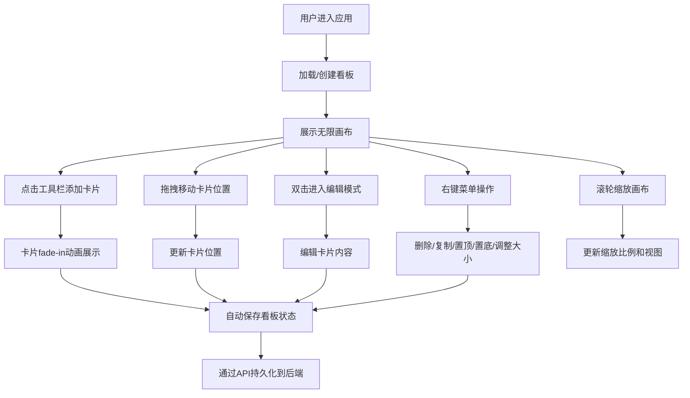

## 1. 产品概述

灵感墙是一个可视化灵感看板应用，让用户可以像在实体墙上钉照片和便签一样，在浏览器中自由创建、拖拽和组织灵感卡片。支持图片卡片、文字便签和链接卡片三种类型，提供无限画布、自由缩放、层叠排序等功能，看板数据可保存和分享。

- 核心价值：为创意工作者提供直观、灵活的数字灵感收集与组织工具
- 目标用户：设计师、产品经理、创作者、学生等需要视觉化整理思路的人群

## 2. 核心功能

### 2.1 用户角色

| 角色 | 注册方式 | 核心权限 |
|------|----------|----------|
| 普通用户 | 无需注册，自动分配用户ID | 创建、编辑、保存、查看看板 |

### 2.2 功能模块

1. **看板画布**：无限滚动画布，支持缩放和拖拽平移
2. **卡片管理**：添加、编辑、删除、复制三种类型卡片
3. **交互工具栏**：右上角工具栏，提供添加卡片、重置视图等操作
4. **右键菜单**：删除、复制、置顶/置底、调整大小
5. **数据持久化**：通过后端API保存和加载看板数据

### 2.3 页面详情

| 页面名称 | 模块名称 | 功能描述 |
|----------|----------|----------|
| 主看板页 | 无限画布 | 背景色#F1F5F9，最小宽度1200px，支持无限滚动和缩放 |
| 主看板页 | 工具栏 | 右上角毛玻璃工具栏，添加图片/文字/链接卡片按钮，重置视图，缩放比例显示 |
| 主看板页 | 图片卡片 | 拖拽上传jpg/png，显示缩略图，圆角12px，宽240px高自适应 |
| 主看板页 | 文字便签 | 白色背景，圆角8px，手写风格字体，可编辑文字 |
| 主看板页 | 链接卡片 | 左侧灰色竖线标记，显示标题和URL |
| 主看板页 | 右键菜单 | 毛玻璃风格，删除/复制/置顶/置底/调整大小选项 |
| 主看板页 | 拖拽缩放 | 鼠标滚轮缩放0.3-3.0倍，光标位置锚定，拖拽移动卡片 |

## 3. 核心流程

用户进入应用后，系统自动创建或加载看板。用户通过工具栏添加不同类型的卡片，在画布上自由拖拽摆放、调整层叠顺序和大小。双击卡片进入编辑模式修改内容。通过右键菜单进行更多操作。最后看板数据通过API保存到后端，可通过ID分享给他人查看。

## 4. 用户界面设计

### 4.1 设计风格

- **主色调**：#3B82F6（蓝色，用于按钮和边框高亮）
- **背景色**：#F1F5F9（浅灰蓝画布背景）
- **文字色**：#1E293B（深 slate 色，保证可读性）
- **辅助色**：#94A3B8（中灰色，用于链接卡片左侧标记）
- **卡片样式**：
  - 图片卡片：圆角12px
  - 文字便签：白色背景，圆角8px
  - 链接卡片：左侧灰色竖线
- **毛玻璃效果**：工具栏和右键菜单使用 `rgba(255,255,255,0.7)` 背景 + `backdrop-filter: blur(12px)`
- **圆角规范**：工具栏/菜单16px，卡片8-12px
- **阴影**：工具栏/菜单 `0 4px 20px rgba(0,0,0,0.1)`
- **字体**：
  - 正文：清晰无衬线字体
  - 文字便签：手写风格字体（如 Caveat 或 Ma Shan Zheng）
- **间距规范**：卡片之间保持12px间距
- **动画**：所有交互过渡0.2s-0.3s，添加卡片0.3s fade-in，拖拽避让0.2s ease-in

### 4.2 页面设计概述

| 页面名称 | 模块名称 | UI元素 |
|----------|----------|--------|
| 主看板页 | 工具栏 | 毛玻璃背景，圆角16px，固定右上角，按钮hover效果，缩放百分比显示 |
| 主看板页 | 图片卡片 | 圆角12px，缩略图自适应，拖拽时半透明0.7，右下角大小调整拉手 |
| 主看板页 | 文字便签 | 白色背景，圆角8px，手写字体，内边距舒适，编辑时光标样式 |
| 主看板页 | 链接卡片 | 左侧灰色竖条，标题粗体，URL小号灰色文字 |
| 主看板页 | 右键菜单 | 毛玻璃，圆角16px，菜单项hover高亮，图标+文字 |
| 主看板页 | 缩放指示器 | 百分比格式，固定显示在工具栏中 |

### 4.3 响应式设计

- 桌面端优先设计，最小画布宽度1200px
- 画布区域全屏显示，无外部滚动条
- 工具栏固定定位，不受画布滚动影响

### 4.4 性能优化

- 拖拽和缩放使用CSS transform实现，保证FPS不低于30
- 卡片使用will-change提示浏览器优化
- 缩小时文字大小反相调整，保证可读性
- 大量卡片时考虑虚拟滚动（初始版本按需优化）
