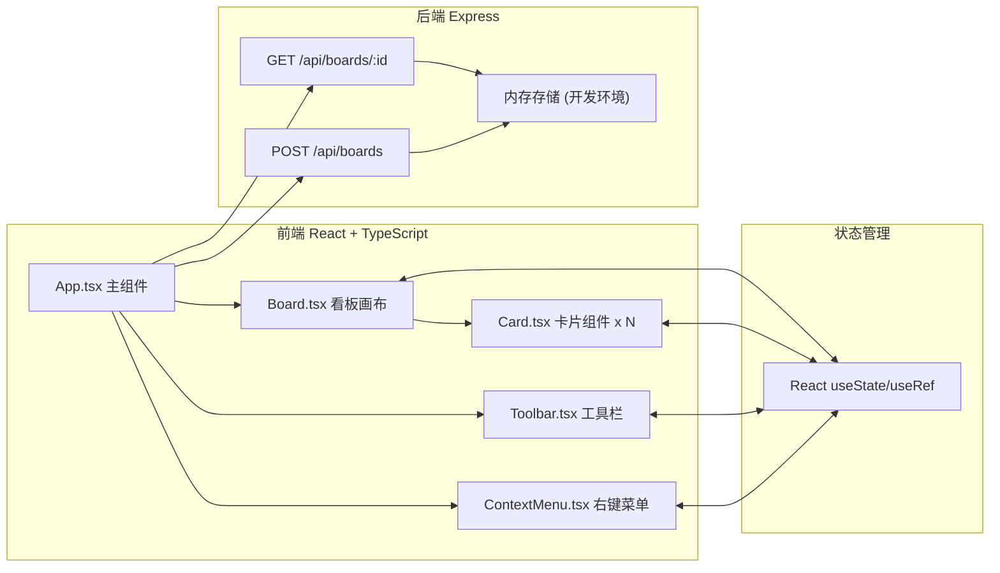
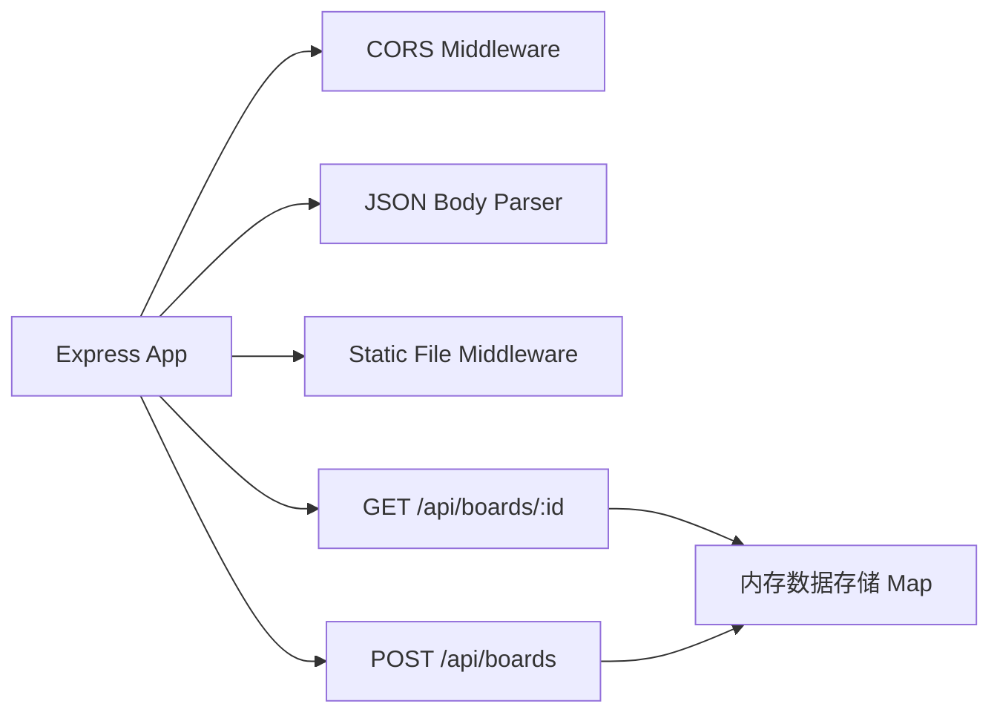
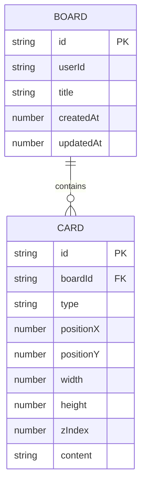

## 1. 架构设计



## 2. 技术说明

- **前端框架**：React@18 + TypeScript@5
- **构建工具**：Vite@5
- **后端框架**：Express@4
- **跨域处理**：cors 中间件
- **ID生成**：uuid 库
- **样式方案**：原生 CSS（不使用UI库和Tailwind）
- **状态管理**：React Hooks (useState, useRef, useCallback, useEffect)

## 3. 路由定义

| 路由 | 用途 |
|------|------|
| / | 主看板页面，加载默认看板或创建新看板 |

## 4. API 定义

### 4.1 获取看板

**GET /api/boards/:id**

响应：
```typescript
interface Board {
  id: string;
  userId: string;
  title: string;
  cards: Card[];
  createdAt: number;
  updatedAt: number;
}
```

### 4.2 保存/创建看板

**POST /api/boards**

请求体：
```typescript
interface SaveBoardRequest {
  id?: string;
  userId: string;
  title: string;
  cards: Card[];
}
```

响应：返回保存后的 Board 对象

### 4.3 类型定义

```typescript
type CardType = 'image' | 'text' | 'link';

interface Position {
  x: number;
  y: number;
}

interface CardSize {
  width: number;
  height: number;
}

interface Card {
  id: string;
  type: CardType;
  position: Position;
  size: CardSize;
  zIndex: number;
  content: ImageCardContent | TextCardContent | LinkCardContent;
}

interface ImageCardContent {
  imageUrl: string;
  imageName?: string;
}

interface TextCardContent {
  text: string;
}

interface LinkCardContent {
  title: string;
  url: string;
}
```

## 5. 服务端架构



服务端采用简洁的 Express 架构，开发阶段使用内存 Map 存储看板数据。静态文件服务用于提供前端构建产物。

## 6. 数据模型

### 6.1 实体关系



### 6.2 数据说明

- **Board（看板）**：每个用户可以有多个看板，通过唯一ID标识
- **Card（卡片）**：隶属于某个看板，包含位置、大小、层级和内容信息
- 卡片内容根据类型不同存储不同结构（JSON格式）
- 所有时间戳使用 Unix 毫秒时间戳

### 6.3 项目文件结构

```
auto262/
├── package.json
├── index.html
├── vite.config.ts
├── tsconfig.json
├── server/
│   └── index.ts          # Express 后端服务
└── src/
    ├── App.tsx           # 主应用组件
    ├── main.tsx          # React 入口
    ├── types.ts          # TypeScript 类型定义
    ├── components/
    │   ├── Board.tsx     # 看板画布组件
    │   ├── Card.tsx      # 卡片组件
    │   ├── Toolbar.tsx   # 工具栏组件
    │   └── ContextMenu.tsx # 右键菜单组件
    └── styles/
        └── index.css     # 全局样式
```
