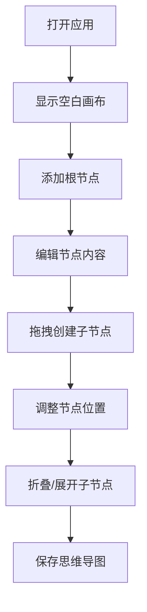

## 1. 产品概述

交互式思维导图应用，帮助用户在浏览器中创建、编辑和分享可视化的思维导图。解决传统思维导图工具笨重、缺乏实时协作和动态展示效果的问题，提供轻量、流畅、美观的创作体验。

- 核心目标：提供简洁高效的思维导图创建工具，支持节点拖拽、连线、折叠展开等交互
- 目标用户：学生、职场人士、创意工作者等需要进行思维整理和知识可视化的用户
- 产品价值：轻量易用、视觉美观、支持保存分享和图片导出

## 2. 核心功能

### 2.1 功能模块

1. **画布交互模块**：节点创建、编辑、拖拽、连线、折叠展开
2. **视图控制模块**：缩放、平移、网格吸附
3. **工具栏模块**：节点操作、视图控制、保存分享
4. **数据管理模块**：保存、加载、导出PNG
5. **后端服务模块**：REST API数据持久化

### 2.2 功能详情

| 功能分类 | 功能名称 | 功能描述 |
|---------|---------|---------|
| 节点操作 | 创建节点 | 圆形节点，直径120px，默认#3B82F6背景，白色文字，圆角50% |
| 节点操作 | 编辑节点 | 双击节点进入编辑模式，修改文字内容 |
| 节点操作 | 删除节点 | 删除选中节点及其子节点 |
| 节点操作 | 添加根节点 | 通过工具栏按钮添加根节点 |
| 连线操作 | 创建连线 | 从节点边缘拖出连线创建子节点 |
| 连线操作 | 贝塞尔曲线 | 连线使用贝塞尔曲线，颜色#64748B，线宽2px |
| 拖拽交互 | 节点拖拽 | 拖拽时节点半透明，0.2s动画，实时更新子节点连线 |
| 拖拽交互 | 网格吸附 | 节点自动吸附到30px间距的网格 |
| 折叠展开 | 折叠子节点 | 点击箭头图标折叠，子节点淡出0.3s ease-out |
| 折叠展开 | 展开子节点 | 点击箭头图标展开，子节点扩散0.4s ease-out，依次延迟0.05s |
| 视图控制 | 缩放 | 滑块控制0.5-2.0倍，步长0.1，鼠标滚轮缩放 |
| 视图控制 | 平移 | 右键拖拽平移画布 |
| 数据管理 | 保存 | 将思维导图数据序列化为JSON存储到后端 |
| 数据管理 | 加载 | 列出保存的导图并选择恢复 |
| 数据管理 | 导出PNG | 导出1920x1080分辨率PNG，背景#0F172A |

## 3. 核心流程

### 3.1 创建思维导图流程

用户打开应用 → 显示空白画布 → 点击"添加根节点"按钮创建根节点 → 双击节点编辑文字 → 从节点边缘拖出连线创建子节点 → 拖拽调整节点位置 → 点击保存按钮存储数据

### 3.2 保存与加载流程

用户编辑思维导图 → 点击保存按钮 → 数据序列化 → 发送到后端API → 存储为JSON文件 → 点击加载按钮 → 获取导图列表 → 选择导图 → 恢复到画布

## 4. 用户界面设计

### 4.1 设计风格

- **主题**：深色模式，科技感，简洁专业
- **主色调**：#3B82F6（蓝色）作为主色，用于节点和按钮
- **背景色**：#0F172A（深蓝黑）画布背景，#1E293B（深灰蓝）工具栏背景
- **文字色**：#F8FAFC（近白）主要文字，#64748B（灰蓝）次要文字和连线
- **圆角**：统一使用圆角设计，节点50%圆形，按钮8px，工具栏16px
- **阴影**：柔和阴影，营造层次感
- **动效**：所有操作0.2s平滑过渡，折叠展开有专属动画

### 4.2 页面布局

| 区域 | 位置 | 宽度 | 背景色 | 描述 |
|------|------|------|--------|------|
| 主画布 | 左侧 | 75% | #0F172A | 思维导图绘制区域，支持缩放平移 |
| 工具栏 | 右侧 | 25% | #1E293B | 操作按钮和控制面板，圆角16px，内边距24px |

### 4.3 工具栏设计

工具栏从上到下分为三组：

1. **标题区**
   - 应用标题：字号24px，颜色#F8FAFC，字体加粗

2. **节点操作组**
   - 添加根节点按钮
   - 删除选中节点按钮
   - 按钮样式：背景#3B82F6，圆角8px，悬浮变亮#2563EB，点击0.1s按下缩放

3. **视图控制组**
   - 放大缩小滑块
   - 范围0.5-2.0倍，步长0.1
   - 滑块轨道#475569，滑块手柄#3B82F6

4. **保存分享组**
   - 保存按钮
   - 加载按钮
   - 导出PNG按钮
   - 按钮统一样式

### 4.4 交互细节

- **节点拖拽**：拖拽时节点半透明，带0.2s动画效果
- **按钮交互**：hover状态变亮，active状态0.1s缩放效果
- **折叠展开**：折叠时子节点淡出0.3s ease-out，展开时扩散0.4s ease-out并依次延迟0.05s
- **缩放**：鼠标滚轮缩放，滑块同步
- **平移**：右键拖拽平移画布
- **网格吸附**：节点自动对齐30px网格

### 4.5 响应式设计

- 桌面端优先设计
- 工具栏固定宽度，画布自适应剩余空间
- 最小支持1280px宽度

## 5. 性能要求

- 200个节点时保持30 FPS以上
- 拖拽操作流畅无卡顿
- 连线路径实时更新
- 保存加载响应迅速
