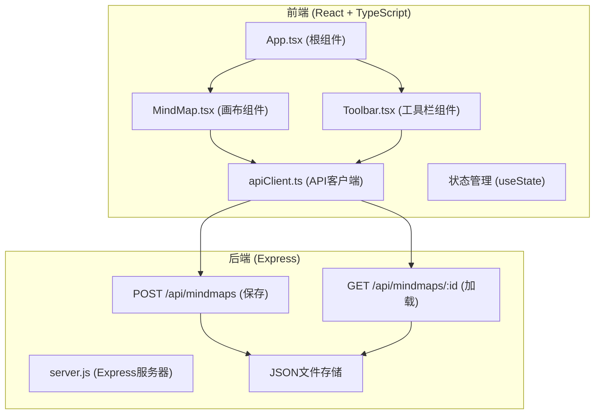
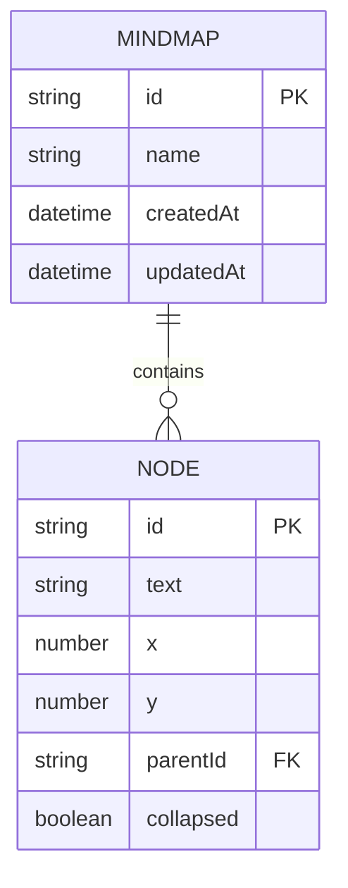

## 1. 架构设计



## 2. 技术描述

### 2.1 前端技术栈
- **框架**：React 18 + TypeScript
- **构建工具**：Vite
- **状态管理**：React useState（组件内状态）
- **HTTP客户端**：Axios
- **渲染方式**：SVG（节点和连线）
- **样式**：内联样式 + CSS变量

### 2.2 后端技术栈
- **框架**：Express 4
- **运行时**：Node.js
- **数据存储**：JSON文件（backend/data/）
- **ID生成**：uuid
- **跨域**：cors

### 2.3 开发工具
- **包管理器**：npm
- **开发服务器**：Vite dev server (前端) + Express (后端)

## 3. 项目结构

```
auto263/
├── package.json
├── index.html
├── vite.config.js
├── tsconfig.json
├── src/
│   ├── App.tsx              # 根组件
│   ├── components/
│   │   ├── MindMap.tsx      # 思维导图画布
│   │   └── Toolbar.tsx      # 工具栏
│   └── utils/
│       └── apiClient.ts     # API客户端
└── backend/
    ├── server.js            # Express服务器
    └── data/                # JSON数据存储
```

## 4. API定义

### 4.1 保存思维导图

**请求**：`POST /api/mindmaps`

请求体：
```typescript
interface MindMapData {
  id?: string;
  name: string;
  nodes: MindMapNode[];
  createdAt?: string;
  updatedAt?: string;
}

interface MindMapNode {
  id: string;
  text: string;
  x: number;
  y: number;
  parentId: string | null;
  collapsed: boolean;
}
```

**响应**：
```json
{
  "id": "uuid-string",
  "name": "思维导图名称",
  "nodes": [...],
  "createdAt": "2024-01-01T00:00:00.000Z",
  "updatedAt": "2024-01-01T00:00:00.000Z"
}
```

### 4.2 获取单个思维导图

**请求**：`GET /api/mindmaps/:id`

**响应**：同上 MindMapData

### 4.3 获取所有思维导图列表

**请求**：`GET /api/mindmaps`

**响应**：
```json
[
  {
    "id": "uuid-string",
    "name": "思维导图名称",
    "updatedAt": "2024-01-01T00:00:00.000Z"
  }
]
```

## 5. 数据模型

### 5.1 节点数据模型



### 5.2 节点属性

| 属性 | 类型 | 说明 |
|------|------|------|
| id | string | 唯一标识，uuid生成 |
| text | string | 节点显示文字 |
| x | number | 节点中心x坐标 |
| y | number | 节点中心y坐标 |
| parentId | string \| null | 父节点ID，根节点为null |
| collapsed | boolean | 是否折叠子节点 |

## 6. 核心交互实现

### 6.1 节点创建
- 点击工具栏按钮创建根节点
- 从节点边缘拖拽创建子节点
- 新节点默认位置考虑网格吸附

### 6.2 拖拽系统
- mousedown记录起始位置
- mousemove更新节点位置
- mouseup结束拖拽，应用网格吸附
- 拖拽时实时更新连线路径

### 6.3 连线渲染
- 使用SVG贝塞尔曲线
- 从父节点边缘到子节点边缘
- 考虑节点半径计算连线路径

### 6.4 折叠展开
- 维护collapsed状态
- CSS transition实现动画
- 折叠时隐藏子节点和连线
- 展开时依次延迟显示

### 6.5 视图变换
- 维护scale和offset状态
- SVG transform实现缩放平移
- 滚轮事件处理缩放
- 右键拖拽处理平移

### 6.6 PNG导出
- 使用Canvas API或html2canvas
- 设置1920x1080分辨率
- 背景色#0F172A
- 生成下载链接
