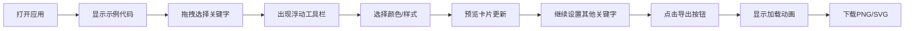

## 1. 产品概述
代码调色板是一款面向开发者的代码美化工具，允许用户为代码片段中的关键字自定义颜色和字体样式，生成个性化语法高亮的代码截图。
- 主要目标：帮助开发者快速创建具有视觉辨识度的代码图片，用于技术博客、文档、演示文稿和社交媒体分享
- 核心价值：通过直观的可视化调色界面，让非设计师也能轻松制作精美的代码插图

## 2. 核心特性

### 2.1 用户角色
| 角色 | 注册方式 | 核心权限 |
|------|----------|----------|
| 普通用户 | 无需注册，直接使用 | 编辑代码、自定义样式、导出PNG/SVG、本地保存样式配置 |

### 2.2 功能模块
1. **主页面**：代码编辑器、样式调色板、导航栏、导出功能

### 2.3 页面详情
| 页面名称 | 模块名称 | 功能描述 |
|-----------|-------------|---------------------|
| 主页面 | 导航栏 | 显示应用名称，提供PNG/SVG导出按钮，带加载动画和成功反馈 |
| 主页面 | 代码编辑器 | 左侧55%区域，显示行号，支持代码输入、关键字高亮、鼠标拖拽选区，浮动工具栏应用样式 |
| 主页面 | 样式调色板 | 右侧400px区域，显示选中关键字预览卡片，颜色网格(5x8)，d3色相环选择器，样式按钮组 |
| 主页面 | 分隔拖拽 | 可拖拽分界线调整左右面板宽度，拖拽时视觉反馈 |
| 主页面 | 导出模块 | 使用dom-to-image导出PNG/SVG，支持0.3s淡入加载动画 |

## 3. 核心流程
用户打开应用 → 默认显示冒泡排序示例代码 → 鼠标拖拽选中关键字 → 选区出现浮动工具栏 → 点击样式按钮或选择颜色 → 右侧预览卡片实时更新 → 重复设置不同关键字样式 → 点击导出按钮 → 显示加载动画 → 下载PNG/SVG文件

## 4. 用户界面设计
### 4.1 设计风格
- 主色调：深色背景#0F172A，面板背景#1E293B，边框#334155/#475569
- 强调色：蓝色#3B82F6（悬停#2563EB），选区黄色#FEF08A/0.3
- 文字色：主要#F8FAFC，次要#94A3B8
- 按钮风格：圆角8px，内边距10px 20px，过渡0.2s
- 字体：Fira Code等宽字体16px（代码），系统字体（界面）
- 布局：flex行布局，左右分栏，顶部导航栏
- 卡片：圆角12px，内边距16px，阴影md(#0F172A/0.5)

### 4.2 页面设计概览
| 页面名称 | 模块名称 | UI元素 |
|-----------|-------------|-------------|
| 主页面 | 导航栏 | 高度56px，应用名称(bold 20px #F8FAFC)，右侧双导出按钮(蓝色背景) |
| 主页面 | 代码编辑器 | 行号区(40px宽#1E293B)，代码区(Fira Code 16px)，默认关键字蓝色#3B82F6，选区半透明黄色背景，浮动工具栏(#1E293B圆角8px阴影lg) |
| 主页面 | 调色板面板 | 宽度400px左边框1px #334155，预览卡片(圆角12px内边距16px)，色块网格(5行8列40x40px圆角6px间隔4px悬停放大1.15倍0.2s cubic-bezier)，d3 HSV色相环 |
| 主页面 | 分界线 | 宽度4px #475569，拖拽时变#3B82F6，拖拽手柄 |

### 4.3 响应式
桌面优先设计，小于768px时切换为上下布局（调色板移至下方），触摸操作优化。

### 4.4 动画效果
- 色块悬停：1.15倍缩放，0.2s cubic-bezier过渡
- 加载动画：Spinner(20px直径3px边#60A5FA)，持续1.5s后显示对勾
- 导出过程：0.3s淡入加载动画
- 拖拽分界线：颜色渐变过渡
