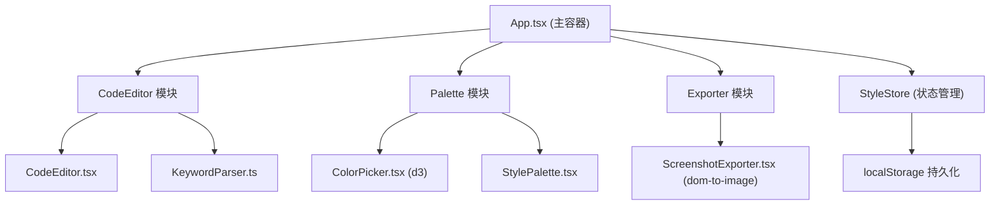

## 1. 架构设计


## 2. 技术说明
- 前端框架：React@18 + TypeScript@5 + Vite@5
- 构建工具：Vite + @vitejs/plugin-react
- 状态管理：zustand（全局样式状态管理）
- 颜色交互：d3@7（HSV色相环生成）
- 截图导出：dom-to-image-more（PNG/SVG导出）
- 样式方案：Tailwind CSS@3（原子化样式）
- 图标库：lucide-react

## 3. 目录结构
```
src/
├── App.tsx                    # 主应用容器，布局管理，状态协调
├── index.css                  # Tailwind CSS 入口
├── main.tsx                   # React 入口
├── vite-env.d.ts              # Vite 类型声明
├── store/
│   └── useStyleStore.ts       # zustand 状态管理（样式配置+localStorage）
├── modules/
│   ├── editor/
│   │   ├── CodeEditor.tsx     # 代码编辑器组件
│   │   └── KeywordParser.ts   # 关键字解析器
│   ├── palette/
│   │   ├── ColorPicker.tsx    # d3 HSV色相环颜色选择器
│   │   └── StylePalette.tsx   # 样式调色板组件
│   └── exporter/
│       └── ScreenshotExporter.tsx  # 截图导出组件
└── types/
    └── index.ts               # 类型定义
```

## 4. 数据模型

### 4.1 类型定义
```typescript
interface KeywordStyle {
  start: number;           // 字符起始位置
  end: number;             // 字符结束位置
  text: string;            // 关键字文本
  color: string;           // 颜色值（默认#3B82F6）
  bold: boolean;           // 加粗
  italic: boolean;         // 斜体
  underline: boolean;      // 下划线
}

interface StyleState {
  code: string;            // 当前代码文本
  styles: KeywordStyle[];  // 所有关键字样式配置
  selectedRange: { start: number; end: number } | null;  // 当前选区
  currentColor: string;    // 当前选中的颜色
}
```

### 4.2 localStorage结构
```json
{
  "codePalette.styles": KeywordStyle[],
  "codePalette.code": "string"
}
```

## 5. 组件通信
- **App.tsx** 作为容器，管理全局布局（导航栏+左右分栏+拖拽分界线）
- **zustand store** 作为单一数据源，所有模块通过store读写状态
- **CodeEditor** 监听用户选区，通过store更新selectedRange
- **StylePalette/ColorPicker** 修改当前选中关键字的样式，更新store
- **ScreenshotExporter** 订阅store，获取代码和样式配置后调用dom-to-image导出

## 6. 性能优化
- 使用memo包装ColorPicker网格色块，避免不必要重渲染
- 代码编辑器使用requestAnimationFrame节流输入响应
- 样式变更批量更新，减少重排次数
- d3色相环使用useMemo缓存计算结果
