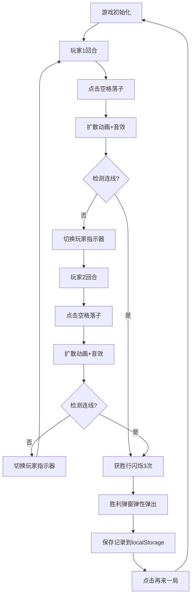

## 1. 产品概述

像素叠叠乐是一款双人对战的像素风格井字棋游戏，两名玩家轮流在3x3九宫格中放置不同颜色的像素块，先达成行、列或对角线同色连线的玩家获胜。游戏采用深色科技感UI，配合流畅的像素扩散动画和音效反馈，提供沉浸式的对战体验。

- 目标用户：喜欢休闲对战小游戏的用户群体
- 产品价值：提供操作简单、视觉精美的像素风双人对战体验

## 2. 核心功能

### 2.1 用户角色
| 角色 | 参与方式 | 核心权限 |
|------|----------|----------|
| 玩家1（靛蓝色） | 本地双人对战 | 放置像素块、悔棋（1次） |
| 玩家2（玫红色） | 本地双人对战 | 放置像素块、悔棋（1次） |

### 2.2 功能模块
1. **游戏主界面**：3x3九宫格画布、回合指示器、实时得分牌
2. **游戏核心逻辑**：落子判定、连线检测、胜负判断、悔棋功能
3. **视觉动效系统**：像素扩散动画、发光描边、获胜闪烁、弹窗动画
4. **音效系统**：Web Audio API生成点击反馈音效
5. **历史记录**：localStorage存储对局记录、最近5局展示

### 2.3 页面详情
| 页面名称 | 模块名称 | 功能描述 |
|-----------|-------------|---------------------|
| 游戏主界面 | 九宫格画布 | 300x300px 3x3格子，点击放置像素块，带扩散动画 |
| 游戏主界面 | 回合指示器 | 右上方圆形头像，显示当前玩家，带滑动过渡 |
| 游戏主界面 | 得分牌 | 左侧实时显示双方胜场数，卡片样式 |
| 游戏主界面 | 悔棋按钮 | 每方每局限用一次，移除上一步落子 |
| 游戏主界面 | 历史记录面板 | 底部展示最近5局对局信息 |
| 胜利弹窗 | 胜利展示 | 显示胜者头像、胜利文字、再来一局按钮 |

## 3. 核心流程

### 主游戏流程
玩家进入游戏 → 玩家1点击空格 → 像素块扩散填充动画+音效 → 系统检测胜负 → 切换到玩家2（滑动过渡） → 循环落子 → 达成连线 → 获胜行闪烁3次 → 弹出胜利弹窗（弹性缩放） → 保存对局记录 → 点击再来一局重置棋盘

## 4. 用户界面设计

### 4.1 设计风格
- **设计主题**：深色科技像素风（Dark Tech Pixel）
- **主背景色**：#0F172A（深蓝黑）
- **卡片背景**：#1E293B（石板灰蓝）
- **文本主色**：#F8FAFC（近白）
- **玩家1颜色**：#6366F1（靛蓝）
- **玩家2颜色**：#F43F5E（玫红）
- **获胜高亮**：#22C55E（翠绿）
- **强调色**：#3B82F6（亮蓝）、#F59E0B（琥珀）
- **分隔线**：#475569（中灰蓝）
- **悬停加深**：#334155
- **字体**：JetBrains Mono等宽字体（数字）、系统sans-serif（文本）
- **按钮风格**：圆角12px，悬停渐变过渡，0.2s transition
- **布局风格**：居中卡片式布局，顶部信息区+中央画布+底部历史记录

### 4.2 页面设计概述
| 页面名称 | 模块名称 | UI元素 |
|-----------|-------------|-------------|
| 游戏主界面 | 顶部信息区 | 左侧得分牌（圆角12px，背景#1E293B，数字monospace 30px加粗）、右侧玩家指示器（圆形48px头像+名字+颜色小圆点，0.2s滑动过渡） |
| 游戏主界面 | 九宫格画布 | 300x300px容器，3x3网格每格100x100px，1px #475569分隔线，像素块0.3s ease-out扩散动画，0.15s发光描边 |
| 游戏主界面 | 控制区 | 悔棋按钮（禁用状态视觉提示）、再来一局按钮 |
| 游戏主界面 | 历史记录 | 列表展示最近5局，悬停背景#334155，格式：玩家A vs 玩家B · 胜者 · 时间 |
| 胜利弹窗 | 弹层 | 毛玻璃遮罩#0F172A88，弹窗背景#1E293B圆角20px内边距24px，0.3s弹性缩放，胜者头像，按钮悬停渐变#3B82F6→#2563EB |

### 4.3 响应式
- **桌面端**：画布300x300px，水平布局（得分+画布+指示器）
- **移动端**：画布240x240px，垂直堆叠布局，控制面板移至画布下方
- **触摸优化**：点击区域≥48px，触摸反馈即时

### 4.4 动效性能要求
- 所有动画60FPS流畅运行
- 点击到视觉反馈延迟≤50ms
- 使用CSS transform/opacity实现动画，避免重排
- Web Audio API预创建AudioContext，首次点击时激活
