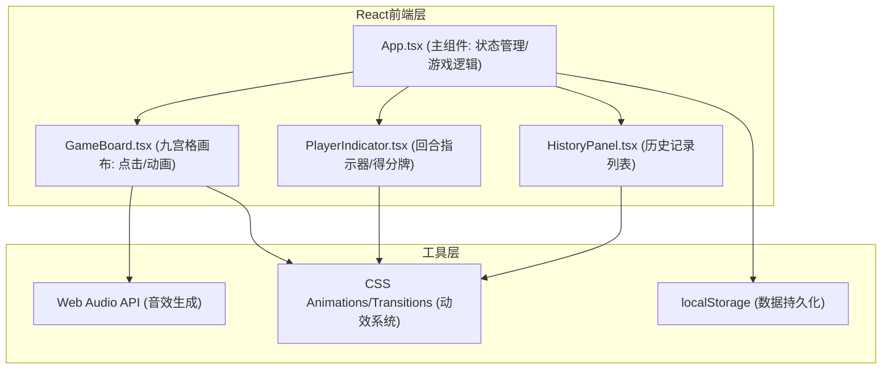

## 1. 架构设计



## 2. 技术描述

- **前端框架**：React@18 + TypeScript@5（严格模式）
- **构建工具**：Vite@5 + @vitejs/plugin-react@4
- **样式方案**：原生CSS + CSS Modules（无需tailwind，用户未要求）
- **状态管理**：React useState/useReducer（本地状态，无需zustand）
- **音效系统**：Web Audio API（OscillatorNode + GainNode合成音符）
- **数据持久化**：localStorage（存储胜场数+对局记录）
- **动画方案**：纯CSS transition/keyframes（60FPS性能优化）

## 3. 项目文件结构
```
.
├── package.json          # 依赖配置（react, react-dom, typescript, vite, @vitejs/plugin-react）
├── index.html            # 入口页面（全屏#0F172A背景）
├── vite.config.js        # Vite构建配置
├── tsconfig.json         # TypeScript严格模式配置
└── src/
    ├── App.tsx           # 主组件：游戏状态、回合管理、胜负判定、布局
    ├── GameBoard.tsx     # 九宫格组件：渲染、点击事件、放置动画
    ├── PlayerIndicator.tsx  # 指示器组件：头像、颜色点、比分牌
    ├── HistoryPanel.tsx  # 历史记录组件：localStorage读取、列表渲染
    ├── types.ts          # TypeScript类型定义（可选，内联也可）
    └── utils/
        ├── audio.ts      # Web Audio API音效工具
        └── storage.ts    # localStorage读写工具
```

## 4. 核心数据模型

### 4.1 TypeScript类型定义
```typescript
// 玩家类型
type Player = 'player1' | 'player2';

// 格子状态：null为空，否则为放置的玩家
type CellState = Player | null;

// 棋盘状态：3x3二维数组
type BoardState = CellState[][];

// 玩家配置
interface PlayerConfig {
  id: Player;
  name: string;
  color: string;  // '#6366F1' | '#F43F5E'
}

// 对局记录
interface GameRecord {
  id: string;
  player1Name: string;
  player2Name: string;
  winner: Player | 'draw';
  timestamp: number;
}

// 游戏统计
interface GameStats {
  player1Wins: number;
  player2Wins: number;
  totalGames: number;
}

// 游戏状态
type GameStatus = 'playing' | 'player1Win' | 'player2Win' | 'draw';
```

### 4.2 localStorage存储结构
```typescript
// Key: 'pixel_game_stats'
{
  player1Wins: number,
  player2Wins: number
}

// Key: 'pixel_game_records'
[
  { id, player1Name, player2Name, winner, timestamp },
  ...  // 最多保留20条，展示最近5条
]
```

## 5. 核心算法

### 5.1 胜负判定算法
```
输入：BoardState (3x3数组)
输出：{ winner: Player | null, line: [row,col][] | null }

1. 检查3行：每行3格是否同色且非空
2. 检查3列：每列3格是否同色且非空
3. 检查2对角线：(0,0)(1,1)(2,2) 和 (0,2)(1,1)(2,0)
4. 若全部填满且无连线 → 平局
```

### 5.2 获胜线索引表（预定义，避免重复计算）
```typescript
const WINNING_LINES: [number, number][][] = [
  [[0,0],[0,1],[0,2]],  // 行0
  [[1,0],[1,1],[1,2]],  // 行1
  [[2,0],[2,1],[2,2]],  // 行2
  [[0,0],[1,0],[2,0]],  // 列0
  [[0,1],[1,1],[2,1]],  // 列1
  [[0,2],[1,2],[2,2]],  // 列2
  [[0,0],[1,1],[2,2]],  // 主对角线
  [[0,2],[1,1],[2,0]],  // 副对角线
];
```

## 6. 性能优化策略

1. **CSS动画GPU加速**：所有动画使用 transform/opacity，加 will-change: transform
2. **React渲染优化**：
   - 使用React.memo包裹子组件（GameBoard等）
   - 使用useCallback缓存事件处理函数
   - 棋盘格子使用key稳定标识
3. **音效优化**：
   - AudioContext单例模式，首次用户交互后创建
   - 预计算音符频率，落子时直接播放
   - 使用短音符（≤100ms）避免卡顿
4. **localStorage**：
   - 读写使用节流（游戏结束时统一写入）
   - 记录数量上限（20条），超出自动删除最早记录

## 7. 音效设计（Web Audio API）

| 事件 | 频率 | 波形 | 时长 | 音量 |
|------|------|------|------|------|
| 玩家1落子 | 523.25Hz (C5) | sine | 80ms | 0.25 |
| 玩家2落子 | 659.25Hz (E5) | sine | 80ms | 0.25 |
| 获胜 | 523→659→784Hz 琶音 | sine | 300ms | 0.3 |
| 悔棋 | 392Hz (G4) 降调 | triangle | 120ms | 0.2 |
