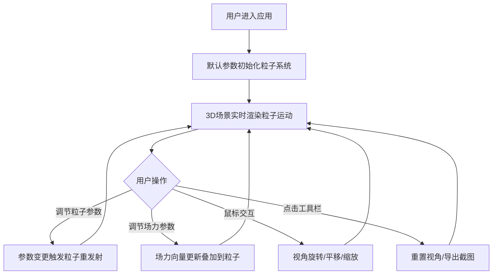

## 1. 产品概述

本产品是一款基于Web的3D流体粒子模拟应用，用户可在浏览器中通过调节参数实时模拟烟雾、水流、火焰等流体运动效果。解决传统粒子模拟工具需安装专业软件、交互反馈不直观的痛点，降低物理模拟的使用门槛。

- 核心用户：视觉设计师、游戏开发者、教育工作者、CG艺术爱好者
- 产品价值：零安装、实时反馈、可视化参数调节的专业级粒子模拟体验

## 2. 核心特性

### 2.1 功能模块

1. **粒子系统控制面板**：粒子数量、初始速度、发射角度、生命周期、粒子大小调节
2. **场力模拟模块**：重力场、涡旋场、风场的独立控制与叠加作用
3. **粒子渲染引擎**：多色渐变、透明度衰减、运动拖尾效果
4. **3D场景交互**：视角旋转、平移、缩放控制
5. **工具栏**：重置视角、PNG截图导出

### 2.2 页面详情

| 页面名称 | 模块名称 | 功能描述 |
|-----------|-------------|---------------------|
| 主界面 | 顶部工具栏 | 重置视角（带动画）、导出PNG截图按钮 |
| 主界面 | 左侧控制面板 | 折叠式分组：粒子参数、场力参数、渲染参数 |
| 主界面 | 右侧3D场景 | Three.js Canvas渲染区，粒子系统与场力可视化 |

## 3. 核心流程

## 4. 用户界面设计

### 4.1 设计风格

- **主色调**：深色科技风，背景 #0F172A，面板渐变 #1A202C → #2D3748
- **强调色**：滑块圆钮 #63B3ED，边框 #4A5568，轨道 #718096，标题文字 #A0AEC0
- **圆角**：滑块/按钮/输入框统一 6px 圆角
- **交互反馈**：按钮点击 0.1s 缩放至 0.95 倍，折叠面板图标 0.2s 旋转动画
- **字体**：现代无衬线字体体系，标题粗体，参数值等宽字体显示

### 4.2 页面设计概述

| 页面名称 | 模块名称 | UI 元素 |
|-----------|-------------|-------------|
| 主界面 | 顶部工具栏 | 固定高度 48px，左侧应用标题，右侧功能按钮组（重置视角 + 导出截图） |
| 主界面 | 左侧控制面板 | 固定宽度 320px，纵向滚动，折叠面板分组，每组参数卡片独立背景 |
| 主界面 | 右侧 3D 场景 | 全屏铺满剩余空间，Canvas 背景 #0F172A，场力用彩色半透明球体+箭头可视化 |

### 4.3 响应式设计

- 桌面端优先设计（≥1280px）
- 窄屏下控制面板可折叠为浮动抽屉
- 触控设备支持手势缩放与旋转

### 4.4 3D 场景指导

- **环境**：深色纯色背景 #0F172A，无HDRI避免视觉干扰
- **光照**：基础环境光 + 轻微方向光，确保粒子与场力可视化球体清晰可辨
- **相机**：PerspectiveCamera，初始距离 15，fov 60°
- **相机控制**：OrbitControls，旋转阻尼 0.5，右键平移，滚轮缩放范围 0.5x-20x
- **场力可视化**：重力（红色箭头）、涡旋（紫色半透明球 + 旋转箭头）、风场（青色箭头）
- **粒子优化**：BufferGeometry + PointsMaterial，单 Draw Call，300 粒子下稳定 60FPS
