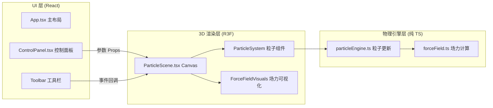

## 1. 架构设计



## 2. 技术说明

- **前端框架**：React 18 + TypeScript (严格模式)
- **构建工具**：Vite 5 + @vitejs/plugin-react
- **3D 引擎**：Three.js 0.160 + @react-three/fiber 8 + @react-three/drei 9
- **状态管理**：React useState/useCallback（无需全局状态，Props 单向传递即可）
- **样式方案**：原生 CSS + CSS 变量（暗色主题 Tokens）
- **初始化工具**：vite-init（react-ts 模板）

## 3. 文件组织结构

```
src/
├── App.tsx                    # 主组件：左右布局 + Canvas + UI
├── components/
│   ├── ControlPanel.tsx       # 控制面板：粒子/场力/渲染参数分组折叠
│   └── ParticleScene.tsx      # 3D 场景：Canvas 包裹粒子与场力
├── utils/
│   ├── particleEngine.ts      # 粒子物理引擎：位置/速度/生命周期更新
│   └── forceField.ts          # 场力计算：重力/涡旋/风场向量函数
├── types/
│   └── index.ts               # 全局类型定义（粒子参数、场力参数）
├── styles/
│   └── index.css              # 全局样式 + 主题 CSS 变量
└── main.tsx                   # 入口
```

## 4. 核心数据模型

### 4.1 粒子参数 (ParticleParams)

| 字段 | 类型 | 范围 | 默认值 | 说明 |
|------|------|------|--------|------|
| count | number | 50-500 | 200 | 粒子数量 |
| velocity | {x,y,z} | -5 ~ 5 | {x:0,y:2,z:0} | 初始速度矢量 |
| emissionAngle | number | 0-360 | 45 | 发射扩散角度（度） |
| lifetime | number | 1-10 | 4 | 生命周期（秒） |
| size | number | 1-8 | 3 | 粒子尺寸（像素） |

### 4.2 场力参数 (ForceFieldParams)

| 字段 | 类型 | 说明 |
|------|------|------|
| gravity | { axis: 'x'\|'y'\|'z', strength: number } | 重力轴与强度 (-10~10) |
| vortex | { strength: number, radius: number, position: {x,y,z} } | 涡旋强度 (0-50) 半径 (50-200) |
| wind | { angle: number, strength: number } | 风场方向角 (0-360°) 强度 (0-20) |

### 4.3 渲染参数 (RenderParams)

| 字段 | 类型 | 说明 |
|------|------|------|
| colors | string[] | 2-4 种渐变色起始色 |
| trailLength | number | 5-20 帧拖尾长度 |

### 4.4 粒子运行时状态 (ParticleState)

由 `particleEngine.ts` 维护的 Float32Array 结构（每个粒子 10 个浮点数）：

```
[posX, posY, posZ, velX, velY, velZ, age, lifetime, colorR, colorG, colorB, alpha]
```

## 5. 性能优化策略

1. **BufferGeometry + Points**：单 Draw Call 渲染所有粒子，避免实例化开销
2. **TypedArray 直接写入**：particleEngine 输出 Float32Array 直接赋值给 BufferAttribute
3. **按需重置**：仅粒子数量/初始速度/发射角度/生命周期变更时重发射，场力参数变更仅更新力向量
4. **requestAnimationFrame 节流**：粒子更新逻辑与 R3F 自动帧率绑定
5. **拖尾复用 Geometry**：拖尾线段复用同一 LineGeometry，仅更新 position attribute
