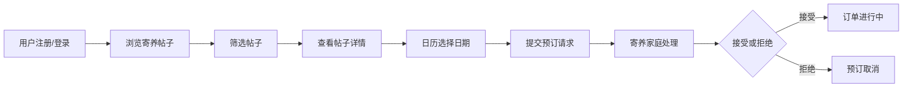

## 1. 产品概述

萌宠驿站是一个连接宠物主人与寄养家庭的平台，解决宠物主人出差或旅游时难以找到可靠、爱宠的临时寄养家庭的痛点。平台提供温馨的寄养服务匹配体验，让宠物在熟悉的家庭环境中获得关爱。

- 目标用户：有寄养需求的宠物主人、愿意提供寄养服务的爱心家庭
- 核心价值：安全可靠的寄养匹配、温馨的家庭式寄养体验、便捷的在线预订管理

## 2. 核心功能

### 2.1 用户角色

| 角色 | 注册方式 | 核心权限 |
|------|---------|---------|
| 宠物主人 | 邮箱密码注册 | 发布寄养需求、浏览寄养家庭、提交预订请求、管理订单 |
| 寄养家庭 | 邮箱密码注册 | 浏览寄养需求、接受预订、管理档期、管理订单 |

### 2.2 功能模块

1. **用户认证模块**：注册、登录、JWT令牌鉴权
2. **寄养帖子模块**：发布寄养需求、浏览帖子列表、筛选搜索
3. **日历预订模块**：可预订日期展示、日期选择、预订提交
4. **订单管理模块**：我的订单、预订请求处理（接受/拒绝）、订单状态追踪

### 2.3 页面详情

| 页面名称 | 模块名称 | 功能描述 |
|---------|---------|---------|
| 首页 | 帖子列表 | 卡片网格展示所有寄养需求，按发布时间倒序排列 |
| 首页 | 筛选器 | 按城市、宠物种类、价格区间实时筛选 |
| 首页 | 空状态 | 无筛选结果时显示友好提示 |
| 发布页 | 表单提交 | 填写宠物信息和寄养时间，发布新帖子 |
| 日历预订页 | 日历视图 | 网格日历展示可预订/已预订日期 |
| 日历预订页 | 日期选择 | 选择1-7天连续日期段，高亮显示选中日期 |
| 日历预订页 | 预订提交 | 确认日期后提交预订请求 |
| 个人中心 | 我的订单 | 查看发布的帖子状态和收到的预订请求 |
| 个人中心 | 请求处理 | 接受或拒绝预订请求 |

## 3. 核心流程

### 3.1 发布寄养需求流程
用户登录 → 进入发布页 → 填写宠物信息（名称、种类、照片、性格、价格、时间范围） → 提交 → 返回首页 → 新帖子显示在列表顶部

### 3.2 预订寄养服务流程
浏览帖子 → 点击卡片进入详情 → 查看日历可预订日期 → 选择1-7天连续日期 → 提交预订请求 → 等待寄养家庭确认 → 订单状态更新

### 3.3 订单处理流程
寄养家庭登录 → 进入个人中心 → 查看收到的预订请求 → 接受/拒绝请求 → 订单状态更新 → 双方查看订单状态

## 4. 用户界面设计

### 4.1 设计风格

- **主色调**：#F97316（暖橙色），代表温馨活力
- **辅助色**：#FDE68A（淡黄色），柔和温暖
- **背景色**：#FFF7ED（浅橙色），营造温馨氛围
- **卡片样式**：白色背景，圆角16px，阴影 0 2px 8px rgba(0,0,0,0.1)
- **字体**：圆润友好的无衬线字体
- **整体风格**：温馨可爱、简洁明快、亲和力强

### 4.2 页面设计概述

| 页面名称 | 模块名称 | UI元素 |
|---------|---------|-------|
| 首页 | 顶部导航 | Logo、导航链接、用户头像、登录按钮 |
| 首页 | 筛选栏 | 城市下拉、宠物种类下拉、价格区间输入，水平排列，平滑过渡 |
| 首页 | 帖子卡片 | 宠物照片（4:3比例）、种类标签、时间范围、距离、价格，悬停上移4px加深阴影 |
| 首页 | 卡片网格 | 响应式布局：1200px+四列、768-1199px两列、<768px单列 |
| 发布页 | 表单 | 分组表单：宠物信息组、寄养时间组，输入框带圆角和橙色焦点边框 |
| 日历页 | 日历头部 | 月份切换按钮、当前年月显示 |
| 日历页 | 日期格子 | 50x50px，可预订日绿色背景绿色文字，已预订日红色背景红色文字，悬停缩放1.1倍 |
| 日历页 | 选中状态 | 选中日期背景 #3B82F6，白色文字 |
| 通用 | 骨架屏 | 加载时显示淡入淡出动画骨架 |
| 通用 | Toast通知 | 提交成功3秒自动消失，橙色主题 |

### 4.3 响应式

- Desktop-first 设计
- 断点：1200px（4列）、768px（2列）、768px以下（1列）
- 移动端优化触摸交互，按钮尺寸不小于44px

### 4.4 交互与动效

- 卡片悬停：上移4px，阴影加深，过渡 0.3s ease
- 按钮悬停：背景色变深，缩放1.02倍
- 日历格子悬停：缩放1.1倍，显示提示气泡
- 页面切换：淡入过渡
- 加载状态：骨架屏脉冲动画
- Toast通知：从顶部滑入，3秒后滑出
