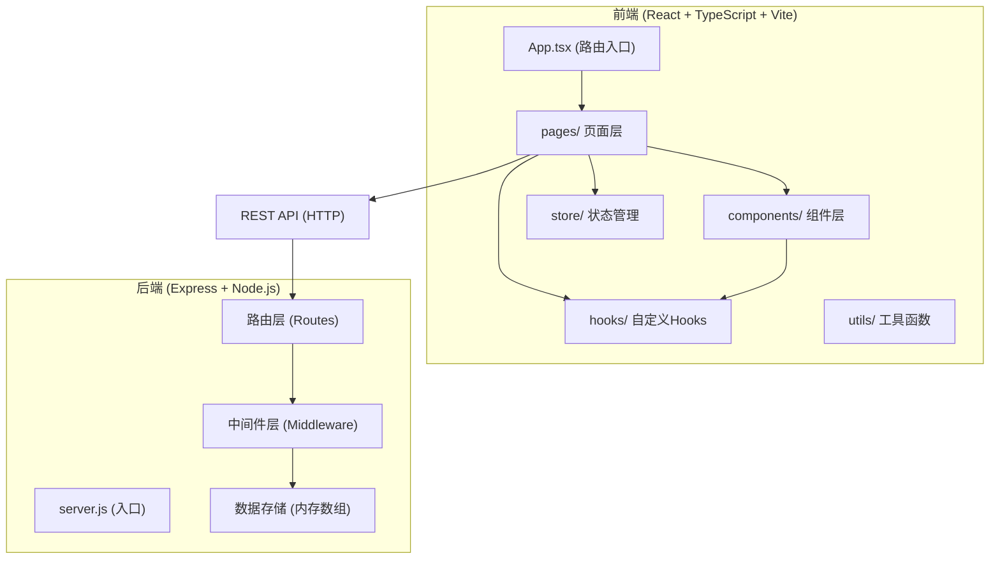
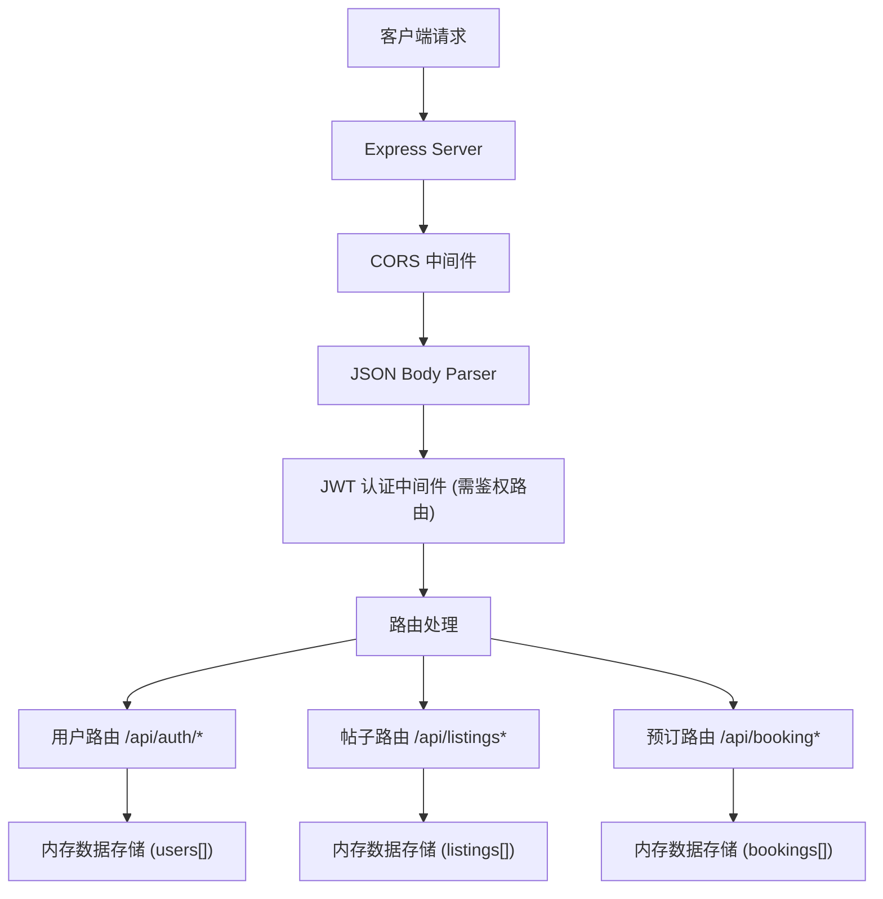
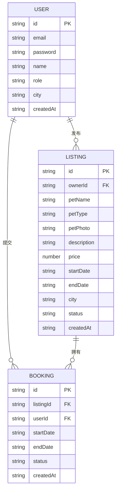

## 1. 架构设计



## 2. 技术说明

- **前端**：React 18 + TypeScript + Vite 6
- **后端**：Express 4 + Node.js
- **状态管理**：Zustand
- **路由**：React Router v6
- **HTTP客户端**：Axios
- **样式方案**：Tailwind CSS 3
- **图标**：Lucide React
- **数据存储**：内存数组（开发演示用）
- **认证**：JWT (jsonwebtoken) + bcryptjs 密码加密
- **跨域**：cors 中间件
- **ID生成**：uuid

## 3. 路由定义

| 前端路由 | 页面 | 说明 |
|---------|-----|------|
| `/` | 首页 Home | 寄养帖子列表 + 筛选器 |
| `/publish` | 发布页 Publish | 发布新的寄养需求 |
| `/booking/:id` | 日历预订页 Booking | 查看日历并提交预订 |
| `/profile` | 个人中心 Profile | 我的订单、预订请求管理 |
| `/login` | 登录页 Login | 用户登录 |
| `/register` | 注册页 Register | 用户注册 |

## 4. API 定义

### 4.1 认证接口

| 方法 | 路径 | 说明 | 请求体 | 响应 |
|-----|------|-----|--------|------|
| POST | `/api/auth/register` | 用户注册 | `{ email, password, name, role }` | `{ token, user }` |
| POST | `/api/auth/login` | 用户登录 | `{ email, password }` | `{ token, user }` |

### 4.2 寄养帖子接口

| 方法 | 路径 | 说明 | 请求体/参数 | 响应 |
|-----|------|-----|-------------|------|
| GET | `/api/listings` | 获取帖子列表 | query: `city?, type?, minPrice?, maxPrice?` | `{ listings: Listing[] }` |
| GET | `/api/listings/:id` | 获取帖子详情 | params: `id` | `{ listing: Listing }` |
| POST | `/api/listing` | 创建帖子 | `{ title, petName, petType, petPhoto, description, price, startDate, endDate, city }` | `{ listing: Listing }` |

### 4.3 预订接口

| 方法 | 路径 | 说明 | 请求体/参数 | 响应 |
|-----|------|-----|-------------|------|
| GET | `/api/bookings/:listingId` | 获取帖子的预订记录 | params: `listingId` | `{ bookings: Booking[] }` |
| POST | `/api/booking` | 提交预订请求 | `{ listingId, startDate, endDate }` | `{ booking: Booking }` |
| PUT | `/api/booking/:id/status` | 更新预订状态 | params: `id`, body: `{ status }` | `{ booking: Booking }` |
| GET | `/api/my/bookings` | 获取我的预订 | - | `{ bookings: Booking[] }` |
| GET | `/api/my/listings` | 获取我发布的帖子 | - | `{ listings: Listing[] }` |

### 4.4 TypeScript 类型定义

```typescript
interface User {
  id: string;
  email: string;
  name: string;
  role: 'owner' | 'foster';
  avatar?: string;
  city?: string;
}

interface Listing {
  id: string;
  ownerId: string;
  ownerName: string;
  petName: string;
  petType: string;
  petPhoto: string;
  description: string;
  price: number;
  startDate: string;
  endDate: string;
  city: string;
  createdAt: string;
  status: 'active' | 'completed';
}

interface Booking {
  id: string;
  listingId: string;
  userId: string;
  userName: string;
  startDate: string;
  endDate: string;
  status: 'pending' | 'accepted' | 'rejected' | 'completed';
  createdAt: string;
}
```

## 5. 服务器架构图



## 6. 数据模型

### 6.1 数据模型定义



### 6.2 初始数据

项目启动时将预置演示数据，包括：
- 2-3个测试用户（宠物主人和寄养家庭）
- 5-8条示例寄养帖子
- 2-3条示例预订记录
