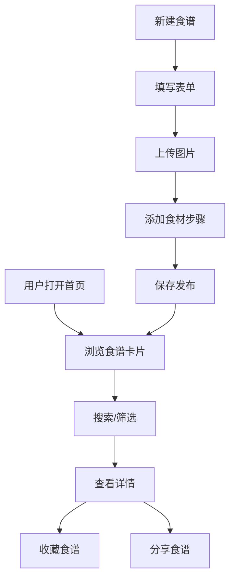

## 1. 产品概述

智能食谱管家是一款帮助用户在浏览器中创建和管理个人烹饪食谱数字化收藏的应用，解决实体菜谱容易丢失、难以按食材或做法检索、以及与朋友分享食谱过于繁琐的问题。

- 主要面向热爱烹饪的家庭用户和美食爱好者
- 核心价值：便捷的食谱数字化管理、智能检索、一键分享

## 2. 核心功能

### 2.1 用户角色

| 角色 | 注册方式 | 核心权限 |
|------|----------|----------|
| 普通用户 | 访客模式（本地存储） | 浏览食谱、创建食谱、收藏食谱、分享食谱 |

### 2.2 功能模块

1. **首页列表**：搜索框、标签筛选面板、食谱卡片网格
2. **食谱详情页**：完整食谱信息展示、收藏按钮、分享按钮
3. **新建食谱页**：食谱表单、食材动态添加、富文本步骤编辑、标签选择
4. **用户空间页**：个人收藏夹、已创建的食谱
5. **搜索结果页**：搜索结果展示、高级筛选

### 2.3 页面详情

| 页面名称 | 模块名称 | 功能描述 |
|----------|----------|----------|
| 首页列表 | 顶部导航栏 | Logo、搜索框、用户头像、登录按钮 |
| 首页列表 | 标签筛选面板 | 标签分类、烹饪时长筛选 |
| 首页列表 | 食谱卡片网格 | 食谱卡片展示、悬停动画、淡入动画 |
| 食谱详情页 | 食谱信息展示 | 封面图、名称、食材、步骤、标签、烹饪时长 |
| 食谱详情页 | 收藏功能 | 心形收藏按钮、缩放动画 |
| 食谱详情页 | 分享功能 | 分享模态框、复制链接、二维码 |
| 新建食谱页 | 食谱表单 | 名称输入、封面上传预览、食材动态增删、富文本步骤、标签选择 |
| 用户空间页 | 收藏夹 | 已收藏食谱列表 |
| 搜索结果页 | 结果展示 | 搜索关键词、筛选条件、结果卡片 |

## 3. 核心流程

### 3.1 浏览食谱流程
用户打开首页 → 查看食谱卡片列表 → 通过搜索框或标签筛选 → 点击卡片进入详情页 → 查看完整食谱信息

### 3.2 创建食谱流程
用户点击新建 → 填写食谱名称 → 上传封面图片 → 添加食材（动态增删）→ 编写步骤说明（富文本）→ 选择标签 → 提交保存

### 3.3 收藏与分享流程
用户浏览食谱 → 点击心形按钮收藏 → 点击分享按钮 → 弹出分享模态框 → 复制链接或扫描二维码

## 4. 用户界面设计

### 4.1 设计风格
- **主色调**：浅色主题，主背景 #F8FAFC，卡片背景 #FFFFFF
- **文字颜色**：标题 #1E293B，正文 #475569，链接 #3B82F6
- **边框分隔**：#E2E8F0
- **强调色**：收藏红心 #EF4444，搜索框背景 #F3F4F6
- **卡片设计**：圆角 12px，阴影 0 2px 8px rgba(0,0,0,0.08)，悬停上浮 4px
- **动效**：淡入向上移动动画 0.4s ease-out，收藏按钮缩放动画 0.3s

### 4.2 排版
- 采用现代无衬线字体体系
- 标题层级清晰，卡片名称醒目
- 食材和步骤信息排版规整易读

### 4.3 页面设计概览

| 页面名称 | 模块名称 | UI元素 |
|----------|----------|--------|
| 首页列表 | 顶部导航 | 固定高度 64px，白底，底部边框，左右布局 |
| 首页列表 | 筛选面板 | 左侧 25% 宽度，标签列表，时长筛选 |
| 首页列表 | 卡片网格 | 右侧 75%，自适应列宽，最小 280px，间距 24px |
| 食谱详情 | 内容区 | 大图展示，食材列表，步骤编号，标签云 |
| 新建食谱 | 表单区 | 分组表单，动态行，富文本编辑器 |

### 4.4 响应式设计
- 桌面端：两栏布局（左侧筛选 25%，右侧内容 75%）
- 移动端（<768px）：筛选面板变为可折叠侧边栏，从左侧滑入，宽度 280px，遮罩层半透明 #00000050
- 触控优化：按钮最小点击区域，触控反馈动画

### 4.5 动效与交互
- 页面加载：卡片淡入向上移动 0.4s ease-out，错落延迟
- 卡片悬停：上浮 4px，阴影加深，过渡 0.2s ease-in-out
- 收藏按钮：空心 → 填充红色，缩放 1.0→1.3→1.0，时长 0.3s
- 分享模态框：背景模糊 #00000088，关闭淡出 0.2s
- 按钮点击：缩放 0.95 倍，0.15s 触感反馈

### 4.6 性能指标
- 首次内容渲染（FCP）≤ 1.5s
- 食谱列表加载（10-15 张卡片）≤ 500ms
- 搜索响应时间 ≤ 300ms
