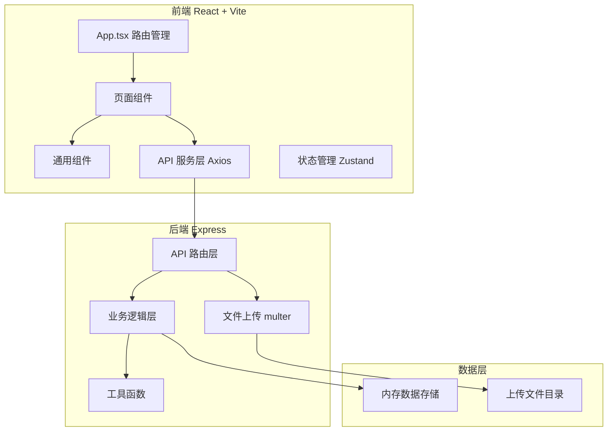
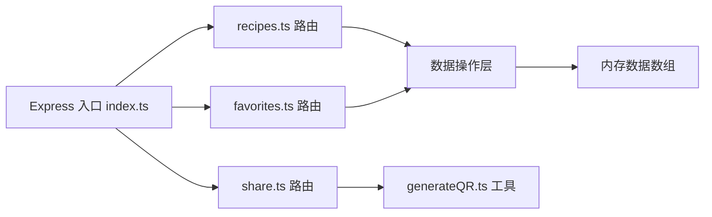
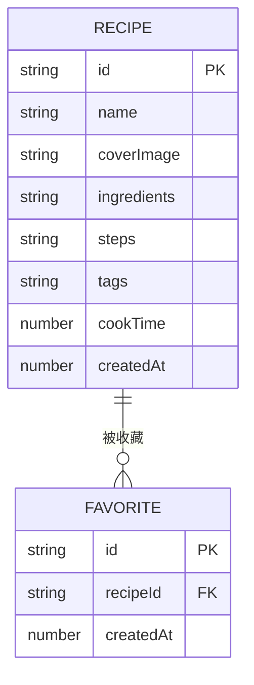

## 1. 架构设计



## 2. 技术说明

- **前端框架**：React 18 + TypeScript + Vite
- **路由管理**：React Router v6
- **HTTP 请求**：Axios
- **状态管理**：Zustand
- **样式方案**：原生 CSS（CSS Modules）
- **图标库**：Lucide React
- **后端框架**：Express 4 + TypeScript
- **文件上传**：Multer
- **二维码生成**：qrcode
- **唯一 ID**：uuid
- **跨域处理**：cors

## 3. 路由定义

| 路由 | 用途 | 页面组件 |
|------|------|----------|
| / | 首页 - 食谱列表 | RecipeList |
| /recipes/:id | 食谱详情页 | RecipeDetail |
| /create | 新建食谱页 | CreateRecipe |
| /profile | 用户空间页 | Profile |
| /search | 搜索结果页 | SearchResult |
| /share/:id | 食谱公开分享页 | ShareRecipe |

## 4. API 定义

### 4.1 食谱 API

```typescript
interface Recipe {
  id: string;
  name: string;
  coverImage: string;
  ingredients: { name: string; amount: string }[];
  steps: string;
  tags: string[];
  cookTime: number; // 分钟
  createdAt: number;
  isFavorite?: boolean;
}

// GET /api/recipes - 获取食谱列表
// Query: search, tags, cookTimeRange
// Response: Recipe[]

// GET /api/recipes/:id - 获取食谱详情
// Response: Recipe

// POST /api/recipes - 创建食谱
// Body: FormData (name, ingredients, steps, tags, cookTime, coverImage)
// Response: Recipe

// PUT /api/recipes/:id - 更新食谱
// Response: Recipe

// DELETE /api/recipes/:id - 删除食谱
// Response: { success: boolean }
```

### 4.2 收藏 API

```typescript
// GET /api/favorites - 获取收藏列表
// Response: Recipe[]

// POST /api/favorites/:id - 收藏食谱
// Response: { success: boolean; isFavorite: boolean }

// DELETE /api/favorites/:id - 取消收藏
// Response: { success: boolean; isFavorite: boolean }
```

### 4.3 分享 API

```typescript
interface ShareInfo {
  shareUrl: string;
  qrCodeDataUrl: string;
}

// GET /api/share/:id - 生成分享链接和二维码
// Response: ShareInfo
```

### 4.4 搜索建议 API

```typescript
// GET /api/search/suggestions?keyword=xxx
// Response: string[] (最多5条建议)
```

## 5. 服务端架构



## 6. 项目文件结构

```
auto269/
├── package.json
├── index.html
├── vite.config.ts
├── tsconfig.json
├── client/
│   └── src/
│       ├── App.tsx
│       ├── main.tsx
│       ├── index.css
│       ├── pages/
│       │   ├── RecipeList.tsx
│       │   ├── RecipeDetail.tsx
│       │   ├── CreateRecipe.tsx
│       │   ├── Profile.tsx
│       │   └── SearchResult.tsx
│       ├── components/
│       │   ├── RecipeCard.tsx
│       │   ├── Navbar.tsx
│       │   ├── FilterPanel.tsx
│       │   ├── SearchBar.tsx
│       │   └── ShareModal.tsx
│       ├── api/
│       │   └── index.ts
│       ├── store/
│       │   └── useRecipeStore.ts
│       ├── types/
│       │   └── index.ts
│       └── utils/
│           └── index.ts
├── server/
│   ├── index.ts
│   ├── routes/
│   │   ├── recipes.ts
│   │   ├── favorites.ts
│   │   └── share.ts
│   ├── utils/
│   │   └── generateQR.ts
│   ├── data/
│   │   └── mockData.ts
│   └── types/
│       └── index.ts
└── uploads/
    └── (图片上传目录)
```

## 7. 数据模型

### 7.1 数据实体



### 7.2 初始数据

预置 10-15 条示例食谱数据，覆盖不同菜系、标签和烹饪时长，用于演示和测试。
