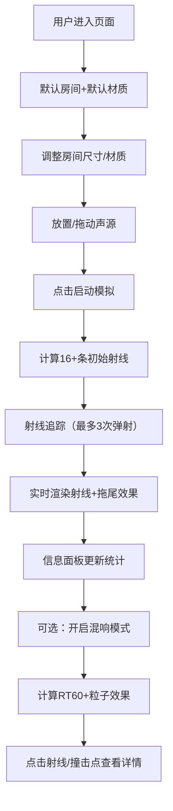

## 1. 产品概述

3D声波反射折射可视化工具，帮助声学工程师和建筑设计师直观预测声音在不同材质墙面组合下的传播路径和混响效果，解决会议室、音乐厅、演播厅规划中的声学设计难题。

- 核心价值：将抽象的声学原理转化为直观的3D可视化，降低声学设计的学习成本和试错成本
- 目标用户：声学工程师、建筑设计师、室内设计师、声学爱好者

## 2. 核心功能

### 2.1 功能模块

1. **3D场景画布**：半封闭房间渲染、视角控制、材质可视化
2. **声源控制**：声源放置、位置调整、模拟启动/停止
3. **射线追踪**：声波射线发射、反射/折射计算、能量衰减、轨迹绘制
4. **材质系统**：玻璃、金属、木材、布料四种材质，独立设置每面墙材质
5. **信息面板**：统计数据、柱状图、点击详情卡片
6. **混响模拟**：Sabine公式计算RT60、粒子回声效果

### 2.2 页面详情

| 页面名称 | 模块名称 | 功能描述 |
|---------|---------|---------|
| 主页面 | 3D场景画布 | 渲染房间、声源、射线、粒子，支持鼠标旋转/缩放/平移 |
| 主页面 | 控制面板 | 材质选择、声源坐标输入、模拟启停、混响开关、面板折叠 |
| 主页面 | 信息面板 | 射线数量、弹射次数、材质撞击统计柱状图、详情卡片 |

## 3. 核心流程

## 4. 用户界面设计

### 4.1 设计风格

- **主题**：深蓝灰科技感
- **主背景**：#1a1a2e
- **辅助面板**：#16213e
- **强调色1（橙金）**：#e94560
- **强调色2（青蓝）**：#0f3460
- **材质色**：玻璃#a8d8ea、金属#c0c0c0、木材#8b5a2b、织物#4a304a
- **射线色**：亮黄#ffdd57（渐变至透明）
- **声源色**：橙色发光球体

**交互风格**：
- 圆形色块材质按钮（直径32px），选中时外圈2px强调色边框，0.2s弹性放大动画
- 悬停效果：0.15s亮度提升1.1倍
- 数值变化：0.3s滚动更新动画
- 面板折叠：0.4s ease-in-out滑出动画
- 墙面选中：0.3s淡入光晕动画
- 柱状图数值：0.5s淡入动画

### 4.2 布局结构

| 区域 | 占比 | 内容 |
|-----|------|------|
| 左侧3D画布 | 70%宽度 | Three.js场景、OrbitControls视角控制 |
| 右侧控制面板 | 30%宽度 | 材质选择、声源控制、模拟控制、混响控制、信息统计 |
| 折叠态 | 40px竖条 | 展开按钮 |

### 4.3 响应式

- 桌面优先，适配1440px-1920px宽屏
- 窗口宽度小于1200px时，控制面板变为底部抽屉式
- 触控设备优化：手势缩放、拖拽支持

### 4.4 3D场景指导

- **环境**：深色空间感，柔和环境光+方向光，突出材质质感
- **相机**：PerspectiveCamera，初始视角略微俯视房间
- **交互**：OrbitControls（鼠标旋转、滚轮缩放、Shift+拖拽平移）
- **房间**：半封闭（前方开口便于观察），六面墙体可独立设材质
- **射线**：Line几何体，线宽随弹射递减，透明度渐变，拖尾效果
- **粒子**：Points几何体，透明度0.1-0.3，指数衰减扩散运动
- **性能**：射线计算<200ms首帧，帧率≥45fps，粒子≤200个无卡顿
