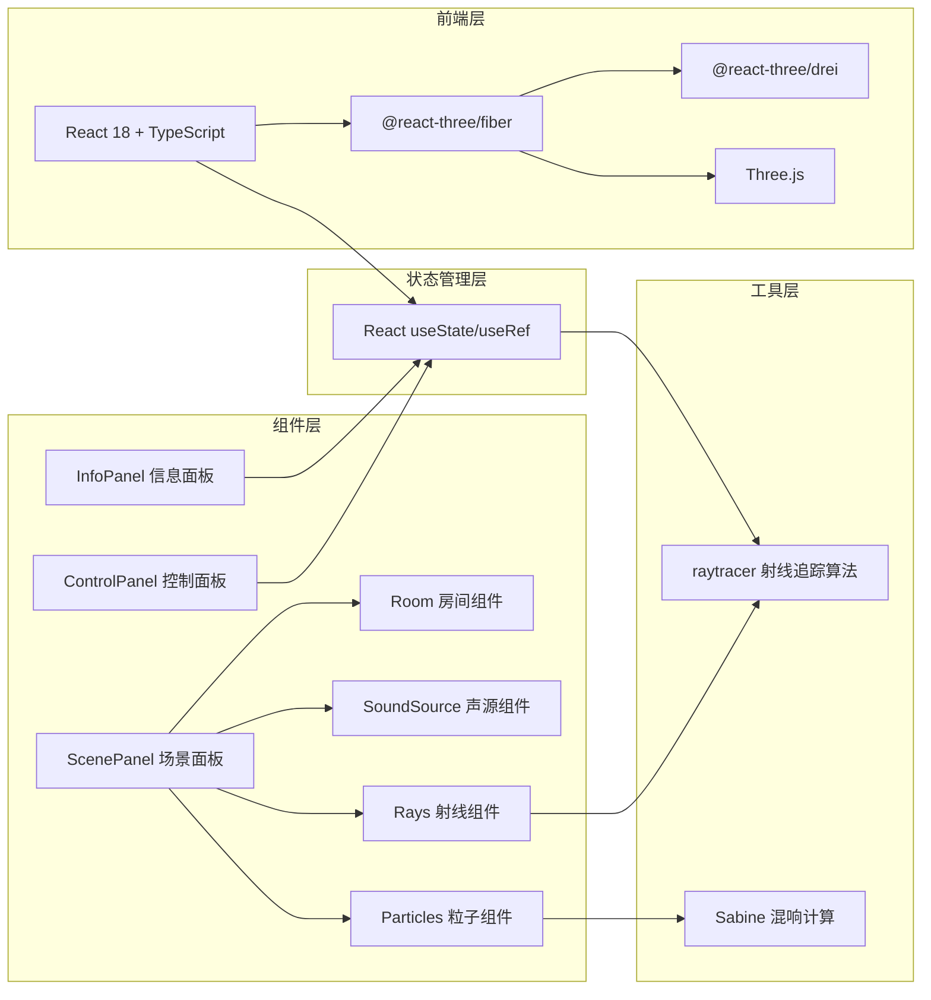

## 1. 架构设计



## 2. 技术选型

- **前端框架**：React 18 + TypeScript
- **构建工具**：Vite 5 + @vitejs/plugin-react
- **3D引擎**：Three.js r160+
- **React-Three桥接**：@react-three/fiber 8.x、@react-three/drei 9.x
- **状态管理**：React hooks（useState/useRef/useMemo），轻量场景无需zustand
- **样式方案**：内联样式 + CSS变量，组件级样式

## 3. 目录结构

```
src/
├── main.tsx              # React入口
├── App.tsx               # 主应用组件
├── types.ts              # 全局类型定义
├── components/
│   ├── ScenePanel.tsx    # 3D场景容器
│   ├── ControlPanel.tsx  # 右侧控制面板
│   ├── InfoPanel.tsx     # 信息统计面板
│   ├── Room.tsx          # 房间墙体组件
│   ├── SoundSource.tsx   # 声源组件
│   ├── Rays.tsx          # 射线渲染组件
│   └── Particles.tsx     # 混响粒子组件
└── utils/
    ├── raytracer.ts      # 射线追踪算法
    └── reverb.ts         # 混响计算（Sabine公式）
```

## 4. 数据模型

### 4.1 核心类型定义

```typescript
// 材质类型
type MaterialType = 'glass' | 'metal' | 'wood' | 'fabric';

// 材质属性
interface MaterialProps {
  color: string;
  reflectionRate: number;  // 反射率 0-1
  transmissionRate: number; // 透射率 0-1
  thickness: number;        // 厚度（单位）
}

// 房间配置
interface RoomConfig {
  width: number;   // X轴方向
  height: number;  // Y轴方向
  depth: number;   // Z轴方向
  walls: {
    front: MaterialType;   // 前墙（开口侧，可设为开放）
    back: MaterialType;    // 后墙
    left: MaterialType;    // 左墙
    right: MaterialType;   // 右墙
    floor: MaterialType;   // 地板
    ceiling: MaterialType; // 天花板
  };
}

// 声源配置
interface SoundSourceConfig {
  position: [number, number, number];
  radius: number;
  active: boolean;
}

// 射线弹射点数据
interface RayBounce {
  position: [number, number, number];
  wall: keyof RoomConfig['walls'];
  material: MaterialType;
  incidentAngle: number;   // 入射角（度）
  reflectAngle: number;    // 反射角（度）
  energyRemaining: number; // 剩余能量比例
}

// 单条射线数据
interface RayData {
  id: number;
  startPoint: [number, number, number];
  direction: [number, number, number];
  bounces: RayBounce[];
  totalBounces: number;
}

// 模拟统计
interface SimulationStats {
  totalRays: number;
  averageBounces: number;
  wallHitCounts: Record<keyof RoomConfig['walls'], number>;
  materialHitCounts: Record<MaterialType, number>;
}

// 混响配置
interface ReverbConfig {
  enabled: boolean;
  rt60: number;          // 混响时间（秒）
  particleCount: number;
}
```

## 5. 核心算法

### 5.1 射线追踪算法（raytracer.ts）

- **初始射线生成**：均匀分布在水平±90°、垂直±45°范围内，至少16条
- **墙面求交**：射线-平面相交检测，计算最近交点
- **反射计算**：基于法线的反射向量 + ±10°随机扰动（模拟散射）
- **折射计算**：基于材质厚度偏移路径
- **能量衰减**：按材质反射率衰减，每次弹射乘以反射率
- **终止条件**：达到最大弹射次数（3次）或能量低于阈值

### 5.2 Sabine混响公式

```
RT60 = 0.161 * V / (A_total)
其中：
  - V = 房间体积
  - A_total = Σ(墙面面积 × 吸声系数)
  - 吸声系数 = 1 - 反射率
```

## 6. 性能优化策略

1. **射线计算**：预计算所有射线数据后一次性渲染，避免每帧重算
2. **几何复用**：使用 InstancedMesh 渲染多条射线
3. **粒子系统**：使用 Points + BufferGeometry，单draw call
4. **状态隔离**：3D场景状态与UI状态分离，减少不必要重渲染
5. **帧率控制**：使用 useFrame 节流，动画循环内避免 heavy computation
6. **射线拖尾**：使用顶点色渐变而非多条线，降低draw call
