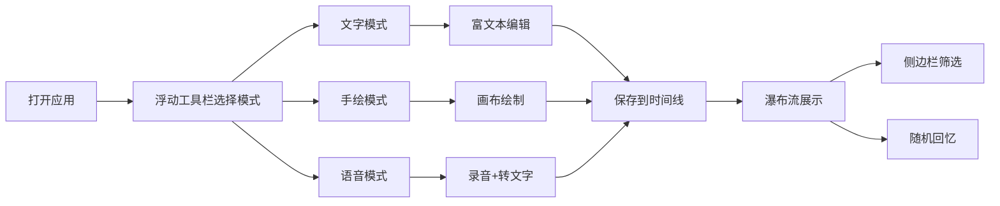

## 1. 产品概述

瞬间灵感速写板是一款专为创意工作者设计的快速灵感捕捉工具，支持文字、手绘图和语音备忘录三种记录形式，通过时间线网格和随机回忆两种模式帮助用户浏览和重温灵感。

- 目标用户：设计师、作家、产品经理、开发者等创意工作者
- 核心价值：快速捕捉一闪而过的创意，随时随地记录灵感，方便后续回顾和整理

## 2. 核心功能

### 2.1 用户角色
| 角色 | 注册方式 | 核心权限 |
|------|----------|----------|
| 普通用户 | 无需注册（本地存储） | 创建、编辑、删除灵感；筛选浏览；随机回忆 |

### 2.2 功能模块
1. **灵感记录模块**：文字输入（富文本）、手绘画布、语音录制与转写
2. **时间线浏览模块**：瀑布流网格展示、卡片动画、滚动加载
3. **侧边栏筛选模块**：标签筛选、类型筛选、日期筛选、随机回忆
4. **浮动工具栏**：三种记录模式切换入口

### 2.3 页面详情
| 页面名称 | 模块名称 | 功能描述 |
|----------|----------|----------|
| 主页面 | 浮动工具栏 | 顶部浮动工具栏，三种记录模式按钮，背景#1E293B，圆角24px，阴影0 4px 20px rgba(0,0,0,0.3) |
| 主页面 | 文字记录模态框 | 居中模态框，宽480px，背景#FFFFFF，圆角16px，0.2s scale淡入动画，支持粗体、斜体、列表富文本编辑 |
| 主页面 | 手绘画布 | 全屏半透明覆盖层，背景rgba(0,0,0,0.7)，自由绘制，色环选色（默认#3B82F6），笔触宽度2-12px滑块，撤销和清空按钮 |
| 主页面 | 语音录制 | 麦克风脉动动画，圆形渐变从#10B981到#34D399，半径30px-50px扩张回缩，周期1.2s，60秒时长限制，自动转文字 |
| 主页面 | 时间线网格 | 瀑布流布局，每列宽240px，间距16px，卡片圆角12px，阴影0 2px 12px rgba(0,0,0,0.08)，0.3s弹性弹出动画 |
| 主页面 | 侧边栏 | 宽240px，背景#1E293B，圆角0 16px 16px 0，标签胶囊按钮（圆角12px，选中背景#3B82F6），随机回忆按钮 |
| 主页面 | 随机回忆 | 卡片翻转动画（0.6s）展示随机灵感 |

## 3. 核心流程

用户打开应用 → 通过浮动工具栏选择记录模式 → 完成灵感记录（文字/手绘/语音）→ 保存后卡片插入时间线 → 通过侧边栏筛选或随机回忆浏览灵感

## 4. 用户界面设计

### 4.1 设计风格
- **主色调**：#1E293B（深灰蓝）、#3B82F6（蓝色）、#10B981（绿色）、#EF4444（红色）
- **背景渐变**：从#F0F4F8到#E2E8F0
- **字体**：Inter + Noto Sans SC
- **卡片风格**：圆角设计，柔和阴影，弹性动画
- **按钮风格**：胶囊形圆角按钮，悬浮态阴影加深

### 4.2 页面设计概述
| 页面名称 | 模块名称 | UI元素 |
|----------|----------|--------|
| 主页面 | 浮动工具栏 | 深色背景、圆角24px、三个模式图标按钮、悬浮阴影 |
| 主页面 | 时间线网格 | 4列瀑布流、卡片间距16px、卡片弹出动画、悬停微交互 |
| 主页面 | 侧边栏 | 深色背景、右侧圆角、标签胶囊、筛选选项、随机回忆按钮 |
| 主页面 | 文字模态框 | 居中弹出、scale动画、富文本工具栏、保存取消按钮 |
| 主页面 | 手绘画布 | 全屏遮罩、色环选择器、笔触滑块、撤销清空按钮 |
| 主页面 | 语音录制 | 脉动圆形按钮、计时器、波形动画、转写预览 |

### 4.3 响应式
- Desktop-first设计，最小宽度1024px
- 时间线网格根据窗口宽度自适应列数
- 触屏设备优化手绘和语音交互
