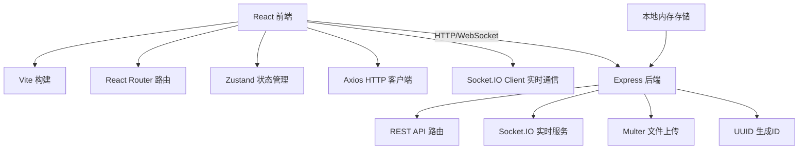
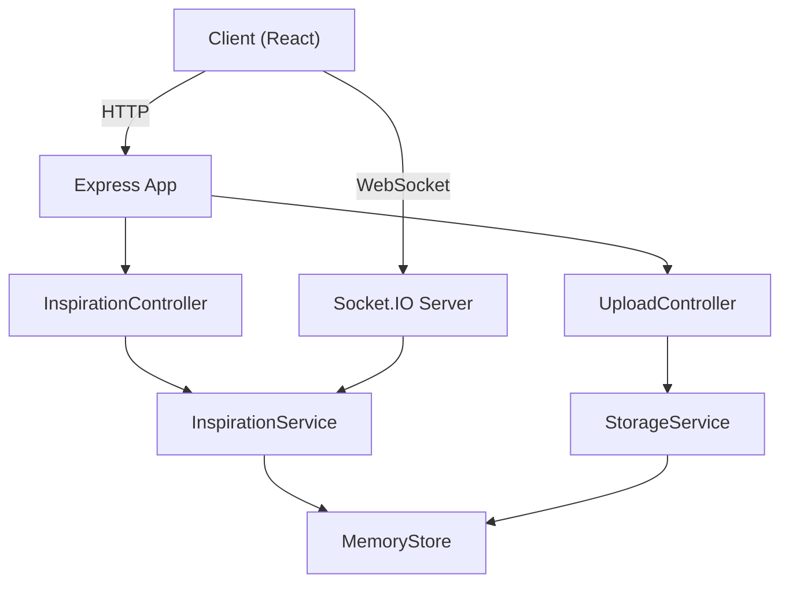
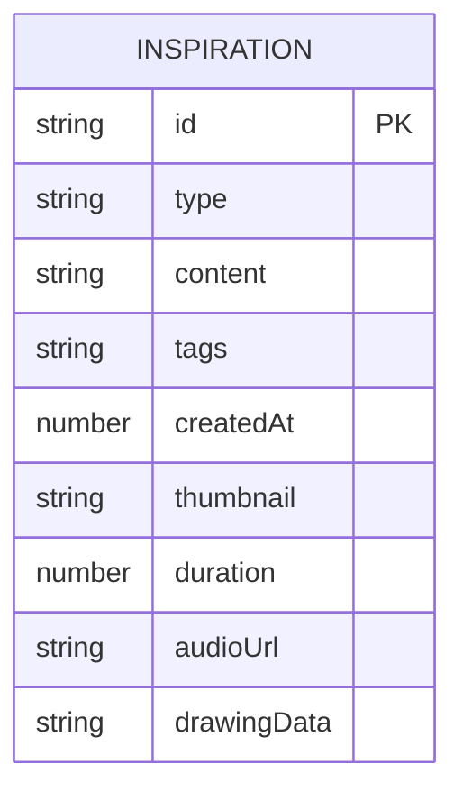

## 1. 架构设计



## 2. 技术描述

- **前端**：React 18 + TypeScript + Vite + Zustand + Axios + Socket.IO Client
- **后端**：Express 4 + TypeScript + Multer + Socket.IO + UUID + CORS
- **构建工具**：Vite 5
- **浏览器API**：Canvas 2D API、MediaRecorder、SpeechRecognition、Web Audio API
- **存储**：后端内存存储（开发演示用）

## 3. 路由定义

| 路由 | 用途 |
|------|------|
| / | 主页面，时间线+工具栏+侧边栏 |

## 4. API 定义

### 4.1 类型定义

```typescript
type InspirationType = 'text' | 'drawing' | 'voice';

interface Inspiration {
  id: string;
  type: InspirationType;
  content: string;           // 文字内容/转写文字/图片base64
  tags: string[];
  createdAt: number;
  thumbnail?: string;        // 手绘缩略图
  duration?: number;         // 语音时长(秒)
  audioUrl?: string;         // 语音文件路径
  drawingData?: string;      // 手绘完整图片数据
}

interface Filters {
  tags: string[];
  types: InspirationType[];
  dateRange: { start: number; end: number } | null;
}
```

### 4.2 REST API

| 方法 | 路径 | 描述 |
|------|------|------|
| GET | /api/inspirations | 获取灵感列表（支持筛选参数） |
| GET | /api/inspirations/:id | 获取单条灵感详情 |
| POST | /api/inspirations | 创建新灵感 |
| PUT | /api/inspirations/:id | 更新灵感 |
| DELETE | /api/inspirations/:id | 删除灵感 |
| GET | /api/inspirations/random | 获取随机灵感 |
| POST | /api/upload/audio | 上传语音文件 |
| GET | /api/tags | 获取所有标签 |

### 4.3 WebSocket 事件

| 事件名 | 方向 | 描述 |
|--------|------|------|
| inspiration:created | Server → Client | 新灵感创建广播 |
| inspiration:updated | Server → Client | 灵感更新广播 |
| inspiration:deleted | Server → Client | 灵感删除广播 |

## 5. 服务器架构图



## 6. 数据模型

### 6.1 数据模型定义



### 6.2 内存存储结构

后端使用 Map 数据结构存储：
- `Map<string, Inspiration>` - 灵感数据主键索引
- `Set<string>` - 标签集合
- `Map<string, string>` - 语音文件路径映射
