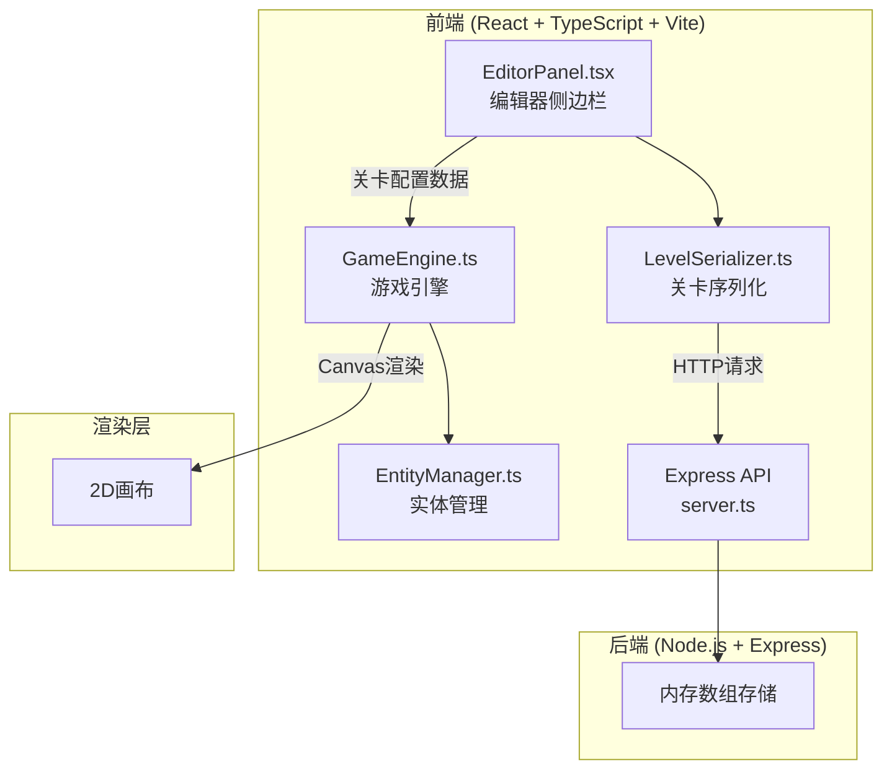

## 1. 架构设计



**数据流向说明：**
- 编辑器模式：EditorPanel → 关卡数据 → GameEngine（渲染网格+实体）
- 测试模式：GameEngine → 每帧物理更新 → 碰撞检测 → Canvas渲染
- 保存流程：EditorPanel → LevelSerializer → POST /api/levels → server.ts → 内存数组
- 加载流程：server.ts → GET /api/levels/:id → LevelSerializer → EditorPanel → GameEngine

## 2. 技术选型

- 前端：React@18 + TypeScript + Vite + Tailwind CSS
- 初始化工具：vite-init (react-express-ts 模板)
- 后端：Express@4 + TypeScript (ESM)
- 数据库：无，使用内存数组存储
- 状态管理：Zustand
- 图标：lucide-react

## 3. 路由定义

| 路由 | 用途 |
|------|------|
| / | 主页面，包含编辑器和测试模式 |

本项目为单页应用，编辑/测试通过模式切换实现，无需多路由。

## 4. API定义

### 4.1 TypeScript类型定义

```typescript
interface LevelEntity {
  id: string;
  type: "platform" | "enemy" | "collectible";
  x: number;
  y: number;
  width: number;
  height: number;
  properties: PlatformProps | EnemyProps | CollectibleProps;
}

interface PlatformProps {
  gridWidth: number; // 1-4
  gridHeight: number; // 1
}

interface EnemyProps {
  movementType: "fixed" | "patrol";
}

interface CollectibleProps {
  score: number; // 1-100
}

interface LevelData {
  id: string;
  name: string;
  entities: LevelEntity[];
  createdAt: string;
  updatedAt: string;
}
```

### 4.2 API端点

| 方法 | 路径 | 请求体 | 响应 | 用途 |
|------|------|--------|------|------|
| POST | /api/levels | `{ name, entities }` | `{ id, name, entities, createdAt, updatedAt }` | 保存关卡 |
| GET | /api/levels/:id | - | `{ id, name, entities, createdAt, updatedAt }` | 加载关卡 |
| GET | /api/levels | - | `[{ id, name, createdAt, updatedAt }]` | 列出所有关卡 |

## 5. 服务器架构

```mermaid
flowchart LR
    "客户端请求" --> "Express路由<br/>server.ts"
    "Express路由" --> "内存数组<br/>levels[]"
    "内存数组" --> "JSON响应"
```

server.ts 为单文件架构，直接处理路由逻辑，使用内存数组 `levels: LevelData[]` 存储数据。

## 6. 文件结构与调用关系

```
project/
├── package.json                    # 依赖管理
├── vite.config.js                  # Vite构建配置
├── tsconfig.json                   # TypeScript严格模式配置
├── index.html                      # 入口HTML（背景#1E293B）
├── src/
│   ├── main.tsx                    # React入口
│   ├── App.tsx                     # 根组件，模式切换逻辑
│   ├── store.ts                    # Zustand全局状态（关卡数据、模式、得分、生命）
│   ├── game/
│   │   ├── GameEngine.ts           # 核心游戏循环（被App.tsx调用）
│   │   └── EntityManager.ts        # 实体管理（被GameEngine调用）
│   ├── editor/
│   │   ├── EditorPanel.tsx         # 编辑器面板（被App.tsx调用）
│   │   └── LevelSerializer.ts      # 序列化/反序列化（被EditorPanel调用）
│   └── components/
│       ├── Canvas.tsx              # Canvas画布组件
│       ├── PropertyEditor.tsx      # 属性编辑浮层
│       ├── LoadModal.tsx           # 加载模态框
│       ├── GameHUD.tsx             # 测试模式HUD
│       ├── GameOverOverlay.tsx     # 游戏结束遮罩
│       └── VictoryOverlay.tsx      # 胜利动画
├── api/
│   └── server.ts                   # Express后端服务器
└── shared/
    └── types.ts                    # 前后端共享类型定义
```

**调用关系：**
- `App.tsx` → `Canvas.tsx` → `GameEngine.ts` → `EntityManager.ts`
- `App.tsx` → `EditorPanel.tsx` → `LevelSerializer.ts` → `api/server.ts`
- `App.tsx` → `PropertyEditor.tsx`, `LoadModal.tsx`, `GameHUD.tsx`, `GameOverOverlay.tsx`, `VictoryOverlay.tsx`
- `GameEngine.ts` 读取 `store.ts` 中的关卡配置 → 每帧更新物理 → 输出画面至Canvas
