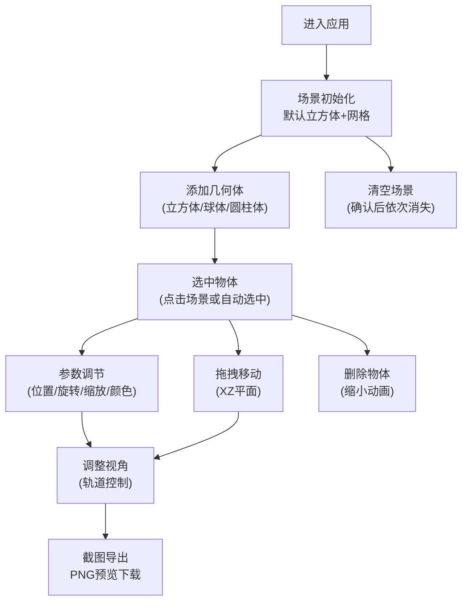

## 1. 产品概述

虚拟空间搭建器是一款基于Web的3D交互可视化应用，用户可在浏览器中通过拖拽和参数调节，在三维场景中自由摆放几何体（立方体、球体、圆柱体），调整其位置、大小、旋转角度和材质颜色，最终生成独特的空间布局并截图保存。面向设计师、创意工作者和3D爱好者，提供轻量级、零安装的空间创意设计体验。

## 2. 核心功能

### 2.1 功能模块

1. **3D场景画布**：Three.js驱动的实时3D渲染场景，包含网格辅助线、光照系统和相机控制
2. **几何体添加**：支持添加立方体、球体、圆柱体三种基础几何体
3. **物体选择与高亮**：点击选中物体，选中状态显示白色发光边框
4. **参数控制面板**：右侧面板提供位置、旋转、缩放滑块和颜色拾取器
5. **拖拽交互**：支持在XZ平面上直接拖动物体
6. **删除与清空**：单个物体删除（带缩小动画）、清空所有物体（带确认对话框）
7. **截图导出**：导出1024x768 PNG图片，新标签页预览下载

### 2.3 页面详情

| 页面名称 | 模块名称 | 功能描述 |
|---------|---------|---------|
| 主页面 | 3D场景区域 | 占满左侧剩余空间，显示网格辅助线、所有几何体，支持OrbitControls视角控制和拖拽交互 |
| 主页面 | 右侧控制面板 | 添加几何体按钮组、选中物体参数调节区、删除/清空按钮、截图按钮 |
| 主页面 | 移动端底部栏 | 宽度<768px时，控制面板折叠为底部导航栏，按钮横向排列 |

## 3. 核心流程

用户进入应用 → 看到默认立方体和网格场景 → 通过右侧面板添加新几何体 → 点击选中物体 → 调节参数或直接拖拽 → 调整视角（轨道控制） → 点击截图导出 → 新标签页预览下载

## 4. 用户界面设计

### 4.1 设计风格

- **整体风格**：深空科技风，深色主题，营造沉浸式3D创作氛围
- **主色调**：深空渐变背景 #0A0A1A → #1A1A3E
- **强调色**：
  - 立方体：#3B82F6（蓝色）
  - 球体：#EC4899（粉色）
  - 圆柱体：#10B981（绿色）
  - 截图按钮：#8B5CF6（紫色）
  - 删除按钮：#EF4444（红色）
  - 清空按钮：#64748B（灰色）
- **面板背景**：垂直渐变 #1E293B → #0F172A，圆角12px，阴影 0 4px 24px rgba(0,0,0,0.4)
- **字体**：现代无衬线字体，白色为主
- **控件风格**：
  - 滑块：背景#334155，填充#3B82F6，高度6px，圆角4px
  - 按钮：高度36px，圆角8px，文字白色加粗
  - 颜色拾取器：原生input，高度32px，圆角6px，无边框
- **动效**：
  - 按钮点击：scale 1→0.95→1，0.1s
  - 物体删除：缩小消失，0.2s
  - 清空场景：依次缩小消失，间隔0.1s
  - 截图按钮：脉冲动画，0.3s
  - 拖拽物体：0.1s平滑插值

### 4.2 页面设计概述

| 页面名称 | 模块名称 | UI元素 |
|---------|---------|-------|
| 主页面 | 3D场景区域 | 全屏深空渐变背景，网格辅助线20x20，环境光+平行光，可拖拽几何体，选中发光边框 |
| 主页面 | 右侧控制面板 | 宽度320px，垂直渐变背景，内边距20px，标题16px加粗白色，参数标签13px白色，滑块组布局，按钮100%宽度 |
| 主页面 | 移动端底部栏 | 高度60px，按钮横向排列，字体12px，固定在底部 |

### 4.3 响应式

- 桌面端：左侧3D场景 + 右侧320px控制面板
- 移动端（<768px）：控制面板折叠为底部导航栏，高度60px，按钮横向排列，字体缩小至12px
- 场景Canvas自适应屏幕大小，resize时自动更新相机比例（延迟≤100ms）

### 4.4 3D场景指引

- **环境**：深空渐变背景，网格辅助线（20x20，#475569，透明度0.3）
- **光照**：环境光强度0.5 + 平行光强度1.0（右上方向）
- **相机**：PerspectiveCamera，默认视角可观察整个20x20网格区域
- **控制**：OrbitControls轨道控制，支持旋转、缩放、平移
- **交互**：点击选中、拖拽移动（XZ平面）、平滑插值
- **选中效果**：白色发光边框线，线宽2px
- **性能**：最多20个物体时≥55FPS，初次加载≤2秒
