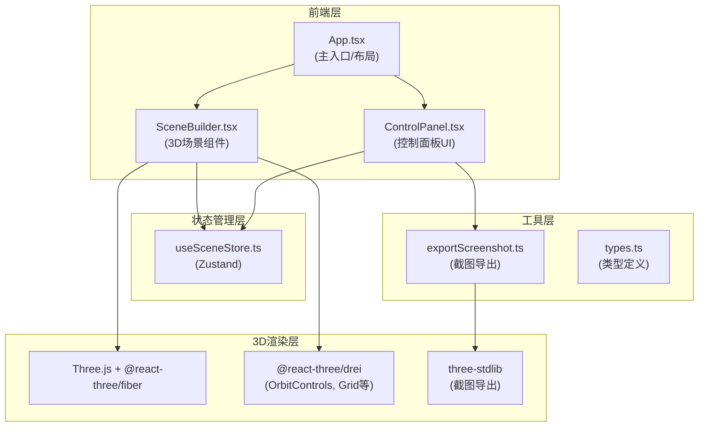

## 1. 架构设计



## 2. 技术说明

- **前端框架**：React 18 + TypeScript
- **构建工具**：Vite
- **3D渲染**：Three.js + @react-three/fiber
- **3D工具库**：@react-three/drei（网格、轨道控制等）
- **截图导出**：three-stdlib
- **状态管理**：Zustand
- **样式方案**：原生CSS + CSS变量（无Tailwind，用户未指定）

## 3. 文件结构

```
.
├── package.json
├── index.html
├── vite.config.js
├── tsconfig.json
└── src/
    ├── App.tsx              # 主组件，布局容器，Canvas + ControlPanel
    ├── components/
    │   ├── SceneBuilder.tsx # 3D场景核心组件
    │   └── ControlPanel.tsx # 右侧控制面板
    ├── hooks/
    │   └── useSceneStore.ts # Zustand状态管理
    ├── utils/
    │   └── exportScreenshot.ts # 截图工具函数
    └── types.ts             # 类型定义
```

## 4. 核心数据模型

### 4.1 ObjectConfig 接口

```typescript
interface ObjectConfig {
  id: string;
  type: 'cube' | 'sphere' | 'cylinder';
  position: [number, number, number];
  rotation: [number, number, number]; // 角度
  scale: [number, number, number];
  color: string;
}
```

### 4.2 Store 状态

```typescript
interface SceneState {
  objects: ObjectConfig[];
  selectedId: string | null;
  addObject: (type: 'cube' | 'sphere' | 'cylinder') => void;
  selectObject: (id: string | null) => void;
  updateObject: (id: string, updates: Partial<ObjectConfig>) => void;
  deleteObject: (id: string) => void;
  clearAll: () => void;
}
```

## 5. 关键技术方案

### 5.1 拖拽交互

使用 @react-three/fiber 的 useThree + raycaster 实现鼠标拾取，在 onPointerDown 时检测交点，onPointerMove 时根据鼠标在XZ平面的投影更新物体位置，使用 lerp 实现0.1s平滑插值。

### 5.2 选中高亮

为选中物体添加 EdgesGeometry + LineBasicMaterial 的边框线，配合 emissive 材质属性实现发光效果。

### 5.3 截图导出

使用 three-stdlib 的截图功能，设置渲染尺寸为1024x768，导出PNG格式，通过 Blob URL 在新标签页打开预览。

### 5.4 删除动画

通过 Zustand 状态中添加 deleting 标记，组件内部使用 useFrame 驱动 scale 缩小动画，动画结束后从状态中移除。

### 5.5 性能优化

- 几何体使用实例化或复用
- 拖拽使用 requestAnimationFrame + lerp 平滑
- 避免不必要的 re-render（useMemo/useRef）

## 6. 性能指标

| 指标 | 目标值 |
|------|--------|
| 拖拽/滑块响应延迟 | ≤100ms |
| 20个物体时帧率 | ≥55FPS |
| 初次加载时间 | ≤2秒 |
