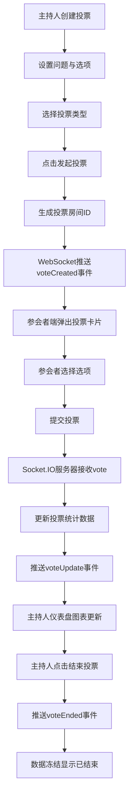

## 1. 产品概述

远程会议投票器是一款面向会议场景的实时投票工具，支持主持人发起投票、参会者扫码匿名投票、结果实时可视化展示。通过WebSocket实现毫秒级数据同步，为各类线上/线下会议提供高效、透明的决策支持。

- 解决会议决策效率低下、投票结果统计繁琐的痛点
- 目标用户：企业会议组织者、学术会议主持人、活动策划人员

## 2. 核心功能

### 2.1 用户角色

| 角色 | 注册方式 | 核心权限 |
|------|----------|----------|
| 主持人 | 无需注册，直接访问 | 创建投票、发起/结束投票、查看实时结果、查看历史投票 |
| 参会者 | 无需注册，扫码/链接访问 | 匿名投票、查看投票状态 |

### 2.2 功能模块

1. **主持人控制面板**：创建投票问题（单选/多选）、选项动态增删、发起/结束投票控制、实时图表仪表盘
2. **参会者投票视图**：投票卡片展示、选项交互、选择提交、投票状态反馈
3. **实时数据同步**：WebSocket连接管理、投票状态推送、结果实时更新
4. **投票历史管理**：历史投票列表、时间倒序排列、投票结果回顾

### 2.3 页面详情

| 页面名称 | 模块名称 | 功能描述 |
|----------|----------|----------|
| 主持人端 | 投票创建区 | 输入问题、选择单选/多选类型、动态增删选项 |
| 主持人端 | 实时仪表盘 | 左侧柱状图、右侧饼图、实时票数显示、已结束标签 |
| 主持人端 | 历史导航栏 | 左侧240px导航栏、投票历史列表、时间倒序 |
| 参会者端 | 投票卡片 | 白色背景圆角卡片、0.3s上滑动画、选项悬停效果 |
| 参会者端 | 选择交互 | 悬停背景色#E2E8F0、点击锁定、0.15s勾选放大动画 |

## 3. 核心流程

主持人在控制面板创建投票问题并设置选项，点击发起后系统生成投票房间，通过WebSocket向所有参会者推送投票事件，参会者端弹出投票卡片，匿名提交选择后数据实时同步至主持人仪表盘，主持人可随时结束投票并查看最终统计结果。

## 4. 用户界面设计

### 4.1 设计风格

- **主色调**：深色主题，背景#0F172A，卡片背景#1E293B，文字#F8FAFC
- **图表配色**：柱状图从#3B82F6渐变至#8B5CF6，饼图采用和谐配色方案
- **交互色**：选项悬停#E2E8F0，勾选状态带放大动画
- **按钮风格**：圆角设计，明确的主按钮/次按钮区分
- **字体方案**：现代无衬线字体，层级分明，标题加粗突出
- **布局风格**：卡片式布局，左侧导航+主内容区，合理留白
- **动效设计**：投票卡片0.3s上滑入场，图表0.5s缓动入场，勾选0.15s放大，导航项0.1s高亮

### 4.2 页面设计概览

| 页面名称 | 模块名称 | UI元素 |
|----------|----------|--------|
| 主持人端 | 控制面板 | 深色背景、表单输入、选项增删按钮、发起/结束控制按钮 |
| 主持人端 | 仪表盘 | 左右双栏布局、柱状图带柱顶票数、饼图带百分比标签、圆角图例 |
| 主持人端 | 导航栏 | 240px宽、深色背景、hover高亮、历史项摘要/人数/时间 |
| 参会者端 | 投票卡片 | 白色背景、12px圆角、0.3s上滑入场、悬停/点击交互 |

### 4.3 响应式设计

- 桌面端优先设计，主持人端适配宽屏显示
- 参会者端优先适配移动端，确保手机扫码后体验流畅
- 触控优化：增大点击区域，适配移动端触控操作

### 4.4 性能指标

- WebSocket消息延迟：≤ 200ms
- 投票提交后图表更新：≤ 300ms
- 页面首次加载时间：≤ 2s
- 支持并发投票人数：≥ 100人
