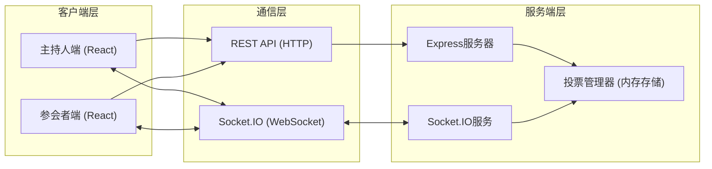
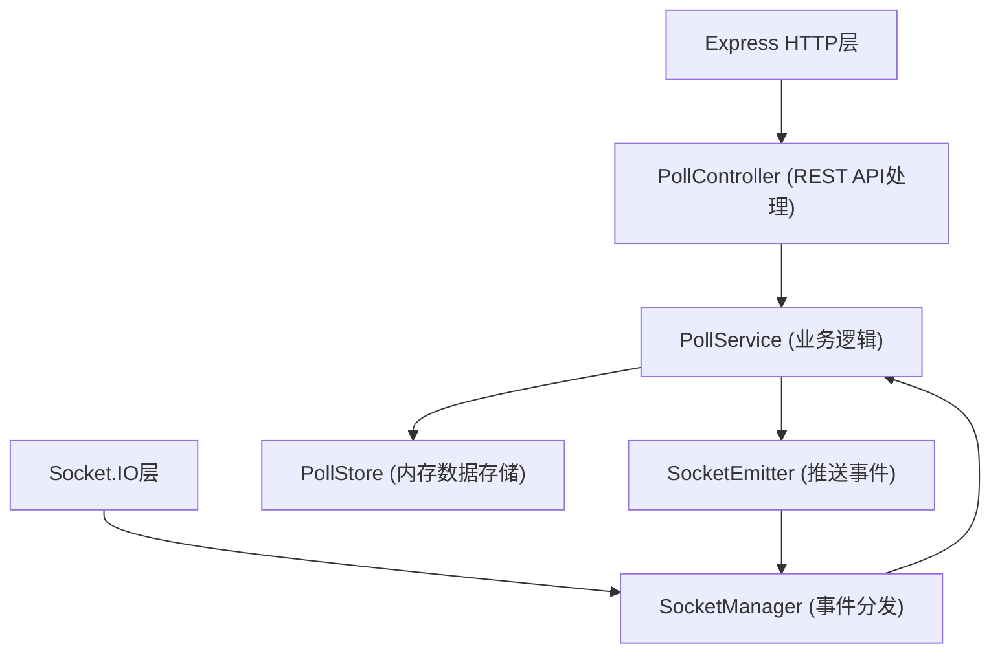
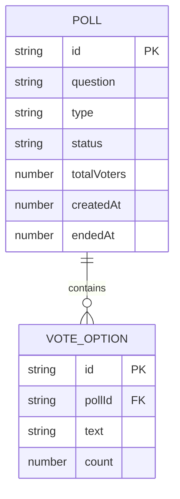

## 1. 架构设计



## 2. 技术说明

- **前端框架**：React 18 + TypeScript 5
- **构建工具**：Vite 5 + @vitejs/plugin-react
- **路由管理**：React Router DOM 6
- **图表库**：Recharts 2
- **实时通信**：Socket.IO Client 4
- **后端框架**：Express 4
- **WebSocket服务**：Socket.IO 4
- **跨域处理**：CORS 2
- **ID生成**：UUID 9
- **数据存储**：内存存储（开发阶段）

## 3. 路由定义

| 路由 | 用途 |
|------|------|
| / | 默认重定向至主持人端 |
| /host | 主持人控制面板页面 |
| /voter/:voteId | 参会者投票页面（带投票ID参数） |

## 4. API定义

### 4.1 TypeScript类型定义

```typescript
interface VoteOption {
  id: string;
  text: string;
  count: number;
}

interface Poll {
  id: string;
  question: string;
  type: 'single' | 'multiple';
  options: VoteOption[];
  status: 'pending' | 'active' | 'ended';
  totalVoters: number;
  createdAt: number;
  endedAt?: number;
}

interface VoteSubmission {
  pollId: string;
  optionIds: string[];
  voterId?: string;
}

interface VoteUpdatePayload {
  pollId: string;
  options: VoteOption[];
  totalVoters: number;
}
```

### 4.2 REST API接口

| 方法 | 路径 | 描述 | 请求体 | 响应 |
|------|------|------|--------|------|
| POST | /api/polls | 创建投票 | `{ question, type, options: string[] }` | `Poll` |
| GET | /api/polls | 获取投票列表 | - | `Poll[]` |
| GET | /api/polls/:id | 获取单个投票详情 | - | `Poll` |
| PATCH | /api/polls/:id/start | 发起投票 | - | `Poll` |
| PATCH | /api/polls/:id/end | 结束投票 | - | `Poll` |

### 4.3 Socket.IO事件

| 事件名 | 方向 | 数据 | 描述 |
|--------|------|------|------|
| joinPoll | Client → Server | `{ pollId, role }` | 加入投票房间 |
| voteCreated | Server → Client | `Poll` | 投票已创建通知 |
| voteStarted | Server → Client | `Poll` | 投票开始通知 |
| submitVote | Client → Server | `VoteSubmission` | 提交投票 |
| voteUpdate | Server → Client | `VoteUpdatePayload` | 投票数据更新 |
| voteEnded | Server → Client | `{ pollId, endedAt }` | 投票结束通知 |

## 5. 服务端架构图



## 6. 数据模型

### 6.1 数据模型定义



### 6.2 内存数据结构

```typescript
// 内存存储结构
interface PollStore {
  polls: Map<string, Poll>;
  voterRecords: Map<string, Set<string>>; // pollId -> Set of voterId
}

// 初始化示例数据
const initialPolls: Poll[] = [
  {
    id: 'demo-001',
    question: '本次会议的时间安排是否合理？',
    type: 'single',
    options: [
      { id: 'opt-1', text: '非常合理', count: 15 },
      { id: 'opt-2', text: '比较合理', count: 23 },
      { id: 'opt-3', text: '一般', count: 8 },
      { id: 'opt-4', text: '不太合理', count: 4 },
    ],
    status: 'ended',
    totalVoters: 50,
    createdAt: Date.now() - 86400000,
    endedAt: Date.now() - 82800000,
  },
];
```

## 7. 前端组件结构

```
src/
├── main.tsx              # 入口
├── App.tsx               # 路由配置
├── components/
│   ├── HostPanel.tsx     # 主持人面板（含图表仪表盘）
│   └── VoterView.tsx     # 参会者投票视图
└── hooks/
    └── useSocket.ts      # Socket.IO封装Hook
```

## 8. 性能优化方案

1. **WebSocket优化**：使用房间机制隔离不同投票，批量更新减少消息频率
2. **前端渲染**：React.memo优化图表组件，避免不必要重渲染
3. **动画优化**：使用CSS transform和opacity实现GPU加速动画
4. **防抖节流**：图表更新使用requestAnimationFrame合并渲染
5. **连接管理**：自动重连机制，心跳检测保持连接活跃
