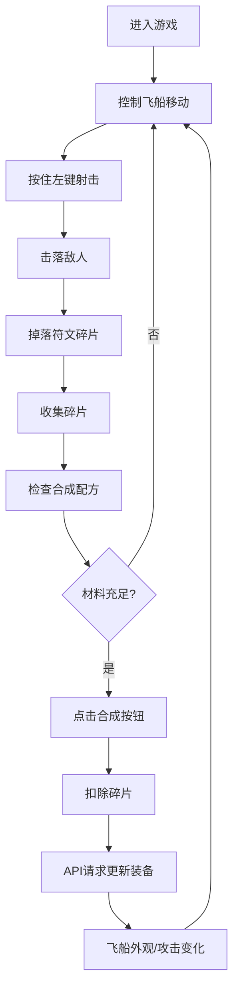

## 1. 产品概述

将经典纵版弹幕射击与装备合成系统结合的网页游戏。玩家操控飞船在弹幕中穿梭，击落敌人收集符文碎片，合成高级符文装备改变飞船外观与攻击方式，最终挑战Boss。

- 核心玩法：弹幕射击躲避 + 符文收集合成 + 装备养成
- 目标用户：休闲游戏玩家、弹幕射击爱好者、合成类游戏玩家
- 产品价值：融合两种经典玩法，提供即时战斗快感与渐进式成长体验

## 2. 核心功能

### 2.1 用户角色
| 角色 | 注册方式 | 核心权限 |
|------|----------|----------|
| 玩家 | 无需注册，本地体验 | 完整游戏体验、符文合成、装备更换 |

### 2.2 功能模块
1. **弹幕战斗模块**：3D游戏场景、玩家飞船控制、敌人AI、碰撞检测、碎片掉落
2. **符文合成模块**：碎片库存管理、配方展示、合成操作、装备效果应用
3. **状态管理模块**：生命值管理、分数统计、装备状态同步

### 2.3 页面详情
| 页面名称 | 模块名称 | 功能描述 |
|----------|----------|----------|
| 游戏主界面 | 战斗场景 | 深空背景粒子效果、玩家飞船、敌人波次、子弹与弹幕、碰撞检测 |
| 游戏主界面 | 合成面板 | 符文碎片库存展示、可合成配方列表、合成按钮交互 |
| 游戏主界面 | HUD界面 | 生命值血条、当前装备显示、分数统计 |

## 3. 核心流程

玩家进入游戏后，鼠标控制飞船在屏幕底部移动，按住左键持续射击。敌人从顶部以波浪或螺旋轨迹下落并发射弹幕。玩家需要躲避弹幕并击落敌人，敌人被击毁后掉落红、蓝、绿三种颜色的符文碎片。收集到足够碎片后，右侧合成面板显示可合成配方，点击合成按钮消耗碎片获得新装备，装备自动应用改变飞船外观和攻击方式。重复此循环挑战更高难度的敌人和Boss。

## 4. 用户界面设计

### 4.1 设计风格
- **主色调**：深空背景 #0b0c10，符文红 #ff4444，符文蓝 #4488ff，符文绿 #44ff44，合成亮橙 #ff9800
- **设计风格**：科幻霓虹风格，深色背景配合发光粒子效果，半透明UI面板
- **字体**：使用 Orbitron 作为数字和标题字体，Roboto 作为正文字体，营造科技感
- **动效**：星星闪烁动画、飞船受伤红色闪烁、子弹发射拖尾、碎片收集磁吸效果

### 4.2 页面设计概述
| 页面名称 | 模块名称 | UI元素 |
|----------|----------|--------|
| 游戏主界面 | 战斗场景 | 深空渐变背景 #0b0c10、闪烁星星粒子（大小1-3px，透明度0.3-0.8）、三角形飞船（边长40px，颜色由主符文决定）、圆形子弹（直径4px，与攻击符文同色）、红色敌人弹幕（直径8px）、彩色符文碎片掉落 |
| 游戏主界面 | 合成面板 | 右侧半透明深灰面板 #1f1f2e（宽220px，圆角8px）、彩色方块（20x20px）表示碎片数量、配方列表、亮橙色合成按钮（可用时）、灰色按钮（不可用时） |
| 游戏主界面 | HUD界面 | 左上角血条（宽200px高12px，渐变绿#00ff00到红#ff0000）、当前装备图标显示 |

### 4.3 响应式
- 桌面端优先设计，固定游戏区域尺寸
- 合成面板固定在右侧，战斗区域自适应剩余空间
- 鼠标控制，支持触摸屏设备

### 4.4 3D场景指引
- **环境**：深空背景，使用Three.js粒子系统创建动态星星效果，星星位置随机，大小和透明度随时间变化
- **光照**：环境光 + 方向性光源，飞船和子弹使用自发光材质产生霓虹效果
- **相机**：正交相机，固定视角，Z轴位置适当以确保所有元素可见
- **交互**：鼠标位置控制飞船X/Y轴移动，飞船始终面向屏幕前方
- **后处理**：轻微辉光效果增强霓虹感，Bloom效果使发光元素更突出
- **性能**：粒子数量控制在200-300颗，使用实例化渲染优化敌人和子弹渲染

## 5. 非功能需求

### 5.1 性能要求
- 帧率稳定在60fps
- 子弹和敌人数量峰值不超过100个时保持流畅
- API响应时间小于100ms

### 5.2 交互要求
- 鼠标移动延迟小于16ms
- 射击响应即时无延迟
- 碎片收集有磁吸动画效果

### 5.3 兼容性要求
- 支持Chrome、Firefox、Edge最新版本
- 需要WebGL支持
