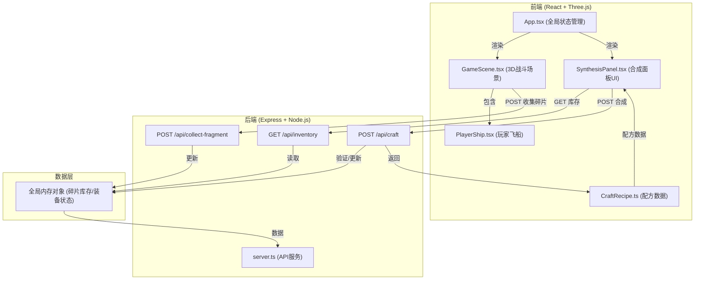
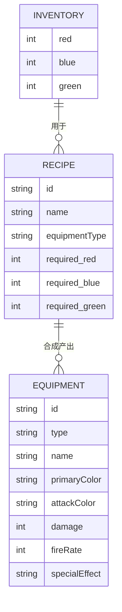

## 1. 架构设计



## 2. 技术描述

- **前端框架**：React@18 + TypeScript@5
- **3D渲染**：Three@0.160 + @react-three/fiber@8 + @react-three/drei@9
- **构建工具**：Vite@5 + @vitejs/plugin-react@4
- **后端框架**：Express@4
- **HTTP客户端**：Axios@1
- **跨域处理**：Cors@2
- **唯一ID**：Uuid@9
- **代码规范**：TypeScript严格模式

## 3. 目录结构

```
auto28/
├── package.json
├── index.html
├── vite.config.js
├── tsconfig.json
├── src/
│   ├── main.tsx
│   ├── App.tsx
│   └── modules/
│       ├── battle/
│       │   ├── GameScene.tsx
│       │   └── PlayerShip.tsx
│       └── craft/
│           ├── SynthesisPanel.tsx
│           └── CraftRecipe.ts
└── server/
    └── server.ts
```

## 4. API 定义

### 4.1 类型定义

```typescript
// 符文类型
type FragmentType = 'red' | 'blue' | 'green';

// 碎片库存
interface Inventory {
  red: number;
  blue: number;
  green: number;
}

// 装备类型
type EquipmentType = 'fire_cannon' | 'frost_shield' | 'thrust_engine' | 'plasma_blade';

// 装备数据
interface Equipment {
  id: string;
  type: EquipmentType;
  name: string;
  primaryColor: string;
  attackColor: string;
  damage: number;
  fireRate: number;
  specialEffect?: string;
}

// 配方
interface Recipe {
  id: string;
  name: string;
  equipmentType: EquipmentType;
  required: {
    red?: number;
    blue?: number;
    green?: number;
  };
  result: Omit<Equipment, 'id'>;
}

// API响应
interface ApiResponse<T> {
  success: boolean;
  data?: T;
  error?: string;
}
```

### 4.2 接口定义

| 方法 | 路径 | 请求体 | 响应 | 说明 |
|------|------|--------|------|------|
| GET | /api/inventory | 无 | `{ red: number, blue: number, green: number }` | 获取当前碎片库存 |
| POST | /api/collect-fragment | `{ type: 'red' \| 'blue' \| 'green' }` | `{ red: number, blue: number, green: number }` | 收集碎片并更新库存 |
| POST | /api/craft | `{ recipeId: string }` | `{ success: boolean, equipment: Equipment, inventory: Inventory }` | 执行合成操作 |

## 5. 数据模型

### 5.1 ER图



### 5.2 配方数据定义

| 配方ID | 名称 | 所需材料 | 产出装备 | 主颜色 | 攻击颜色 | 特效 |
|--------|------|----------|----------|--------|----------|------|
| fire_cannon | 火焰炮 | 红色x3 | 火焰炮装备 | #ff4444 | #ff6600 | 高伤害，子弹附带灼烧 |
| frost_shield | 冰霜护盾 | 蓝色x2 + 绿色x1 | 冰霜护盾装备 | #4488ff | #88ccff | 减速敌人弹幕，增加防御 |
| thrust_engine | 推进引擎 | 绿色x2 + 红色x1 | 推进引擎装备 | #44ff44 | #aaff44 | 提升移动速度和射速 |
| plasma_blade | 等离子刃 | 红色x2 + 蓝色x2 | 等离子刃装备 | #ff44ff | #ff88ff | 发射穿透型子弹 |

## 6. 核心模块说明

### 6.1 战斗模块 (GameScene.tsx)
- 管理Three.js场景、相机、渲染器
- 星空粒子系统：200-300颗星星，使用BufferGeometry + PointsMaterial
- 敌人管理：波浪形/螺旋形运动轨迹，定时生成
- 子弹管理：玩家子弹和敌人弹幕对象池
- 碰撞检测：圆形碰撞检测算法
- 碎片掉落逻辑：敌人死亡时随机掉落1-2个碎片
- 使用useFrame进行每帧更新

### 6.2 玩家飞船 (PlayerShip.tsx)
- 鼠标位置跟踪：使用useThree的pointer事件
- 射击逻辑：按住左键每隔fireRate毫秒发射子弹
- 生命值管理：最大100点，碰撞扣10点，0时游戏结束
- 受伤闪烁：被击中时材质颜色变红0.2秒
- 装备渲染：根据当前装备改变飞船颜色和子弹属性

### 6.3 合成面板 (SynthesisPanel.tsx)
- 定时轮询/api/inventory更新库存显示
- 彩色方块显示碎片数量（20x20px）
- 配方列表展示：显示所需材料和当前库存对比
- 合成按钮：材料充足时亮橙色#ff9800，不足时灰色#666
- 点击合成调用/api/craft，成功后应用装备到飞船

### 6.4 后端服务 (server.ts)
- 全局内存对象存储inventory和equipment状态
- CORS中间件允许跨域请求
- JSON解析中间件
- /api/inventory：直接返回inventory对象
- /api/collect-fragment：验证type参数，对应数量+1
- /api/craft：验证recipeId，检查材料充足性，扣除材料，生成装备
- 端口：默认3001（前端3000，后端3001）

## 7. 性能优化

- **对象池**：子弹和敌人使用对象池复用，避免频繁创建销毁
- **实例化渲染**：大量重复元素使用InstancedMesh
- **碰撞检测优化**：使用空间分区减少检测次数
- **React状态隔离**：3D场景状态与UI状态分离，避免不必要重渲染
- **节流防抖**：鼠标移动事件节流，API请求防抖
