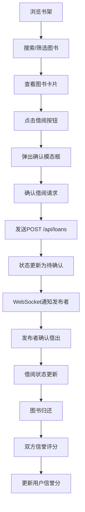

## 1. 产品概述
社区漂流书架是一个面向社区用户的闲置图书在线漂流与交换平台，解决用户闲置图书利用率低、缺乏便捷借阅渠道的问题，通过信任机制和评分体系构建安全的图书共享社区。
- 目标用户：热爱阅读、希望共享闲置图书的社区居民
- 产品价值：降低阅读成本，促进知识共享，建立社区阅读文化氛围

## 2. 核心功能

### 2.1 用户角色
| 角色 | 注册方式 | 核心权限 |
|------|----------|----------|
| 普通用户 | 模拟登录 | 发布图书、搜索借阅、管理借阅记录、信誉评分 |

### 2.2 功能模块
1. **图书发布模块**：拖拽上传封面、填写图书信息、选择借阅状态
2. **书架浏览模块**：搜索框、筛选器、瀑布流图书卡片列表
3. **借阅流程模块**：借阅请求、确认模态框、WebSocket通知
4. **个人中心模块**：侧边栏导航、借入/借出记录列表
5. **信誉评分模块**：星级评分、信誉分计算、借阅权限控制

### 2.3 页面详情
| 页面名称 | 模块名称 | 功能描述 |
|----------|----------|----------|
| 首页/书架页 | 导航栏 | 品牌标识、搜索框、个人中心入口 |
| 首页/书架页 | 搜索筛选区 | 关键字搜索（0.3s延迟）、按书名/作者/状态筛选、搜索建议气泡 |
| 首页/书架页 | 瀑布流图书列表 | 每行4列卡片、悬停动画、淡入效果 |
| 首页/书架页 | 图书发布表单 | 拖拽上传封面预览、富文本简介、状态选择 |
| 个人中心页 | 侧边栏 | 用户头像、信誉评分、导航菜单、响应式折叠 |
| 个人中心页 | 用户资料区 | 用户名、信誉总分、评分人数 |
| 个人中心页 | 借阅记录列表 | 借入/借出记录、状态标签、按时间排序 |
| 全局组件 | 图书卡片 | 封面、书名、作者、借阅状态、借阅按钮 |
| 全局组件 | 确认模态框 | 缩放动画、图书信息展示、借阅须知 |
| 全局组件 | 星级评分 | 悬停变色、点击放大、1-5星评分 |

## 3. 核心流程
用户进入平台后，可浏览全局书架上的所有可借阅图书，通过搜索和筛选快速找到目标图书；点击借阅按钮后确认借阅信息，发送借阅请求给图书所有者；图书所有者确认后完成借阅流程；图书归还后双方进行信誉评分，评分影响后续借阅权限。

## 4. 用户界面设计

### 4.1 设计风格
- 主色调：暖白#FAFAFA背景，紫罗兰#8B5CF6品牌色
- 文字颜色：#0F172A深灰蓝
- 卡片样式：220x320px尺寸，12px圆角，白色#FFFFFF背景，0 4px 12px rgba(0,0,0,0.1)阴影
- 按钮样式：点击时scale(0.95)按下动画，0.1s过渡
- 字体选择：标题使用Playfair Display展示字体，正文使用Lato优雅无衬线字体
- 图标风格：线性简约图标，配合品牌色点缀

### 4.2 页面设计概述
| 页面名称 | 模块名称 | UI元素 |
|----------|----------|---------|
| 书架首页 | 导航栏 | 品牌logo渐变文字、搜索框聚焦动效、用户头像悬停缩放 |
| 书架首页 | 瀑布流列表 | 卡片0.3s向上淡入动画、stagger延迟、悬停上移-4px加深阴影 |
| 书架首页 | 发布表单 | 拖拽上传区域虚线边框高亮、封面128x128圆角预览、富文本编辑器 |
| 个人中心 | 侧边栏 | 240px宽#1E293B深色背景、圆角0 12px 12px 0、菜单选中高亮 |
| 个人中心 | 记录列表 | 60x60封面缩略图、状态标签（绿/橙/灰）、时间倒序排列 |
| 全局组件 | 模态框 | 16px圆角、#F8FAFC背景、0.2s缩放动画、0.4s遮罩淡入 |
| 全局组件 | 星级评分 | 悬停#FBBF24金色、未选中#CBD5E1浅灰、0.2s颜色过渡和放大 |

### 4.3 响应式适配
- 桌面端（>1024px）：4列瀑布流、完整侧边栏
- 平板端（768-1024px）：2列瀑布流、侧边栏折叠为汉堡菜单
- 手机端（<768px）：1列瀑布流、顶部汉堡菜单、侧边栏从左侧滑入
- 触摸优化：按钮最小48x48px点击区域、触摸反馈动画

### 4.4 动画与交互动效
- 页面加载：卡片staggered淡入，每个延迟50ms
- 卡片悬停：transform: translateY(-4px)，阴影加深至0 8px 24px rgba(139,92,246,0.15)，0.3s ease-out
- 模态框：scale(0.9)→scale(1)缩放，0.2s ease-out
- 星级评分：hover时scale(1.1)放大，颜色渐变
- 搜索建议：气泡淡入下滑动画
