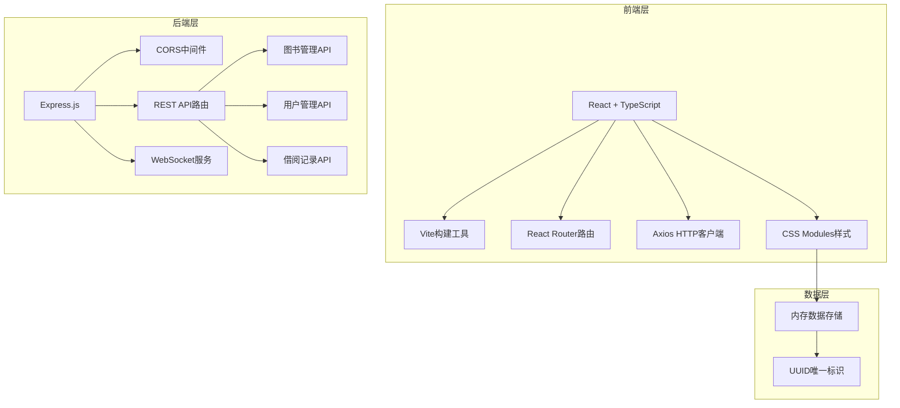
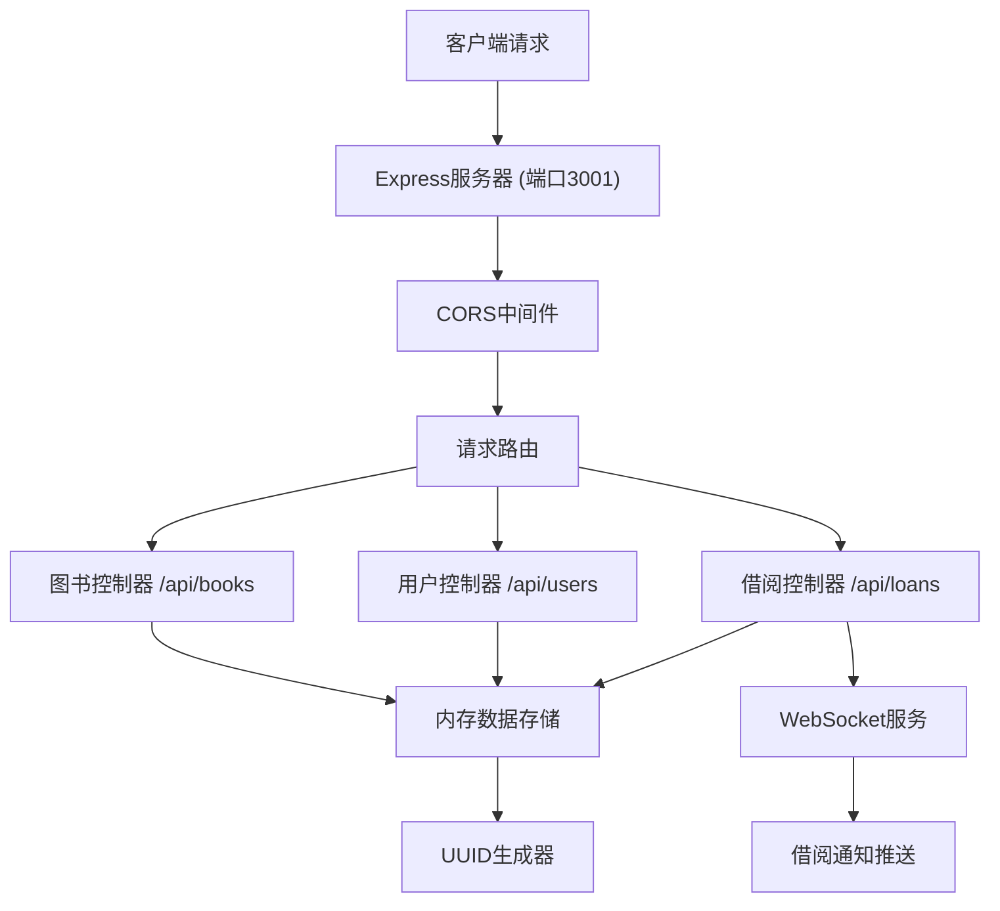
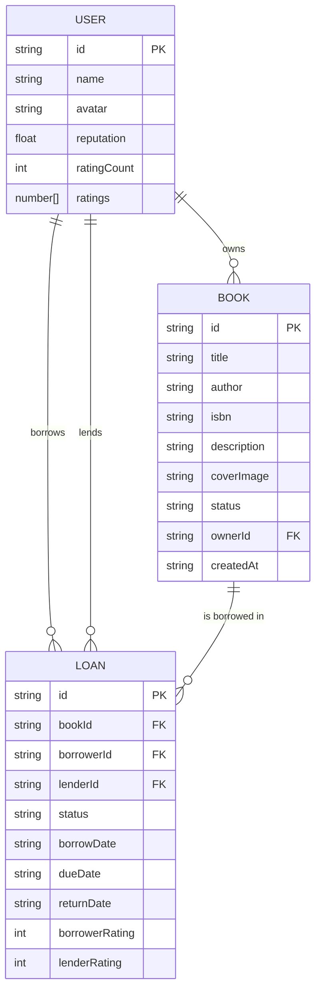

## 1. 架构设计



## 2. 技术描述
- 前端：React@18 + TypeScript@5 + Vite@5
- 路由：react-router-dom@6
- HTTP客户端：axios@1
- 后端：Express@4 + cors@2
- 唯一标识：uuid@9
- WebSocket：ws库实现实时通知
- 构建工具：Vite，配置/api代理到http://localhost:3001
- 数据存储：内存模拟数据库，应用重启后重置

## 3. 路由定义
| 路由 | 用途 |
|------|------|
| / | 书架首页，展示图书列表、搜索筛选、发布表单 |
| /profile/:id | 个人中心页面，展示用户资料和借阅记录 |

## 4. API定义

### 4.1 TypeScript类型定义
```typescript
interface Book {
  id: string;
  title: string;
  author: string;
  isbn: string;
  description: string;
  coverImage: string;
  status: 'available' | 'borrowed' | 'pending';
  ownerId: string;
  createdAt: string;
}

interface User {
  id: string;
  name: string;
  avatar: string;
  reputation: number;
  ratingCount: number;
  ratings: number[];
}

interface Loan {
  id: string;
  bookId: string;
  borrowerId: string;
  lenderId: string;
  status: 'pending' | 'active' | 'returned' | 'overdue';
  borrowDate: string;
  dueDate: string;
  returnDate?: string;
  borrowerRating?: number;
  lenderRating?: number;
}

interface BookCardProps {
  book: Book;
  onBorrow: (bookId: string) => void;
  disabled?: boolean;
}

interface UserProfileProps {
  userId: string;
}
```

### 4.2 REST API端点

#### 图书管理API
| 方法 | 路径 | 描述 | 请求体 | 响应 |
|------|------|------|--------|------|
| GET | /api/books | 获取所有图书列表 | - | Book[] |
| POST | /api/books | 发布新图书 | {title, author, isbn, description, coverImage, ownerId} | Book |
| GET | /api/books/:id | 获取单本图书详情 | - | Book |
| PUT | /api/books/:id | 更新图书信息 | Partial<Book> | Book |

#### 用户管理API
| 方法 | 路径 | 描述 | 请求体 | 响应 |
|------|------|------|--------|------|
| GET | /api/users | 获取所有用户 | - | User[] |
| GET | /api/users/:id | 获取用户详情 | - | User |
| POST | /api/users/:id/rate | 提交用户评分 | {rating: number, raterId: string} | User |

#### 借阅记录API
| 方法 | 路径 | 描述 | 请求体 | 响应 |
|------|------|------|--------|------|
| GET | /api/loans | 获取所有借阅记录 | - | Loan[] |
| GET | /api/loans/user/:userId | 获取用户借阅记录 | - | Loan[] |
| POST | /api/loans | 创建借阅请求 | {bookId, borrowerId, lenderId} | Loan |
| PUT | /api/loans/:id | 更新借阅状态 | {status, returnDate?} | Loan |

## 5. 服务器架构图



## 6. 数据模型

### 6.1 ER图



### 6.2 初始化数据

```typescript
// 初始Mock用户数据
const mockUsers: User[] = [
  {
    id: 'user-1',
    name: '李明',
    avatar: 'https://i.pravatar.cc/150?img=1',
    reputation: 4.8,
    ratingCount: 15,
    ratings: [5, 5, 4, 5, 5]
  },
  {
    id: 'user-2',
    name: '王芳',
    avatar: 'https://i.pravatar.cc/150?img=2',
    reputation: 4.5,
    ratingCount: 12,
    ratings: [4, 5, 4, 5]
  },
  {
    id: 'user-3',
    name: '张伟',
    avatar: 'https://i.pravatar.cc/150?img=3',
    reputation: 2.8,
    ratingCount: 8,
    ratings: [3, 2, 3, 3]
  }
];

// 初始Mock图书数据
const mockBooks: Book[] = [
  {
    id: 'book-1',
    title: '百年孤独',
    author: '加西亚·马尔克斯',
    isbn: '978-7-5442-5399-4',
    description: '魔幻现实主义文学代表作，讲述布恩迪亚家族七代人的传奇故事...',
    coverImage: 'https://picsum.photos/seed/book1/400/600',
    status: 'available',
    ownerId: 'user-1',
    createdAt: new Date().toISOString()
  }
];
```
