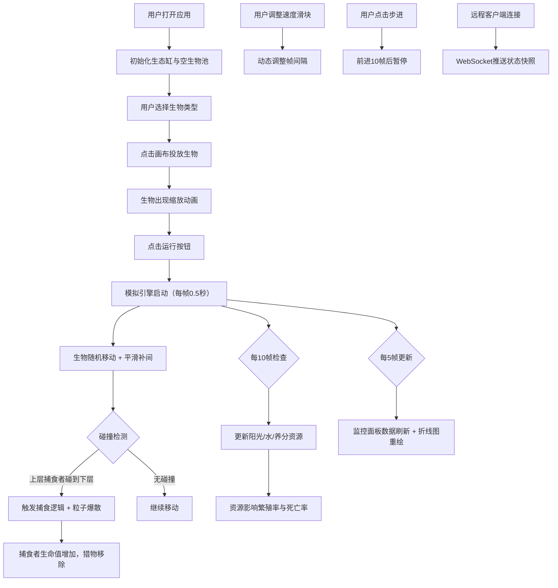

## 1. 产品概述

微观生态缸模拟器（MicroEcoTank）是一个在浏览器中运行的交互式生态系统模拟应用，旨在帮助用户直观观察和理解生态系统中的生物链关系、资源循环机制与种群动态变化规律，解决传统生态观察需要长时间周期和复杂实验设备的痛点。

- **核心价值**：将复杂的生态系统浓缩到可交互的数字缸体中，用户可以实时观察捕食、繁殖、资源竞争等生态现象
- **目标用户**：生物爱好者、教育工作者、学生，以及对复杂系统模拟感兴趣的技术用户
- **市场定位**：兼具教育意义与交互趣味性的科学可视化工具

## 2. 核心功能

### 2.1 用户角色

| 角色 | 注册方式 | 核心权限 |
|------|----------|----------|
| 普通用户 | 无需注册 | 本地运行模拟、投放生物、调整参数、观察数据 |
| 远程观察者 | 通过WebSocket连接 | 只读方式观察其他用户的生态缸实时状态 |

### 2.2 功能模块

1. **生态缸画布**：70%宽度的主展示区域，渲染所有生物实体、资源指示、粒子特效
2. **控制面板**：运行/暂停/重置控制、步进模式、速度调节滑块、物种投放面板
3. **数据监控面板**：300px宽侧边栏，实时种群数据、折线图趋势展示
4. **生态模拟引擎**：生物移动、捕食逻辑、繁殖机制、资源更新循环
5. **WebSocket服务**：支持远程客户端订阅生态缸状态快照

### 2.3 页面详情

| 页面名称 | 模块名称 | 功能描述 |
|----------|----------|----------|
| 主页面 | 生态缸画布 | 使用Canvas渲染4种生物实体，支持位置平滑补间动画，捕食时粒子爆散特效 |
| 主页面 | 控制面板 | 运行/暂停/重置按钮，0.5x-4x速度滑块，步进前进10帧，4类生物投放选择 |
| 主页面 | 监控面板 | 实时种群数量、平均寿命、总资源量显示，100帧历史数据折线图，悬浮提示 |
| 主页面 | 投放交互 | 点击画布投放选中生物，带0.3秒缩放出现动画 |

## 3. 核心流程

## 4. 用户界面设计

### 4.1 设计风格
- **主色调**：深蓝到墨绿的径向渐变背景，营造水底沉浸式环境
- **强调色**：生物专用色（绿色生产者、黄色初级消费者、红色次级消费者、灰色分解者）
- **面板风格**：深色半透明背景 `rgba(0,0,0,0.7)`，白色半透明边框
- **字体**：等宽字体用于数据展示，#E2E8F0 浅色文本
- **动效风格**：柔和的平滑过渡，粒子爆散特效，位置补间动画

### 4.2 页面设计概述

| 页面名称 | 模块名称 | UI元素 |
|----------|----------|--------|
| 主页面 | 生态缸画布 | 径向渐变背景，2px纯白半透明边框，12px圆角，柔和光晕效果，Canvas绘制 |
| 主页面 | 控制面板 | 左侧排列，圆角按钮，滑块控件，下拉选择器，科幻感深色基调 |
| 主页面 | 监控面板 | 右侧300px宽，等宽字体数据展示，白色半透明坐标轴折线图，悬浮数据提示 |
| 主页面 | 生物符号 | 绿色圆点（生产者）、黄色三角（初级消费者）、红色圆形（次级消费者）、灰色六边形（分解者） |

### 4.3 响应性
- **桌面优先**：针对大屏幕优化三栏布局（控制面板 + 生态缸 + 监控面板）
- **自适应**：在较窄屏幕上监控面板可折叠，画布区域自动调整尺寸
- **触控优化**：按钮最小触控区域48x48px，滑动操作流畅

### 4.4 视觉细节
- **背景**：使用 `radial-gradient(circle at 50% 50%, #0a2463 0%, #1e3f20 100%)` 模拟深水环境
- **光晕**：生态缸画布使用 `box-shadow: 0 0 40px rgba(100, 200, 255, 0.3)` 营造发光效果
- **生物渲染**：每个生物带有轻微的模糊发光边缘，提升视觉层次感
- **粒子效果**：捕食时产生10-15个随机方向飞散的小粒子，0.4秒淡出消失
- **折线图**：极简风格，白色半透明坐标轴，与生物颜色一致的2px曲线
