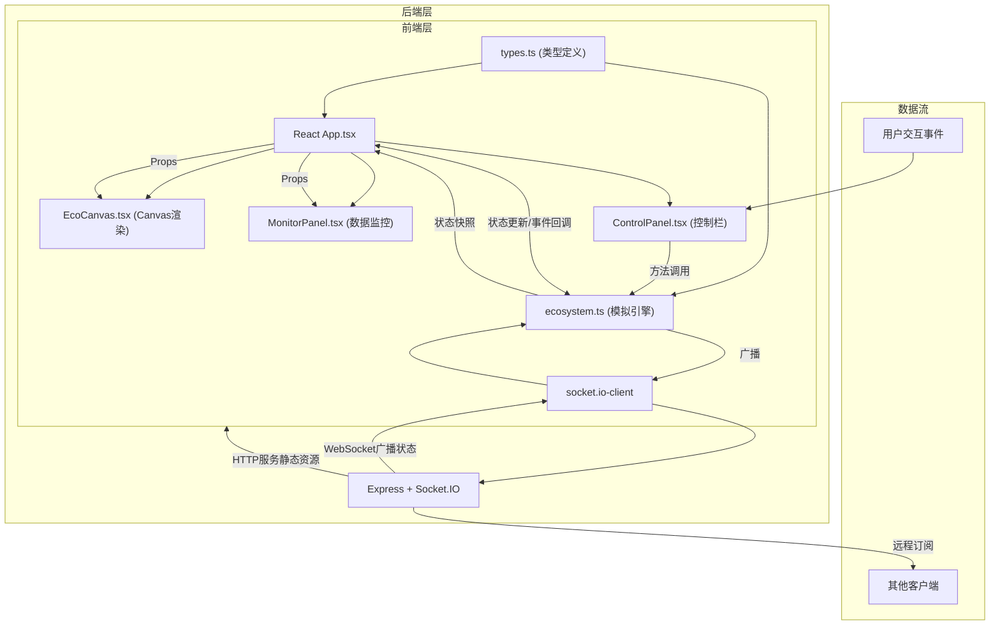

## 1. 架构设计



## 2. 技术描述

### 2.1 前端技术栈
- **框架**：React 18 + TypeScript
- **构建工具**：Vite 5 + @vitejs/plugin-react
- **渲染引擎**：原生 Canvas API（2D Context），不使用 react-konva 以获得更好的性能控制
- **状态管理**：React useState/useRef + 自定义 Ecosystem 类
- **动画**：requestAnimationFrame 循环，位置平滑补间算法
- **WebSocket**：socket.io-client 用于远程观察功能

### 2.2 后端技术栈
- **框架**：Express 4
- **WebSocket**：Socket.IO
- **CORS**：cors 中间件处理跨域
- **功能**：静态资源服务 + WebSocket 状态广播中继

### 2.3 性能优化策略
- **对象池模式**：复用粒子对象避免频繁GC
- **空间分区**：碰撞检测使用网格分区，将O(n²)降为O(n)
- **批量更新**：10帧批量更新资源，5帧批量更新图表
- **离屏渲染**：静态背景预渲染到离屏Canvas
- **节流控制**：WebSocket广播节流，默认每秒2次快照

## 3. 目录结构与文件定义

```
auto286/
├── package.json
├── vite.config.js
├── tsconfig.json
├── index.html
├── src/
│   ├── types.ts          # 所有TypeScript接口定义
│   ├── ecosystem.ts      # 生态模拟引擎核心类
│   ├── App.tsx           # 根组件，状态协调
│   └── components/
│       ├── EcoCanvas.tsx      # Canvas渲染组件
│       ├── ControlPanel.tsx   # 控制面板组件
│       └── MonitorPanel.tsx   # 数据监控面板
└── server/
    └── index.ts          # Express + Socket.IO服务
```

## 4. 核心数据模型与类型定义（types.ts）

```typescript
// 生物类型枚举
export enum CreatureType {
  PRODUCER = 'producer',      // 生产者：绿色圆点
  PRIMARY_CONSUMER = 'primary', // 初级消费者：黄色三角
  SECONDARY_CONSUMER = 'secondary', // 次级消费者：红色圆形
  DECOMPOSER = 'decomposer'   // 分解者：灰色六边形
}

// 生物实体接口
export interface Creature {
  id: string;
  type: CreatureType;
  x: number;
  y: number;
  prevX: number;  // 用于平滑补间
  prevY: number;
  vx: number;     // 速度向量
  vy: number;
  health: number; // 生命值
  maxHealth: number;
  age: number;    // 已存活帧数
  lifespan: number; // 预期寿命
  speed: number;  // 移动速度
  reproductionRate: number; // 繁殖概率
  predationRange: number;   // 捕食范围
  spawnScale: number; // 出现动画缩放值 0→1
}

// 资源状态接口
export interface Resources {
  sunlight: number;  // 阳光 0-100
  water: number;     // 水分 0-100
  nutrients: number; // 养分 0-100
}

// 粒子特效接口
export interface Particle {
  x: number;
  y: number;
  vx: number;
  vy: number;
  color: string;
  life: number;      // 剩余生命
  maxLife: number;
  size: number;
  active: boolean;
}

// 生态缸配置接口
export interface TankConfig {
  width: number;
  height: number;
  frameInterval: number;   // 每帧间隔 ms，默认500ms
  speedMultiplier: number; // 速度倍率 0.5-4
  resourceUpdateInterval: number; // 资源更新帧间隔，默认10
}

// 生态状态快照
export interface EcoState {
  creatures: Creature[];
  resources: Resources;
  frameCount: number;
  isRunning: boolean;
  population: Record<CreatureType, number>;
  avgLifespan: Record<CreatureType, number>;
  particles: Particle[];
}

// 历史数据点
export interface HistoryPoint {
  frame: number;
  population: Record<CreatureType, number>;
}
```

## 5. 生态模拟引擎核心方法（ecosystem.ts）

| 方法名 | 参数 | 返回值 | 功能描述 |
|--------|------|--------|----------|
| `constructor(config: TankConfig)` | 缸体配置 | Ecosystem实例 | 初始化生态引擎 |
| `start()` | 无 | void | 启动模拟循环 |
| `pause()` | 无 | void | 暂停模拟 |
| `reset()` | 无 | void | 重置生态缸到初始状态 |
| `step(frames?: number)` | 前进帧数（默认1） | void | 步进指定帧数 |
| `addCreature(type: CreatureType, x: number, y: number)` | 类型, x坐标, y坐标 | Creature | 投放新生物 |
| `setSpeed(multiplier: number)` | 速度倍率 0.5-4 | void | 调整模拟速度 |
| `subscribe(callback: (state: EcoState) => void)` | 状态回调函数 | 取消订阅函数 | 订阅状态更新 |
| `getState()` | 无 | EcoState | 获取当前状态快照 |

### 5.1 核心算法

**捕食检测逻辑**：
```
对于每只生物:
  若为上层消费者:
    获取网格分区内所有下层生物
    计算距离，若 < 捕食范围:
      触发捕食：生命值+20，猎物移除，生成粒子特效
```

**繁殖逻辑**：
```
每帧检查每只生物:
  若生命值 > 80% 且 随机值 < 繁殖率 * 资源系数:
    在附近生成同类新生物，双方生命值减半
```

**资源更新**（每10帧）：
```
阳光 = 基础值 + 正弦波动
水分 = 基础值 - 消耗速率 * 生物数量
养分 = 基础值 + 分解者数量 * 转化率
资源系数 = (阳光+水分+养分) / 300
```

## 6. API 与 WebSocket 定义

### 6.1 WebSocket 事件

| 事件名 | 方向 | 数据结构 | 描述 |
|--------|------|----------|------|
| `subscribe` | 客户端→服务端 | `{ tankId: string }` | 订阅指定生态缸 |
| `unsubscribe` | 客户端→服务端 | `{ tankId: string }` | 取消订阅 |
| `state-update` | 服务端→客户端 | `EcoState` | 状态快照广播 |
| `frame-update` | 服务端→客户端 | `{ frameCount: number, population: Record }` | 精简帧更新 |

### 6.2 HTTP 接口

| 方法 | 路径 | 用途 |
|------|------|------|
| GET | `/` | 提供静态页面 |
| GET | `/api/tanks` | 获取活跃生态缸列表 |

## 7. 性能指标与测试要求

- **FPS目标**：50-200个生物时稳定60FPS
- **CPU占用**：单核心使用率 ≤ 60%
- **内存泄漏**：连续运行1小时内存增长 ≤ 50MB
- **渲染效率**：每帧Canvas绘制时间 ≤ 8ms
- **测试命令**：`npm run build && npm run preview` 进行性能测试
