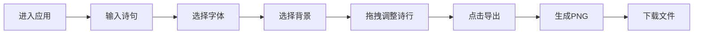

## 1. 产品概述

"一页诗画"是一款在线诗意海报生成工具，用户可以自由组合短诗与背景素材，生成精美的可导出PNG格式的诗意海报作品。

- 核心价值：让文字与视觉艺术融合，为用户提供简单易用的诗意创作工具
- 目标用户：诗歌爱好者、设计师、社交媒体内容创作者
- 解决问题：无需专业设计技能，即可快速生成有美感的诗文图片

## 2. 核心功能

### 2.1 功能模块
1. **诗句编辑器**：文本输入、字体选择（楷体/宋体/手写体）
2. **画布预览区**：实时渲染、诗行拖拽微调、背景展示
3. **背景选择器**：预设渐变背景、自定义纹理、粒子动画
4. **导出功能**：PNG高清导出、下载进度展示

### 2.2 页面详情
| 页面名称 | 模块名称 | 功能描述 |
|-----------|-------------|---------------------|
| 主页面 | 诗句编辑器 | 多行文本输入、字体切换、实时同步到画布 |
| 主页面 | 画布预览区 | 600x800px预览画布、诗行独立拖拽、背景渲染、粒子动画 |
| 主页面 | 背景选择栏 | 5张预设渐变卡片、1张自定义纹理卡、悬停缩放效果 |
| 主页面 | 导出按钮 | 蓝紫渐变按钮、点击内阴影效果、生成1200x1600px高清PNG |

## 3. 核心流程

用户进入应用 → 在左侧编辑面板输入诗句 → 选择字体 → 在下方选择背景渐变/纹理 → 开启粒子动画 → 拖动诗行调整位置 → 点击右上角导出按钮 → 等待生成 → 自动下载PNG文件

## 4. 用户界面设计

### 4.1 设计风格
- **主色调**：深灰蓝底色（#0B0C10 → #1F2833），蓝紫色强调色（#667EEA → #764BA2）
- **面板风格**：半透明毛玻璃效果（rgba(255,255,255,0.15)，背板模糊12px，圆角24px）
- **阴影**：多层模糊阴影（0 4px 6px rgba(0,0,0,0.1) + 0 10px 20px rgba(0,0,0,0.15)）
- **字体**：系统字体，诗句支持楷体、宋体、手写体三种选择
- **动效**：所有交互带平滑过渡动画（0.2s-0.5s）

### 4.2 页面设计概述
| 页面名称 | 模块名称 | UI元素 |
|-----------|-------------|-------------|
| 主页面 | 整体布局 | 深色渐变背景、居中毛玻璃面板、左右分栏（30%/70%） |
| 主页面 | 左侧编辑面板 | 文本输入框、字体选择器、圆角16px |
| 主页面 | 右侧画布区 | 600x800px白色边框画布、放大动画、诗行可拖拽 |
| 主页面 | 底部背景栏 | 5张渐变卡片（60x60px，圆角12px，间隔8px，悬停缩放1.15倍） |
| 主页面 | 导出按钮 | 右上角蓝紫渐变按钮、圆角12px、点击内阴影效果 |
| 主页面 | 进度条 | 导出时0.5s从0到100%动画 |

### 4.3 响应性
- 桌面端优先设计
- 最小支持宽度：1200px
- 画布区域保持固定宽高比

### 4.4 动效与交互
- 背景切换：0.5s渐变过渡
- 卡片悬停：0.2s缩放至1.15倍
- 画布加载：0.3s放大动画
- 拖拽归位：平滑过渡
- 导出进度：0.5s进度条动画
- 按钮点击：0.2s内阴影效果

## 5. 性能要求
- 界面更新：每次操作（输入、切换背景、拖拽）均在16ms内完成（60FPS）
- 导出PNG：总耗时不超过3秒
- 粒子动画：50个粒子，0.5px/帧速度，2-6px随机大小
