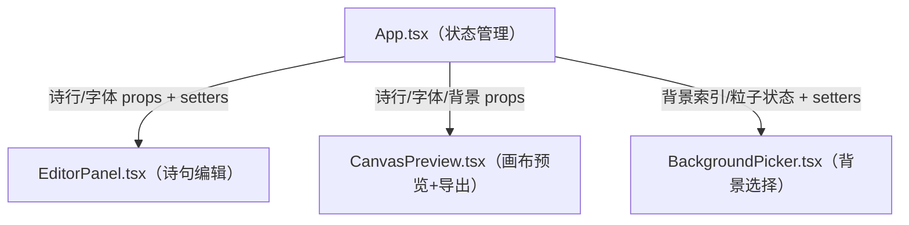

## 1. 架构设计



## 2. 技术描述
- **前端框架**：React 18 + TypeScript
- **构建工具**：Vite
- **导出库**：html2canvas
- **样式方案**：原生 CSS（CSS Modules）
- **状态管理**：React useState（组件内状态，props 传递）

## 3. 目录结构
```
src/
├── App.tsx              # 主组件，状态管理，布局容器
├── components/
│   ├── EditorPanel.tsx      # 左侧编辑面板
│   ├── CanvasPreview.tsx    # 右侧画布预览 + 导出逻辑
│   └── BackgroundPicker.tsx # 底部背景选择栏
├── index.css            # 全局样式
└── main.tsx             # 入口文件
```

## 4. 核心数据模型

### 诗行数据结构
```typescript
interface PoemLine {
  id: string;
  text: string;
  x: number;  // 相对于画布的百分比位置 0-100
  y: number;  // 相对于画布的百分比位置 0-100
}
```

### 背景数据结构
```typescript
interface BackgroundConfig {
  type: 'gradient' | 'texture';
  colors?: string[];    // 渐变色数组
  noiseIntensity?: number;  // 噪声强度 0-1
}
```

### 应用状态
```typescript
interface AppState {
  poemLines: PoemLine[];
  fontFamily: string;
  backgroundIndex: number;
  particleEnabled: boolean;
}
```

## 5. 预设背景配置
```typescript
const PRESET_GRADIENTS = [
  ['#FF6B6B', '#C44A4A'],  // 暖红
  ['#4ECDC4', '#2C7A7A'],  // 青蓝
  ['#667EEA', '#764BA2'],  // 蓝紫
  ['#F7DC6F', '#D4AC0D'],  // 金黄
  ['#BB8FCE', '#7D3C98'],  // 紫罗兰
];
```

## 6. 性能优化策略
- **React.memo**：对纯展示组件进行记忆化
- **useCallback**：对传递给子组件的回调函数进行记忆化
- **requestAnimationFrame**：粒子动画使用 RAF 驱动
- **CSS transforms**：拖拽和动画优先使用 transform 属性，触发 GPU 加速
- **节流/防抖**：文本输入可考虑防抖优化

## 7. 导出实现方案
- 使用 html2canvas 捕获画布 DOM 元素
- scale 参数设为 2，实现 2x 画质输出
- 导出尺寸：1200 x 1600 px（画布 600x800 的 2 倍）
- 生成 Blob 后通过 a 标签触发下载
