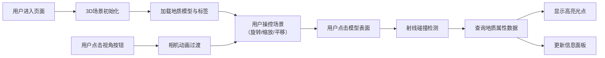

## 1. 产品概述

地质剖面探测器是一个基于Web的3D交互可视化应用，旨在为地质研究人员和教育工作者提供直观的三维地质模型探索工具。用户可以在浏览器中加载并操控三维地质模型，实时查看任意位置的地质属性数据。

- 核心价值：将复杂的三维地质结构以直观的可视化方式呈现，降低地质数据分析的门槛
- 目标用户：地质研究人员、学生、教育工作者、工程勘察人员
- 市场定位：专业级地质数据可视化Web应用，支持教学演示和科研分析场景

## 2. 核心功能

### 2.1 用户角色
| 角色 | 注册方式 | 核心权限 |
|------|----------|----------|
| 普通用户 | 无需注册，直接访问 | 浏览3D模型、查看地质属性、切换视角 |

### 2.2 功能模块
1. **3D地质场景**：加载多层地质模型，支持旋转、缩放、平移交互
2. **点击检测系统**：射线检测模型表面，获取点击位置地质属性
3. **信息面板**：实时展示选中点的深度、岩性、年代等属性数据
4. **视角预设系统**：提供俯视、正视、剖面三种预设视角，支持平滑过渡动画
5. **地层标签系统**：在主要地层边界显示悬浮标签，始终面向相机

### 2.3 页面详情
| 页面名称 | 模块名称 | 功能描述 |
|----------|----------|----------|
| 主界面 | 3D场景容器 | 占屏幕70%宽度，渲染地质模型，处理鼠标交互 |
| 主界面 | 信息面板 | 右侧320px宽面板，展示选中点地质数据 |
| 主界面 | 视角切换按钮组 | 左下角三个方形按钮，切换预设视角 |
| 主界面 | 地层标签 | 悬浮于地层边界，随相机旋转保持面向用户 |

## 3. 核心流程

## 4. 用户界面设计

### 4.1 设计风格
- **主色调**：深色科技感主题，背景 #0A0E27
- **强调色**：浅蓝色 #7B9BF2（数据数值），白色 #FFFFFF（标签文字）
- **面板样式**：背景 #1A1E3E，圆角 16px，阴影 0 4px 24px rgba(0,0,0,0.6)
- **按钮样式**：方形 60x60px，圆角 12px，背景 #2A2E5E，悬停 #3A4E8E
- **字体**：现代无衬线字体，数字采用等宽字体提升可读性
- **标签样式**：半透明毛玻璃背景 rgba(10,14,39,0.8)，模糊 8px，圆角 8px

### 4.2 页面设计概述
| 页面名称 | 模块名称 | UI元素 |
|----------|----------|--------|
| 主界面 | 3D场景容器 | 全屏高度，70%宽度，半透明地质模型（不透明度0.7），5层彩色地层，2条断层线，白色高亮光点 |
| 主界面 | 信息面板 | 标题栏，数据项列表（深度、岩性、年代、样本编号），浅蓝色彩虹分隔线 |
| 主界面 | 视角按钮组 | 三个垂直排列按钮，图标+文字提示，悬停动画 |
| 主界面 | 地层标签 | 悬浮文字，半透明背景，随相机旋转 |

### 4.3 响应式设计
- **桌面端（≥768px）**：场景容器70%宽度，信息面板固定右侧320px
- **移动端（<768px）**：场景容器100%宽度，信息面板以抽屉形式从右侧滑入
- **触控优化**：支持双指缩放、单指旋转等手势操作

### 4.4 3D场景设计指南
- **环境设置**：深色背景 #0A0E27，环境光+方向光组合照明
- **光照配置**：环境光强度0.4，方向光强度0.8，带柔和阴影
- **相机设置**：PerspectiveCamera，初始距离20，视角60度
- **运动控制**：OrbitControls，阻尼系数0.3，左键旋转、右键平移、滚轮缩放
- **模型构成**：5层BoxGeometry地层（不同尺寸、颜色），2条Line断层线
- **后处理**：抗锯齿，辉光效果（高亮光点）
- **性能预算**：三角面≤5万，帧率≥30FPS，射线检测响应≤50ms
