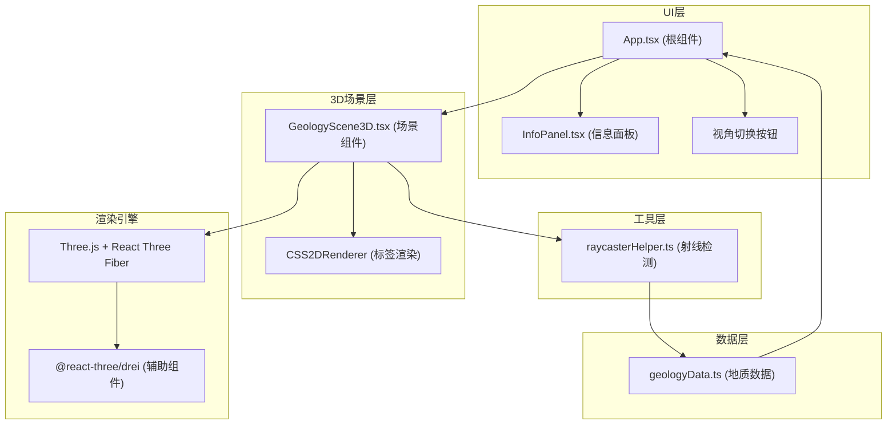
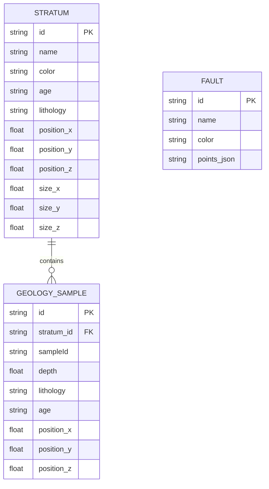
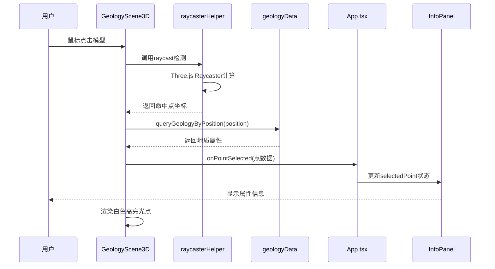
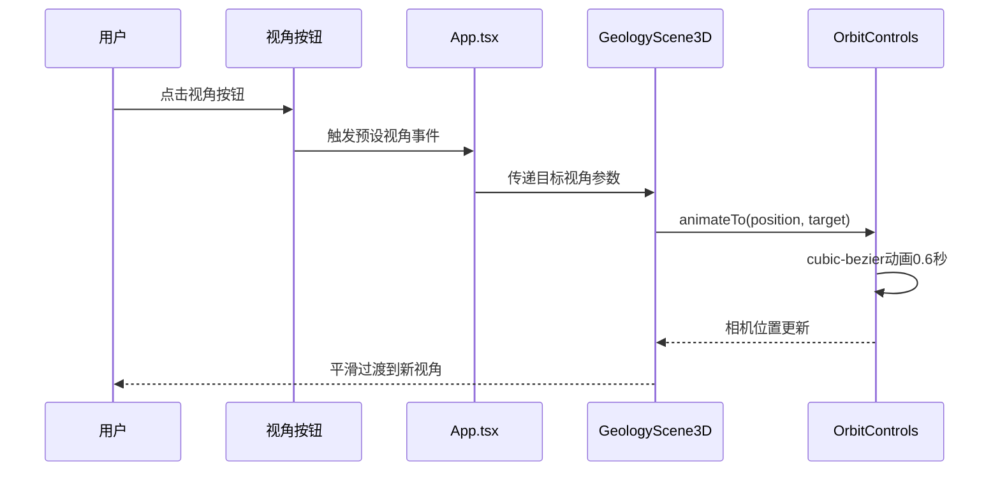

## 1. 架构设计



## 2. 技术栈说明

| 技术/依赖 | 版本 | 用途 |
|----------|------|------|
| React | ^18.2.0 | 前端UI框架，管理组件状态与生命周期 |
| React DOM | ^18.2.0 | React DOM渲染器 |
| TypeScript | ^5.0.0 | 类型安全的JavaScript超集，严格模式 |
| Three.js | ^0.160.0 | 3D渲染引擎 |
| @react-three/fiber | ^8.15.0 | Three.js的React渲染器，声明式3D场景 |
| @react-three/drei | ^9.92.0 | R3F辅助组件库（OrbitControls, Html等） |
| Vite | ^5.0.0 | 快速的前端构建工具和开发服务器 |
| @vitejs/plugin-react | ^4.2.0 | Vite的React插件 |

## 3. 目录结构

```
auto288/
├── package.json
├── vite.config.js
├── tsconfig.json
├── index.html
└── src/
    ├── main.tsx           # React应用入口
    ├── App.tsx            # 根组件，全局状态管理
    ├── scene/
    │   └── GeologyScene3D.tsx  # 3D场景组件
    ├── ui/
    │   └── InfoPanel.tsx       # 信息面板组件
    ├── data/
    │   └── geologyData.ts      # 地质数据模块
    └── utils/
        └── raycasterHelper.ts  # 射线检测工具
```

## 4. 核心数据类型定义

```typescript
// 地质点属性
interface GeologyPoint {
  id: string;
  position: { x: number; y: number; z: number };
  depth: number;
  lithology: string;
  age: string;
  sampleId: string;
}

// 地层定义
interface Stratum {
  id: string;
  name: string;
  color: string;
  position: [number, number, number];
  size: [number, number, number];
  age: string;
  lithology: string;
}

// 断层定义
interface Fault {
  id: string;
  name: string;
  points: [number, number, number][];
  color: string;
}

// 视角预设
interface ViewPreset {
  name: string;
  position: [number, number, number];
  target: [number, number, number];
}
```

## 5. 数据模型

### 5.1 地层数据模型



### 5.2 数据初始化

地层数据（5层）：
- 第四系（#E8D5B7）：最上层，松散沉积物
- 新近系（#C4A77D）：砂岩、泥岩
- 白垩系（#8B7355）：红色砂岩
- 侏罗系（#5C8A5C）：煤层、页岩
- 三叠系（#4A6B8A）：石灰岩

断层数据（2条）：
- 正断层F1：红色线条，走向NE-SW
- 逆断层F2：橙色线条，走向NW-SE

## 6. 模块交互流程

### 6.1 点击检测数据流



### 6.2 视角切换流程



## 7. 性能优化策略

1. **模型优化**：使用简单几何体（BoxGeometry）构建地层，总三角面控制在5万以内
2. **射线检测**：仅对可见Mesh进行检测，使用BVH加速结构（如有需要）
3. **标签渲染**：使用CSS2DRenderer而非WebGL渲染标签，降低性能开销
4. **材质复用**：多个地层共享相同材质实例，减少draw call
5. **帧率控制**：启用OrbitControls的阻尼效果，减少不必要的重绘
6. **状态优化**：使用React.memo优化UI组件重渲染，分离3D场景与UI状态

## 8. 依赖安装与运行

- 安装依赖：`npm install`
- 开发模式：`npm run dev`
- 生产构建：`npm run build`
- 预览构建：`npm run preview`
